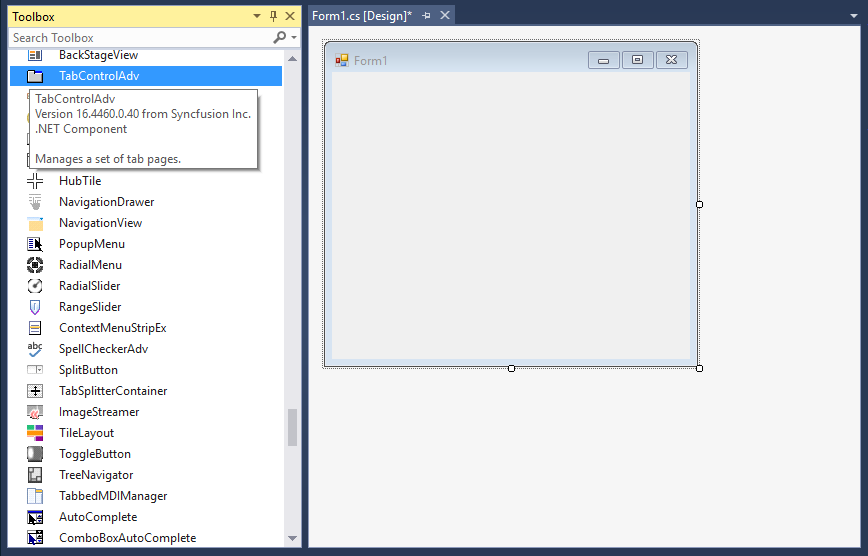
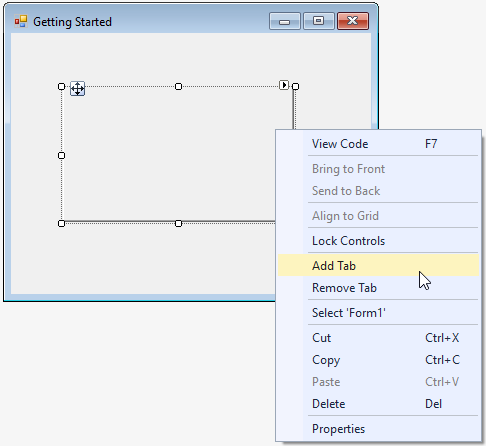
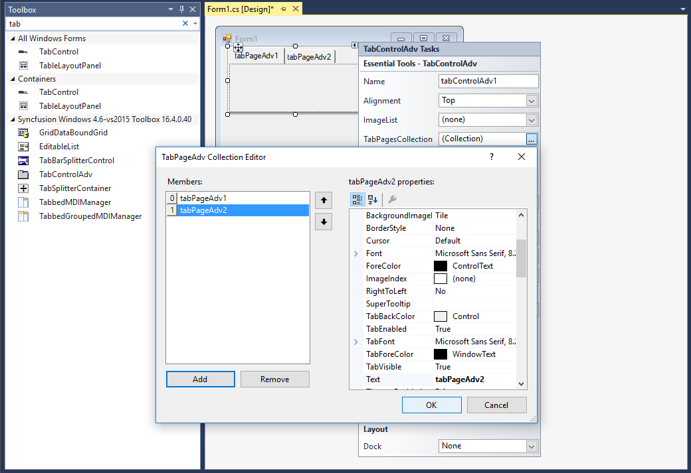
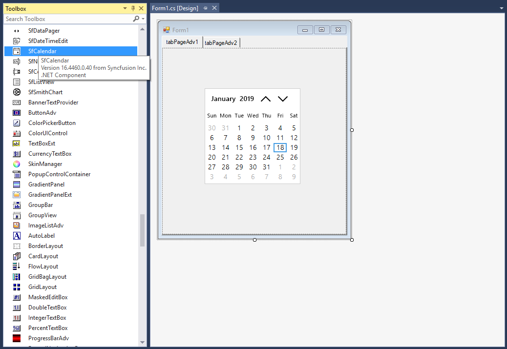
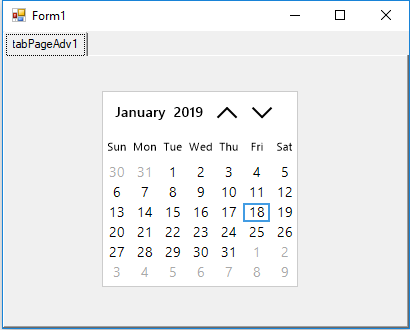
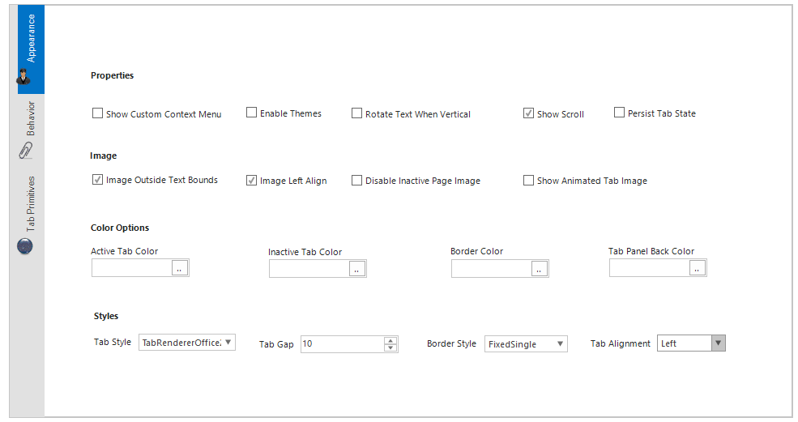
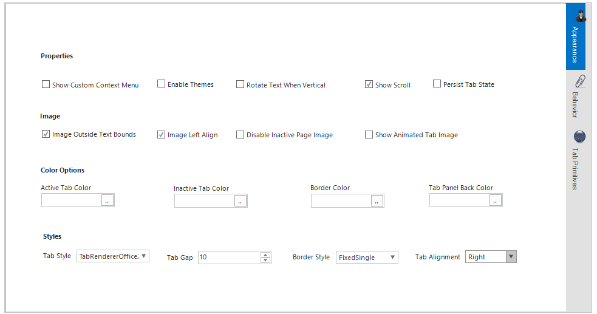
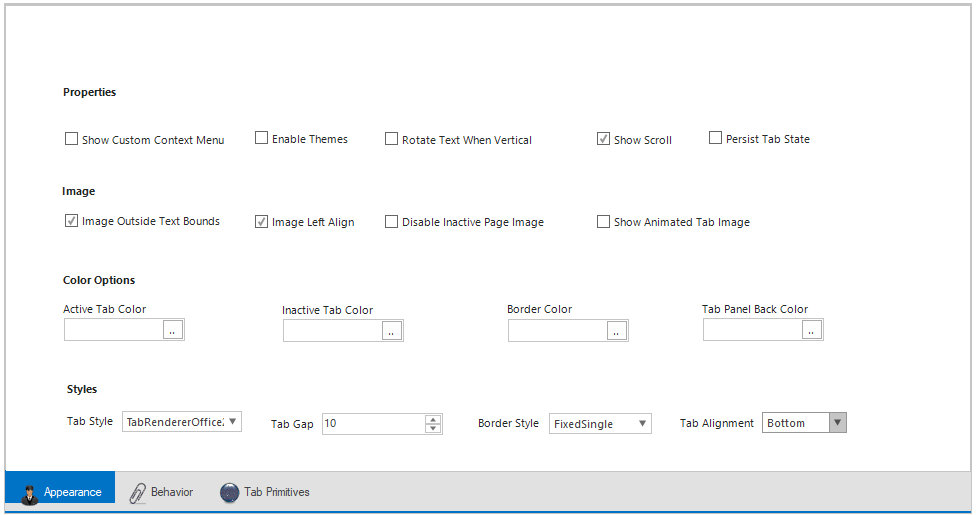

# Getting Started with Windows Forms TabControl (TabControlAdv)

## Assembly deployment

Refer to the [control dependencies](https://help.syncfusion.com/windowsforms/control-dependencies#tabcontroladv) section to get the list of assemblies or NuGet package that needs to be added as a reference to use the control in any application.

You can find more details about installing the NuGet packages in a Windows Forms application in the following link:

[How to install nuget packages](https://help.syncfusion.com/windowsforms/installation/install-nuget-packages)

### Create a simple application with TabControlAdv

You can create a Windows Forms application with [Windows Forms TabControl](https://www.syncfusion.com/winforms-ui-controls/tabcontrol) (TabControlAdv) using the following steps:

### Create a project

Create a new Windows Forms project in Visual Studio to display the [TabControlAdv](https://help.syncfusion.com/cr/windowsforms/Syncfusion.Windows.Forms.Tools.TabControlAdv.html) control with tab pages.

## Add control through designer

The [Windows Forms TabControl](https://www.syncfusion.com/winforms-ui-controls/tabcontrol) (TabControlAdv) control can be added to an application by dragging it from the toolbox to a designer view. The following assembly references are added automatically:

* Syncfusion.Grid.Base.dll
* Syncfusion.Grid.Windows.dll
* Syncfusion.Shared.Base.dll
* Syncfusion.Shared.Windows.dll
* Syncfusion.Tools.Base.dll
* Syncfusion.Tools.Windows.dll

## Add tabs

The tabs can be added to [TabControlAdv](https://help.syncfusion.com/cr/windowsforms/Syncfusion.Windows.Forms.Tools.TabControlAdv.html) in the following ways:

**1.** Right-click the [TabControlAdv](https://help.syncfusion.com/cr/windowsforms/Syncfusion.Windows.Forms.Tools.TabControlAdv.html) and select the Add Tab option to add the [TabPages](https://help.syncfusion.com/cr/windowsforms/Syncfusion.Windows.Forms.Tools.TabControlAdv.html#Syncfusion_Windows_Forms_Tools_TabControlAdv_TabPages) to [TabControlAdv](https://help.syncfusion.com/cr/windowsforms/Syncfusion.Windows.Forms.Tools.TabControlAdv.html) through designer.

**2.** Add tabs using [TabPagesCollection](https://help.syncfusion.com/cr/windowsforms/Syncfusion.Windows.Forms.Tools.TabControlAdv.html#Syncfusion_Windows_Forms_Tools_TabControlAdv_TabPages) in smart tags of [TabControlAdv](https://help.syncfusion.com/cr/windowsforms/Syncfusion.Windows.Forms.Tools.TabControlAdv.html).

### Add controls in tab pages

You can add any control in tab page.

## Add control manually in code

To add the control manually in C#, follow the given steps:

1. Add the following required assembly references to the project: 

    * Syncfusion.Grid.Base.dll
    * Syncfusion.Grid.Windows.dll
    * Syncfusion.Shared.Base.dll
    * Syncfusion.Shared.Windows.dll
    * Syncfusion.Tools.Base.dll
    * Syncfusion.Tools.Windows.dll

2. Include the **Syncfusion.Windows.Forms.Tools namespace**.
  
  
  
  using Syncfusion.Windows.Forms.Tools;
  
  
  Imports Syncfusion.Windows.Forms.Tools
  
  
  
  {{ codesnippet1 | OrderList_Indent_Level_1 }}

3. Create a [TabControlAdv](https://help.syncfusion.com/cr/windowsforms/Syncfusion.Windows.Forms.Tools.TabControlAdv.html) instance, and add it to the window.

  
  
  
  TabControlAdv tabControlAdv1 = new TabControlAdv();
  this.Controls.Add(tabControlAdv1);
  
  
  Dim tabControlAdv1 As TabControlAdv = New TabControlAdv()
  Me.Controls.Add(tabControlAdv1)
  
  
  
  {{ codesnippet2 | OrderList_Indent_Level_1 }}

## Add tabs

Create an instance of [TabPageAdv](https://help.syncfusion.com/cr/windowsforms/Syncfusion.Windows.Forms.Tools.TabPageAdv.html), and add it to the TabControlAdv.



TabPageAdv tabPageAdv1 = new TabPageAdv();
this.tabPageAdv1.Text = "tabPageAdv1";
this.tabControlAdv1.Controls.Add(this.tabPageAdv1);


Dim tabPageAdv1 As TabPageAdv = New TabPageAdv()
Me.tabControlAdv1.Controls.Add(Me.tabPageAdv1)
Me.tabPageAdv1.Text = "tabPageAdv1"



### Add controls in tab pages

You can add any control in [TabPageAdv](https://help.syncfusion.com/cr/windowsforms/Syncfusion.Windows.Forms.Tools.TabPageAdv.html). Create an instance of the control, and add it to [TabPageAdv](https://help.syncfusion.com/cr/windowsforms/Syncfusion.Windows.Forms.Tools.TabPageAdv.html).



SfCalendar calendar = new SfCalendar();
tabPageAdv1.Controls.Add(calendar);


Dim calendar As New SfCalendar()
tabPageAdv1.Controls.Add(calendar)



## Tab placement

[Windows Forms TabControl](https://help.syncfusion.com/cr/windowsforms/Syncfusion.Windows.Forms.Tools.TabControlAdv.html) (TabControlAdv) provides an option to display tabs horizontally at the top or bottom and vertically at the left or right by setting the [Alignment](https://help.syncfusion.com/cr/windowsforms/Syncfusion.Windows.Forms.Tools.TabControlAdv.html#Syncfusion_Windows_Forms_Tools_TabControlAdv_Alignment) property of [TabControlAdv](https://help.syncfusion.com/cr/windowsforms/Syncfusion.Windows.Forms.Tools.TabControlAdv.html).



//Tabs placement
tabControlAdv1.Alignment = TabAlignment.Bottom;


'Tabs placement
tabControlAdv1.Alignment = TabAlignment.Bottom



**Left**

**Right**

**Top**

**Bottom**

## Edit header at run time

You can rename or edit the header at run time by enabling the [LabelEdit](https://help.syncfusion.com/cr/windowsforms/Syncfusion.Windows.Forms.Tools.TabControlAdv.html#Syncfusion_Windows_Forms_Tools_TabControlAdv_LabelEdit) property of [TabControlAdv](https://help.syncfusion.com/cr/windowsforms/Syncfusion.Windows.Forms.Tools.TabControlAdv.html). 



// Renaming header text.
this.tabControlAdv.LabelEdit = true;


' Renaming header text.
Me.tabControlAdv.LabelEdit = True



## Multi-line tabs

You can arrange the tabs in multiple rows by enabling the [Multiline](https://help.syncfusion.com/cr/windowsforms/Syncfusion.Windows.Forms.Tools.TabControlAdv.html#Syncfusion_Windows_Forms_Tools_TabControlAdv_Multiline) property of [TabControlAdv](https://help.syncfusion.com/cr/windowsforms/Syncfusion.Windows.Forms.Tools.TabControlAdv.html).



//Multiline tabs
tabControlAdv1.Multiline = true;


'Multiline tabs
tabControlAdv1.Multiline = True



