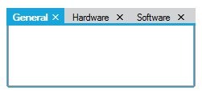

# Interactive features

## CloseButton settings

[TabControlAdv](https://help.syncfusion.com/cr/windowsforms/Syncfusion.Tools.Windows~Syncfusion.Windows.Forms.Tools.TabControlAdv.html) has CloseButtons for all the [TabPages]([TabPages](https://help.syncfusion.com/cr/windowsforms/Syncfusion.Tools.Windows~Syncfusion.Windows.Forms.Tools.TabControlAdv~TabPages.html)) to close the corresponding [TabPages]([TabPages](https://help.syncfusion.com/cr/windowsforms/Syncfusion.Tools.Windows~Syncfusion.Windows.Forms.Tools.TabControlAdv~TabPages.html)) irrespective of the Style set.

Close button on all the TabItems can be made visible by setting the [ShowTabCloseButton](https://help.syncfusion.com/cr/windowsforms/Syncfusion.Tools.Windows~Syncfusion.Windows.Forms.Tools.TabControlAdv~ShowTabCloseButton.html) property to`true`.





this.tabControlAdv1.ShowTabCloseButton = true;





Me.tabControlAdv1.ShowTabCloseButton = True





Also the Tab Close button can be restricted to be shown only for ActiveTabPage. This can be done by setting the [ShowCloseButtonForActiveTabOnly](https://help.syncfusion.com/cr/windowsforms/Syncfusion.Tools.Windows~Syncfusion.Windows.Forms.Tools.TabControlAdv~ShowCloseButtonForActiveTabOnly.html) property to `true`.





this.tabControlAdv1.ShowCloseButtonForActiveTabOnly = true;





Me.tabControlAdv1.ShowCloseButtonForActiveTabOnly = True





N> Close Button can be set for the whole [TabControlAdv](https://help.syncfusion.com/cr/windowsforms/Syncfusion.Tools.Windows~Syncfusion.Windows.Forms.Tools.TabControlAdv.html) by using [Tab Navigation](/windowsforms/tabcontroladv/tab-navigation).

## Tooltip support

Tooltip for the [TabControlAdv](https://help.syncfusion.com/cr/windowsforms/Syncfusion.Tools.Windows~Syncfusion.Windows.Forms.Tools.TabControlAdv.html) can be enabled using the [ShowToolTips](https://help.syncfusion.com/cr/windowsforms/Syncfusion.Tools.Windows~Syncfusion.Windows.Forms.Tools.TabControlAdv~ShowToolTips.html) property and the tooltip text for the TabPages can be specified using the [ToolTipText](https://help.syncfusion.com/cr/windowsforms/Syncfusion.Tools.Windows~Syncfusion.Windows.Forms.Tools.TabPageAdv~ToolTipText.html) property of individual pages which allows to provide a unique Tooltip for each page.





this.tabControlAdv1.ShowToolTips = true;

this.tabPageAdv1.ToolTipText = "Tooltips for tab page 1";





Me.tabControlAdv1.ShowToolTips = True

Me.tabPageAdv1.ToolTipText = "Tooltips for tab page 1"





## SuperTooltip support

Now, the [TabControlAdv](https://help.syncfusion.com/cr/windowsforms/Syncfusion.Tools.Windows~Syncfusion.Windows.Forms.Tools.TabControlAdv.html) displays [SuperToolTip](https://help.syncfusion.com/cr/windowsforms/Syncfusion.Tools.Windows~Syncfusion.Windows.Forms.Tools.TabPageAdv~SuperTooltip.html) on the Tabs when hovering the mouse.





this.tabControlAdv1.ShowSuperToolTips  = true;

this.tabPageAdv1.SuperToolTips  = true;





Me.tabControlAdv1.ShowSuperToolTips  = True

Me.tabPageAdv1.SuperToolTips  = True





## Scroll settings

This section discusses about the Scrolling properties available in the [TabControlAdv](https://help.syncfusion.com/cr/windowsforms/Syncfusion.Tools.Windows~Syncfusion.Windows.Forms.Tools.TabControlAdv.html).

### ScrollButton

TabControlAdv has the ability to add ScrollButtons on the TabPanel when the number of tab items increase. These ScrollButtons allows the user to navigate through the TabPages in the front and back. For this, the [ShowScroll](https://help.syncfusion.com/cr/windowsforms/Syncfusion.Tools.Windows~Syncfusion.Windows.Forms.Tools.TabControlAdv~ShowScroll.html) property of the [TabControlAdv](https://help.syncfusion.com/cr/windowsforms/Syncfusion.Tools.Windows~Syncfusion.Windows.Forms.Tools.TabControlAdv.html) must be set.

ScrollButtons can have a VS like scroll button-look and normal button look.

For VS like scroll button-look, the [VSLikeScrollButton](https://help.syncfusion.com/cr/windowsforms/Syncfusion.Tools.Windows~Syncfusion.Windows.Forms.Tools.TabControlAdv~VSLikeScrollButton.html) property has to be set to `true`.





this.tabControlAdv1.ShowScroll = true;

this.tabControlAdv1.VSLikeScrollButton = true;





Me.tabControlAdv1.ShowScroll = True

Me.tabControlAdv1.VSLikeScrollButton = True





### ScrollBars

ScrollBars can be set for the TabPages for which the [AutoScroll](https://docs.microsoft.com/en-us/dotnet/api/system.windows.forms.scrollablecontrol.autoscroll?redirectedfrom=MSDN&view=netframework-4.7.2#System_Windows_Forms_ScrollableControl_AutoScroll) property has to be set to `true`. The [AutoScrollMinSize](https://docs.microsoft.com/en-us/dotnet/api/system.windows.forms.scrollablecontrol.autoscrollminsize?view=netframework-4.7.2) is set to a value, which if exceeded, enables the [TabControlAdv](https://help.syncfusion.com/cr/windowsforms/Syncfusion.Tools.Windows~Syncfusion.Windows.Forms.Tools.TabControlAdv.html) to automatically add a scrollbar to the TabPage. Setting [AutoScrollMargin](https://docs.microsoft.com/en-us/dotnet/api/system.windows.forms.scrollablecontrol.autoscrollmargin?view=netframework-4.7.2), allows to maintain a minimum distance between the end margin of any control that is placed inside the TabPage and the margin of the TabPage.

[ScrollIncrement](https://help.syncfusion.com/cr/windowsforms/Syncfusion.Tools.Windows~Syncfusion.Windows.Forms.Tools.TabControlAdv~ScrollIncrement.html) property is used to specify whether to scroll through Tabs or Pages.

N> The [TabControlAdv.BringSelectedTabToView](https://help.syncfusion.com/cr/windowsforms/Syncfusion.Tools.Windows~Syncfusion.Windows.Forms.Tools.TabControlAdv~BringSelectedTabToView.html) method is used to bring the selected Tab to view, if scrolled out of view.





this.tabPageAdv1.AutoScroll = true;

this.tabPageAdv1.AutoScrollMargin = new System.Drawing.Size(20, 20);

this.tabPageAdv1.AutoScrollMinSize = new System.Drawing.Size(50, 50);

this.tabControlAdv1.ScrollIncrement = Syncfusion.Windows.Forms.Tools.ScrollIncrement.Page;

this.tabControlAdv1.BringSelectedTabToView();





Private Me.tabPageAdv1.AutoScroll = True

Private Me.tabPageAdv1.AutoScrollMargin = New System.Drawing.Size(20, 20)

Private Me.tabPageAdv1.AutoScrollMinSize = New System.Drawing.Size(50, 50)

Private Me.tabControlAdv1.ScrollIncrement = Syncfusion.Windows.Forms.Tools.ScrollIncrement.Page

Private Me.tabPageAdv1.BringSelectedTabToView()





