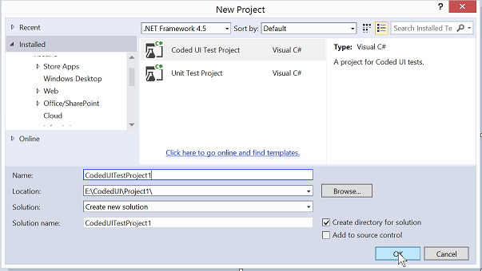
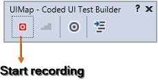
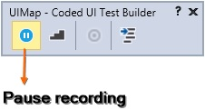

# Coded UI Testing in Windows Forms Controls

This section demonstrates how to create a simple test with TreeViewAdv. The Coded UI functionality can be tested from VS2010 or above with Ultimate or Premium version. TreeViewAdv supports Coded UI from Syncfusion Essential Studio version v9.1.0.20.

## Creating Coded UI Project

CUIT should contain the Coded UI test project. When the Application does not contain the CUIT project, create a new project.

N> The CUIT file is generated automatically, when creating the Coded UI test project. To add another test file, choose shortcut menu of the CUIT project, point to add, and then choose Coded UI test

## Recording Steps

While generating code for Coded UI Test dialog box, choose the Record actions as shown in the following image.

1) After choosing the option, Coded UI Test Builder UIMap is shown at the BottomRight of the window.

2) Choose the Start recording option from the UI Map to record the testing and it is also possible to pause the recording while testing the application.

3) The recorded steps can be viewed by using the UIMap or by pressing “Alt + S” key.

4) To delete actions that was recorded by mistake, choose “Edit” Actions.

5) To generate code that replicates performed actions, choose the Generate Code icon and type a name and description for CUIT method.

6) After completion of the testing process, choose the Generate code option from the UI Map to generate the code in the test project. The generated code replicates performed actions.

7) Choose the required method and description for code generation.

## Testing Recorded Steps

The Application can be tested with the generated CUIT Method. 

1) Add a TestMethod named `CodedUITestMethod1`.





public void CodedUITestMethod1()
{
    // Generates code for this test. Select "Generate Code for Coded UI Test" from the shortcut menu and select one of the menu items.
    this.UIMap.RecordedMethod1();
}





Public Sub CodedUITestMethod1()
	' Generates code for this test. Select "Generate Code for Coded UI Test" from the shortcut menu and select one of the menu items.
	Me.UIMap.RecordedMethod1()
End Sub





2) **Build** and **Run** the application that has already been configured. 

3) Right click the body of the CodedUITestMethod and then select Generate Code for Coded UI Test -> Use CUIT builder as shown in the following screenshots.

4) Now CUIT performs Recorded testing process.

## Supported Controls

The following controls are featured with Coded UI Testing support.

<table>
<tr>
<th>
Supported controls</th><th>
Levels</th></tr>
<tr>
<td>
GridControl</td><td>
4 Levels</td></tr>
<tr>
<td>
GridGroupingControl</td><td>
4 Levels</td></tr>
<tr>
<td>
GridDataBoundGrid</td><td>
4 Levels</td></tr>
<tr>
<td>
TreeViewAdv</td><td>
2 Levels</td></tr>
<tr>
<td>
RibbonControlAdv</td><td>
2 Levels</td></tr>
<tr>
<td>
Carousel</td><td>
2 Levels</td></tr>
<tr>
<td>
RadialMenu</td><td>
2 Levels</td></tr>
<tr>
<td>
TabControlAdv</td><td>
2 Levels</td></tr>
<tr>
<td>
TabSplitterContainer</td><td>
2 Levels</td></tr>
</table>

