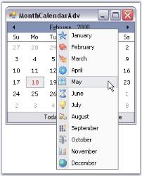

# Month Settings

## Navigation at RunTime

At run time, you have options to move to the next month or previous month using the left or right scroll buttons and also using the context menu displayed, when you click on the month of the calendar. To specify images for individual months in the menu, use MonthImageList property.

 


this.monthCalendarAdv1.MonthImageList = this.imageList1;




Me.monthCalendarAdv1.MonthImageList = Me.imageList1


 

## Foreground Color for Inactive Months

The below property sets the color for the inactive months.

_Table175: Property Table_

<table>
<tr>
<th>
MonthCalendarAdv  Properties</th><th>
Description</th></tr>
<tr>
<td>
InactiveMonthColor</td><td>
The previous or next month dates of the current month will be inactive in the MonthCalendarAdv control. This property specifies color of those inactive month dates.</td></tr>
</table>



this.monthCalendarAdv1.InactiveMonthColor = System.Drawing.Color.InactiveCaptionText;




Me.monthCalendarAdv1.InactiveMonthColor = System.Drawing.Color.InactiveCaptionText


 

## First Day of the Week

MonthCalendarAdv lets you specify the first day to be displayed in a week using FirstDayOfWeek property. Default will be Sunday.



this.monthCalendarAdv1.FirstDayOfWeek = Day.Monday;





Me.monthCalendarAdv1.FirstDayOfWeek = Day.Monday



 

