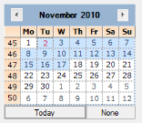

# Selecting a Date

## Range of Selection

The minimum and maximum date selectable by the calendar can be specified using MinValue and MaxValue properties. (This is similar to MinDate and MaxDate of windows MonthCalendar control).

_Table173: Property Table_

<table>
<tr>
<th>
MonthCalendarAdv  Properties</th><th>
Description</th></tr>
<tr>
<td>
Value</td><td>
Indicates the current value of the calendar. By default this value will be the current date.</td></tr>
<tr>
<td>
MinValue</td><td>
Specifies the minimum value selectable by the calendar.</td></tr>
<tr>
<td>
MaxValue</td><td>
Specifies the maximum value selectable by the calendar.</td></tr>
</table>



this.monthCalendarAdv1.Value = new System.DateTime(2008, 2, 19);

this.monthCalendarAdv1.MinValue = new System.DateTime(2000, 2, 21, 0, 0, 0, 0);

this.monthCalendarAdv1.MaxValue = new System.DateTime(2008, 2, 21, 0, 0, 0, 0);




Me.monthCalendarAdv1.Value = New Date(2008, 2, 19) 

Me.monthCalendarAdv1.MinValue = New System.DateTime(2000, 2, 21, 0, 0, 0, 0)

Me.monthCalendarAdv1.MaxValue = New System.DateTime(2008, 2, 21, 0, 0, 0, 0)



When we drag and drop a MonthCalendarAdv control, current system date, i.e, today's date will be selected by default. To change the selected date, DateTime Collection Editor is used, which is invoked using SelectedDates property. 

> Note: It is possible to set color for the highlighted date. See_ Text Settings _topic for details.

## Multiple Selection at run time

It is possible to enable multiple selection of the dates at run time. The below properties enables multiple selection. 

_Table174: Property Table_

<table>
<tr>
<th>
MonthCalendarAdv  Properties</th><th>
Description</th></tr>
<tr>
<td>
AllowMultipleSelection</td><td>
Indicates whether multiple selection of dates is allowed. i.e, by holding the Ctrl key and selecting the dates using mouse.</td></tr>
<tr>
<td>
MouseDragMultiSelect</td><td>
Indicates whether selection of dates are allowed using mouse down and dragging at run time.</td></tr>
</table>


this.monthCalendarAdv1.AllowMultipleSelection = true;

this.monthCalendarAdv1.MouseDragMultiselect = true;




this.monthCalendarAdv1.AllowMultipleSelection = True

Me.monthCalendarAdv1.MouseDragMultiselect = True



 

Select Date Range Programmatically

Using the SelectedDates property, range of dates can be selected in the MonthCalendarAdv control. The dates should be given in array format using the DateTime Array list. 


DateTime[] dateTimes = new DateTime[] { new DateTime(2010, 11, 2), new DateTime(2010, 11, 3) };

DateTime[] dateTotal = new DateTime[] { };




Dim dateTimes As DateTime() = New DateTime() {New DateTime(2010, 11, 2), New DateTime(2010, 11, 3)}

Me.monthCalendarAdv1.SelectedDates = dateTimes


Dates should be specified in the DataTime Array List. Then the DateTime Array list should be declared to the SelectedDates Property. This would select the dates that are in the DateTime Array list. 

 

> Note: Date range should be specified manually in the DateTime Array list.
