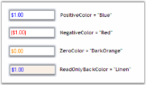

# Appearance

## Themes

CurrencyTextBox control can be themed by setting ThemesEnabled to true.

Table 313: Property Table

<table>
<tr>
<td>
CurrencyTextBox Property</td><td>
Description</td></tr>
<tr>
<td>
ThemesEnabled</td><td>
Specifies whether the CurrencyTextBox control uses XP themes, when BorderStyle is set to Fixed3D.</td></tr>
</table>



this.currencyTextBox1.ThemesEnabled = true;





Me.currencyTextBox1.ThemesEnabled = True



 

## Border Styles

The below properties describes various properties available to set border for the CurrencyTextBox control.

Table 314: Property Table

<table>
<tr>
<td>
CurrencyTextBox Properties</td><td>
Description</td></tr>
<tr>
<td>
BorderStyle</td><td>
Sets the style of the border. The options includes:FixedSingle,Fixed3D andNone (Default).</td></tr>
<tr>
<td>
Border3DStyle</td><td>
Sets 3D border style of the CurrencyTextBox when the BorderStyle is in Fixed3D. The options includes:{{ 'Raised,' | markdownify }}{{ 'RaisedOuter,' | markdownify }}{{ 'RaisedInner,' | markdownify }}{{ 'Sunken (default),' | markdownify }}{{ 'SunkenOuter,' | markdownify }}{{ 'SunkenInner,' | markdownify }}{{ 'Etched,' | markdownify }}{{ 'Bump,' | markdownify }}{{ 'Adjust and' | markdownify }}{{ 'Flat.' | markdownify }}</td></tr>
<tr>
<td>
BorderSides</td><td>
Specifies the border sides. The options includes{{ 'Left,' | markdownify }}{{ 'Top,' | markdownify }}{{ 'Right,' | markdownify }}{{ 'Bottom,' | markdownify }}{{ 'Middle and' | markdownify }}{{ 'All (default).' | markdownify }}</td></tr>
<tr>
<td>
BorderColor</td><td>
Specifies the color of the border when BorderStyle is FixedSingle.</td></tr>
</table>



this.currencyTextBox1.BorderStyle = System.Windows.Forms.BorderStyle.FixedSingle;

this.currencyTextBox1.Border3DStyle = System.Windows.Forms.Border3DStyle.Flat;

this.currencyTextBox1.BorderColor = System.Drawing.Color.Magenta;

this.currencyTextBox1.BorderSides = System.Windows.Forms.Border3DSide.All;





Me.currencyTextBox1.BorderStyle = System.Windows.Forms.BorderStyle.FixedSingle

Me.currencyTextBox1.Border3DStyle = System.Windows.Forms.Border3DStyle.Flat

Me.currencyTextBox1.BorderColor = System.Drawing.Color.Magenta

Me.currencyTextBox1.BorderSides = System.Windows.Forms.Border3DSide.All



 

## Color Settings

We can set different colors for the different set of currency values i.e, Colors can be set for positive currency values, negative currency values and zero values by using the below properties. We can draw the background of Currency TextBox with colors when it is in read only mode by ReadOnlyBackColor.

Table 315: Property Table

<table>
<tr>
<td>
CurrencyTextBox Properties</td><td>
Description</td></tr>
<tr>
<td>
PositiveColor</td><td>
Specifies Forecolor when the current value is positive.</td></tr>
<tr>
<td>
NegativeColor</td><td>
Specifies Forecolor when the current value is negative.</td></tr>
<tr>
<td>
ReadOnlyBackColor</td><td>
Specifies the color to be used for back color when the control is read only. Set ReadOnly to 'true'.</td></tr>
<tr>
<td>
ZeroColor</td><td>
Specifies Forecolor when the current value is Zero.</td></tr>
</table>



this.currencyTextBox1.PositiveColor = System.Drawing.Color.Blue;

this.currencyTextBox1.NegativeColor = System.Drawing.Color.Red;

this.currencyTextBox1.ReadOnlyBackColor = System.Drawing.Color.Linen;

this.currencyTextBox1.ZeroColor = System.Drawing.Color.DarkOrange;





Me.currencyTextBox1.PositiveColor = System.Drawing.Color.Blue

Me.currencyTextBox1.NegativeColor = System.Drawing.Color.Red

Me.currencyTextBox1.ReadOnlyBackColor = System.Drawing.Color.Linen

Me.currencyTextBox1.ZeroColor = System.Drawing.Color.DarkOrange



 

