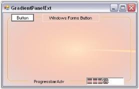

# Host Primitives

Any .NET Windows Forms control or custom control can be included as a primitive in the GradientPanelExt. The host control should be referred in the HostControl property of the GradientPanelExt Collection Editor. 



//button1

Button button1 = new Button();

button1.FlatStyle = System.Windows.Forms.FlatStyle.Popup;

button1.Text = "Button";

//hostPrimitive1

HostPrimitive hostPrimitive1 = new HostPrimitive();

hostPrimitive1.BackColor = System.Drawing.Color.Transparent;

hostPrimitive1.HostControl = button1;

hostPrimitive1.Size = new System.Drawing.Size(60, 20);

//progressBarAdv1

ProgressBarAdv progressBarAdv1= new ProgressBarAdv();

progressBarAdv1.BackColor = System.Drawing.Color.Transparent;

progressBarAdv1.ProgressStyle = Syncfusion.Windows.Forms.Tools.ProgressBarStyles.Tube;

progressBarAdv1.TubeStartColor = System.Drawing.Color.FromArgb(((int)(((byte)(255)))), ((int)(((byte)(192)))), ((int)   (((byte             )(192)))));

//hostPrimitive2

HostPrimitive hostPrimitive2 = new HostPrimitive();

hostPrimitive2.Alignment = Syncfusion.Windows.Forms.Tools.Alignment.Bottom;

hostPrimitive2.BackColor = System.Drawing.Color.Transparent;

hostPrimitive2.HostControl = progressBarAdv1;

hostPrimitive2.Position = 200;

hostPrimitive2.Size = new System.Drawing.Size(100, 20);

//Adding Primitives

gpe.Primitives.AddRange(new Syncfusion.Windows.Forms.Tools.Primitive[] {

  hostPrimitive1,

  hostPrimitive2});




'button1

Private button1 As Button = New Button()

Private button1.FlatStyle = System.Windows.Forms.FlatStyle.Popup

Private button1.Text = "Button"

'hostPrimitive1

Private hostPrimitive1 As HostPrimitive = New HostPrimitive()

Private hostPrimitive1.BackColor = System.Drawing.Color.Transparent

Private hostPrimitive1.HostControl = button1

Private hostPrimitive1.Size = New System.Drawing.Size(60, 20)

'progressBarAdv1

Private progressBarAdv1 As ProgressBarAdv = New ProgressBarAdv()

Private progressBarAdv1.BackColor = System.Drawing.Color.Transparent

Private progressBarAdv1.ProgressStyle = Syncfusion.Windows.Forms.Tools.ProgressBarStyles.Tube

Private progressBarAdv1.TubeStartColor = System.Drawing.Color.FromArgb((CInt((CByte(255)))), (CInt((CByte(192)))), (      CInt((CByte       (192)))))

'hostPrimitive2

Private hostPrimitive2 As HostPrimitive = New HostPrimitive()

Private hostPrimitive2.Alignment = Syncfusion.Windows.Forms.Tools.Alignment.Bottom

Private hostPrimitive2.BackColor = System.Drawing.Color.Transparent

Private hostPrimitive2.HostControl = progressBarAdv1

Private hostPrimitive2.Position = 200

Private hostPrimitive2.Size = New System.Drawing.Size(100, 20)

'Adding Primitives

gpe.Primitives.AddRange(New Syncfusion.Windows.Forms.Tools.Primitive() {hostPrimitive1, hostPrimitive2})



See Also

Expand and Collapse Options, Image and Text Primitives