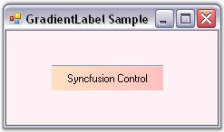

# Border Settings

This section discusses the border settings of the GradientLabel control.

The border style and sides of the GradientLabel can be customized using the properties given below.

Table 390: Property Table

<table>
<tr>
<td>
GradientLabel Properties</td><td>
Description</td></tr>
<tr>
<td>
BorderSides</td><td>
Specifies the sides of the GradientLabel that will have a border.  The options included are as follows.{{ 'Left,' | markdownify }}{{ 'Top,' | markdownify }}{{ 'Right,' | markdownify }}{{ 'Bottom,' | markdownify }}{{ 'Middle and' | markdownify }}{{ 'All.' | markdownify }}The default value is set to 'All'.</td></tr>
<tr>
<td>
BorderStyle</td><td>
Specifies the 3D border style for the GradientLabel.The options included are as follows.{{ 'Raised,' | markdownify }}{{ 'RaisedOuter,' | markdownify }}{{ 'RaisedInner,' | markdownify }}{{ 'Sunken,' | markdownify }}{{ 'SunkenOuter,' | markdownify }}{{ 'SunkenInner,' | markdownify }}{{ 'Etched,' | markdownify }}{{ 'Bump,' | markdownify }}{{ 'Adjust and' | markdownify }}{{ 'Flat.' | markdownify }}The default value is set to 'Sunken'.</td></tr>
<tr>
<td>
BorderColor</td><td>
Sets the color for the 2D border. The BorderColor will be effective only when the BorderStyle property is set to FixedSingle.</td></tr>
</table>

We can set the border sides for the GradientLabel using the BorderSides property.If BorderSides is set to 'Left', only the left border of GradientLabel will be shown.

The GradientLabel replaces the default border style provided for Label classes with the Border3DStyle type in this property. This property uses the Border3DStyle enumeration.

In 3D mode, the border styles can be Raised, Sunken, Flat and so on. Setting the value to 'Adjust' shows no border.



this.gradientLabel1.BorderSides = System.Windows.Forms.Border3DSide.Top;

this.gradientLabel1.BorderStyle = System.Windows.Forms.Border3DStyle.Flat;

this.gradientLabel1.BorderColor = Color.Red;





Me.gradientLabel1.BorderSides = System.Windows.Forms.Border3DSide.Top

Me.gradientLabel1.BorderStyle = System.Windows.Forms.Border3DStyle.Flat

Me.gradientLabel1.BorderColor = Color.Red


 
