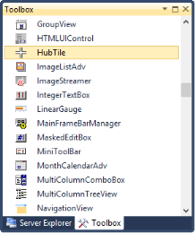
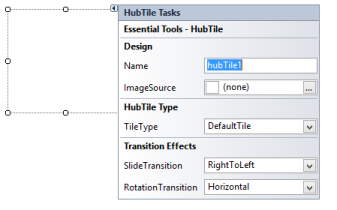

# HubTile

## Overview

HubTile is a content control that functions as live tiles in an application for user interface. Its content updates are shown by a variety of animations, similar to the live tile updates of Windows 8 and Windows Phone. The control provides notifications by various transition effects. A HubTile can have an image, title, body and footer for updation in the tile.

### Key Features

* Hub Tile – The control provides notifications through various transition effects. 
* Rotate Tile – The control rotates itself in transition and direction.
* Pulsing Tile – The control zooms in and out and translates its image.
* Freezing – HubTile notification functionality can be frozen. 

## Getting Started

This section briefly describes how to design a HubTile control in a Windows Forms Application.

* Adding a HubTile Control
* Configuring the HubTile Control

### Adding HubTile Control

* Create a new Windows Forms Application Project in VS IDE through New Project Wizard.
* Drop a HubTile control on the Form.

### Configuring HubTile Control 

The most commonly used settings of the HubTile control can be configured either by Designer, using the Smart tag or by the Properties window or by code. 

## Concept and Features

### Tile Types

#### DefaultTile

This type provides notification through various transition effects.

Key Properties

* Title - The title can be displayed at the top of the hub tile.
* Footer - The footer can be displayed at the bottom of the hub tile.
* ImageSource - An image can be displayed in the background of the hub tile.

The following code example shows the usage of the Title, Footer and ImageSource properties.



this.HubTile1.Title.Text  = "This is the title area. Display your image here”;

this.HubTile1.Title.TextColor  = Color.White;

this.HubTile1.Footer.Text = "HubTile";

this.HubTile1.Footer.TextColor  = Color.White;

this.HubTile1.ImageSource  = this.ImageListAdv1.Images[0];





Me.HubTile1.Title.Text = "This is the title area. Display your image here”

Me.HubTile1.Title.TextColor  = Color.White

Me.HubTile1.Footer.Text = "HubTile"

Me.HubTile1.Footer.TextColor  = Color.White

Me.HubTile1.ImageSource  = Me.ImageListAdv1.Images(0)



_Transition Effects_

In HubTile, image transition can be performed at specified intervals and in different directions just like the Windows 8 live tiles. They include the following transition effects.

* Bottom-to-Top
* Top-to-Bottom
* Left-to-Right
* Right-to-Left

HubTile image transition direction can be modified using the following code example.



this.HubTile1.TileType = HubTileType.DefaultTile;

this.HubTile1.TurnLiveTileOn = true;

this.HubTile1.SlideTransition = TransitionDirection.BottomToTop;





Me.HubTile1.TileType = HubTileType.DefaultTile

Me.HubTile1.TurnLiveTileOn = True

Me.HubTile1.SlideTransition = TransitionDirection.LeftToRight



_Transition Speed_

In HubTile, image transition speed can be increased or decreased by using ImageTransitionSpeed property.



this.HubTile1.ImageTransitionSpeed = 3;





Me.HubTile1.ImageTransitionSpeed = 3



#### PulsingTile

This Tile type resembles the Music and Video HubTile in Windows Phone. The image content of HubTile can be zoomed in and out randomly. 

The following code example shows how to enable pulsing tile using code behind.



this.HubTile1.TileType = HubTileType.PulsingTile;





Me.HubTile1.TileType = HubTileType.PulsingTile



_Pulse Duration_

In PulsingTile, the time interval between Zoom In and Zoom Out operations can be modified using PulseDuration property. It decreases on increasing the value to this property and vice-versa.

The following code example shows how to set the Pulse duration.



this.HubTile1.PulseDuration = 2;





Me.HubTile1.PulseDuration = 2



_Pulse Scale_

In PulsingTile, the zoom level can be set using PulseScale property.

The following code example shows how to set the PulseScale depth.



this.HubTile1.PulseScale= 2;





Me.HubTile1.PulseScale = 2



#### RotateTile

The Tile will animate by rotating itself in different orientation.

The following code example shows how to enable rotate transition using code behind.



this.HubTile1.TileType = HubTileType.RotateTile





Me.HubTile1.TileType = HubTileType.RotateTile



_Transition Effects_

Horizontal Transition

Tile is rotated horizontally. The following image illustrates Horizontal rotation.

The following code sets Rotate Transition horizontally. 



this.HubTile1.RotationTransition=  TileFlipDirection.Horizontal;





Me.HubTile1.RotationTransition = TileFlipDirection.Horizontal



Vertical Transition

Tile gets rotated vertically. The following image illustrates the Verticalrotation.

The following code sets Rotate Transition vertically.



this.HubTile1.RotationTransition = TileFlipDirection.Vertical;





Me.HubTile1.RotationTransition = TileFlipDirection.Vertical



Transition Speed

In HubTile, Rotation speed can be increased or decreased by the RotationTransitionSpeed property.



this.HubTile1.RotationTransitionSpeed = 3;





Me.HubTile1.RotationTransitionSpeed = 3



#### Freezing

The Notification and Animation of a HubTile can be frozen.

The following code example shows how to freeze the HubTile.



this.HubTile1.IsFrozen = true;





Me.HubTile1.IsFrozen = True



#### Appearance and Styling

_Banner Visibility_

HubTile provides support to render Banner similar to Windows 8 live tiles. 

Banner can be added using the following code example.



this.HubTile1.ShowBanner = true;





Me.HubTile1.ShowBanner = True



> Note: Banner visibility customization is applicable only for DefaultTile type.

_Banner Text Customization_

In HubTile, information in the form of text can be displayed in Banner.

The following code example is used to customize Banner text.



this.HubTile1.Banner.Text  = "Child Play is on the way”;

this.HubTile1.Banner.TextColor  = Color.White;





Me.HubTile1.Banner.Text  = "Child Play is on the way”

Me.HubTile1.Banner.TextColor  = Color.White



> Note: Banner Text properties are applicable only for DefaultTile and RotateTile types.

_Banner Icon_

In Banner, icons can be added, like the following image. Use the following code example to create a Banner icon.



this.HubTile1.ShowBannerIcon = true;

this.HubTile1.BannerIcon = this.ImageListAdv1.Images[0];





Me.HubTile1.ShowBannerIcon = True

Me.HubTile1.BannerIcon = Me.ImageListAdv1.Images[0]



> Note: Banner Icon customization is applicable only for DefaultTile type.

_Banner Color_

HubTileBanner color can be changed using the BannerColor property. 

The following code illustrates how to change the Banner color.



this.HubTile1.BannerColor= Color.Green;





Me.HubTile1.BannerColor= Color.Green



> Note: BannerColor is applicable only for DefaultTile and RotateTile types.

_Selection Marker_

HubTile provides selection marker support similar to Windows 8 Start screen tile. 

The following code example demonstrates how to keep a tile selection marked.



this.HubTile1.IsSelectionMarked = true;





Me.HubTile1.IsSelectionMarked = True



> Note: Selection Marker is applicable only for DefaultTile type.

_Selection Marker Arrow Color_

In HubTile, the color of the Selection Marker Arrow can be customized using SelectionArrowColor.

The following code example illustrates how to set the Selection Marker Arrow Color.



this.HubTile1.SelectionArrowColor = Color.White;





Me.HubTile1.SelectionArrowColor = Color.White



> Note: SelectionArrowColor is applicable only for DefaultTile type.

_Selection Marker Border Color_

In HubTile, Selection Marker Border color can be customized using SelectionMarkerColor.



this.HubTile1.SelectionMarkerColor = Color.Blue;





Me.HubTile1.SelectionMarkerColor = Color.Blue



> Note: SelectionMarkerColor is applicable only for DefaultTile type.

_Hovered Border Color_

In HubTile, border highlight is rendered once it is focused. Its appearance can be customized using the HoveredBorderColor property.

The following code example demonstrates how you can customize the border color of HubTile on mouse hovering.



this.HubTile1.HoveredBorderColor= Color.Green;





Me.HubTile1.HoveredBorderColor= Color.Green



The following code example illustrates how to enable the hover border color.



this.HubTile1.EnableHoverColor= true;





Me.HubTile1.EnableHoverColor= True



_Expand On Hover_

HubTile can be expanded once it is focused. It can be enabled by using the ExpandOnHover property.

The following code illustrates how to enable the HubTileExpand behavior while mouse hovering.



this.HubTile1.ExpandOnHover= true;





Me.HubTile1.ExpandOnHover= True



> Note: ExpandOnHover is applicable only for DefaultTile type.

_Tile Press Behavior_

Tile sliding effect occurs on mouse click and based on the position of the mouse pointer. This property allows you to enable or disable the sliding effect in HubTile.

The following code example shows how to enable the Sliding Effect in the HubTile.



this.HubTile1.EnableTileSlideEffect = true;





Me.HubTile1.EnableTileSlideEffect = True



> Note: EnableTileSlideEffect is applicable only for DefaultTile and PulsingTile types.

## Frequently Asked Questions

### General

#### What are the Events available in HubTile and purpose of the Events?

The Events available in HubTile are as follows,

* BeforeTransition Event
* TransitionCompleted Event
* SelectionMarked Event
* ZoomCompleted Event
* TextChanged Event

BeforeTransition Event

This Event is triggered before the Image and Rotation Transition occur in HubTile.

Event Data

BeforeTransitionEventArgs contain the following members that provide information specific to this Event.

_Table_ _966_: Members Table

<table>
<tr>
<td>
Members</td><td>
Description</td></tr>
<tr>
<td>
ImageIndex</td><td>
This property returns the HubTile image index that is Slided.</td></tr>
<tr>
<td>
TileType</td><td>
This property returns the HubTile Tile type.</td></tr>
<tr>
<td>
Cancel</td><td>
This property enables you to avoid particular image Slide Transition.</td></tr>
<tr>
<td>
RotateTransition</td><td>
This property returns the Rotate transition direction of the HubTile.</td></tr>
<tr>
<td>
SlideTransition</td><td>
This property returns the image transition direction of HubTile.</td></tr>
</table>



    private void HubTile1_BeforeTransition(object sender, BeforeTransitionEventArgs e)

        {

            e.ImageIndex = 1;

            e.SlideTransition = TransitionDirection.ToptoBottom;

            e.TileType = HubTileType.DefaultTile;

            e.RotateTransition = TileFlipDirection.Horizontal;

        }





Private Sub HubTile1_BeforeTransition(sender As System.Object, e As BeforeTransitionEventArgs) Handles HubTile1.BeforeTransition

        e.ImageIndex = 1

        e.RotateTransition = TileFlipDirection.Horizontal

        e.SlideTransition = TransitionDirection.BottomToTop

        e.TileType = HubTileType.PulsingTile

End Sub 



TransitionCompleted Event

This Event is triggered after the image Transition and Rotation Transition are completed in HubTile.

Event Data

TransitionCompletedEventArgs contain the following members that provide information specific to this Event.

_Table_ _967_: Members Table

<table>
<tr>
<td>
Members</td><td>
Description</td></tr>
<tr>
<td>
ImageIndex</td><td>
This property returns the HubTile image index that is Slided.</td></tr>
<tr>
<td>
TileType</td><td>
This property returns the HubTile Tile type.</td></tr>
<tr>
<td>
</td><td>
</td></tr>
<tr>
<td>
RotateTransition</td><td>
This property returns the Rotate transition Orientation of the HubTile.</td></tr>
<tr>
<td>
SlideTransition</td><td>
This property returns the image transition direction of HubTile.</td></tr>
</table>



   private void HubTile1_TransitionCompleted (object sender, TransitionCompletedEventArgs e)

   {

       e.ImageIndex = 1;

e.SlideTransition = TransitionDirection.ToptoBottom;

e.TileType = HubTileType.DefaultTile;

e.RotateTransition = TileFlipDirection.Horizontal;

   }





Private Sub HubTile1_TransitionCompleted(sender As System.Object, e As TransitionCompletedEventArgs) Handles HubTile1.TransitionCompleted

            e.ImageIndex = 1

            e.SlideTransition = TransitionDirection.ToptoBottom

            e.TileType = HubTileType.DefaultTile

            e.RotateTransition = TileFlipDirection.Horizontal

    End Sub 
	


SelectionMarked Event

This Event is triggered once the HubTile is Selection marked.

Event Data

SelectionMarker contains the following members that provide information specific to this Event.

_Table_ _968_: Members Table

<table>
<tr>
<td>
Members</td><td>
Description</td></tr>
<tr>
<td>
IsSelected</td><td>
This returns whether HubTile is selection marked or not.</td></tr>
</table>



private void HubTile1_HubTileSelectionMarked(object sender, SelectionMarkedEventArgs e)

{

    bool isSelectionMarked = e.IsSelected;

}





Private Sub HubTile1_SelectionMarked(sender As System.Object, e As SelectionMarkedEventArgs) Handles HubTile1.SelectionMarked

  Dim isSelectionMarked As Boolean = e.IsSelected

End Sub



ZoomCompleted Event

This Event is triggered after the HubTile image content is Zoomed In and Out.

Event Data

ZoomCompletedcontains the following members that provide information specific to this Event:

_Table_ _969_: Members Table

<table>
<tr>
<td>
 Members</td><td>
Description</td></tr>
<tr>
<td>
PulseScale</td><td>
This returns the HubTile Pulse scale.</td></tr>
<tr>
<td>
PulseDuration</td><td>
This returns the HubTile  PulseDuration.</td></tr>
</table>



     private void HubTile1_ZoomCompleted(object sender, ZoomCompletedEventArgs e)

        {

            e.PulseDuration = 1;

            e.PulseScale = 3;

        }





Private Sub HubTile1_ZoomCompleted(sender As System.Object, e As ZoomCompletedEventArgs) Handles HubTile1.ZoomCompleted

            e.PulseDuration = 1

            e.PulseScale = 3

End Sub 



TextChanged Event

This Event raises when HubTile Title, Body, Footer, Banner Text are changed.



private void  HubTile1_TextChanged(object sender, EventArgs e)

{

      string TitleText = this.HubTile.Title.Text;

}





Private Sub HubTile1_TextChanged(sender As System.Object, e As System.EventArgs) Handles HubTile1.TextChanged

     Dim TitleText As String = Me.HubTile1.Title.Text

 End Sub 

 
 
#### How to add ImageCollection to HubTile for Transition Effects?

You can achieve this requirement using HubTileImageList and ImageListAdv properties.

_Table_ _970_: Property Table

<table>
<tr>
<td>
Property</td><td>
Description</td></tr>
<tr>
<td>
ImageListAdv</td><td>
This property holds to ImageListAdv instance that holds image collection for HubTile transition effects.</td></tr>
<tr>
<td>
ImageList</td><td>
This property holds to ImageList instance that holds image collection for HubTile transition effects.</td></tr>
</table>
This is configured either through code or form designer. 

Through Code



this.HubTile1.ImageListAdv = this.ImageListAdv;

this.HubTile1.ImageList = this.ImageList;





Me.HubTile1.ImageListAdv = Me.ImageListAdv

Me.HubTile1.ImageList = Me.ImageList



Through Designer

The following screenshot displays the ImageListAdv property.

The following screenshot displays the ImageList property.

#### How to add HubTile using code example?

The following section guides you through the steps involved in setting up a simple HubTile layout design through code.

Add the following namespace.



//namespaces

using Syncfusion.Windows.Forms.Tools;

using Syncfusion.Windows.Forms;





‘namespaces

Imports Syncfusion.Windows.Forms

Imports Syncfusion.Windows.Forms.Tools



The following code example shows how to create the HubTile via code.



// Create the HubTile instance

HubTile HubTile1 = new HubTile();

this.Controls.Add(this.HubTile1);





‘Create the HubTile instance

Dim HubTile1 As HubTile =  New HubTile()

Me.Controls.Add(Me.HubTile1)



#### How to display BannerIcon in Banner of HubTile?

You can achieve this by using HubTileShowBannerTileIcon and BannerIcon property.

_Table_ _971_: Property Table

<table>
<tr>
<td>
Property</td><td>
Description</td></tr>
<tr>
<td>
ShowBannerIcon</td><td>
This property decides whether BannerIcon is displayed in DefaultTile type of HubTile or not.</td></tr>
<tr>
<td>
BannerIcon</td><td>
This property sets BannerIcon in DefaultTile Banner of HubTile.</td></tr>
</table>



/// Sets whether BannerIcon needs to be displayed in BannerTile 

this.HubTile1.ShowBannerIcon = true;

/// Sets BannerIcon in BannerTile type of Hubtile.

this.HubTile1.BannerIcon = this.ImageListAdv.Images[0];





‘Sets whether BannerIcon needs to be displayed in BannerTile 

Me.HubTile1.ShowBannerIcon = True

‘Sets BannerIcon in BannerTile type of Hubtile.

Me.HubTile1.BannerIcon = Me.ImageListAdv.Images[0]



####  How to Freeze HubTile functionality in runtime?

You can achieve it by setting HubTileFreezeproperty to ‘true’.

_Table_ _972_: Property Table

<table>
<tr>
<td>
Property</td><td>
Description</td></tr>
<tr>
<td>
IsFrozen</td><td>
This property disables HubTile notification functionality.</td></tr>
</table>



this.HubTile1.IsFrozen = true;





Me.HubTile1.IsFrozen = True



####  How to modify HubTile Image Transition direction in runtime?

You can set HubTileSlideTransition property to achieve this.

_Table_ _973_: Property Table

<table>
<tr>
<td>
Property</td><td>
Description</td></tr>
<tr>
<td>
SlideTransition </td><td>
This property sets HubTile image transition direction.</td></tr>
</table>



/// Sets Image transition direction as RightToLeft

this.HubTile1.SlideTransition = TransitionDirection.RightToLeft;

/// Sets Image transition direction as LeftToRight

this.HubTile1.SlideTransition = TransitionDirection.LeftToRight;

/// Sets Image transition direction as TopToBottom

this.HubTile1.SlideTransition = TransitionDirection.ToptoBottom;

/// Sets Image transition direction as BottomToTop

this.HubTile1.SlideTransition= TransitionDirection.BottomToTop;





‘Sets Image transition direction as RightToLeft

Me.HubTile1.SlideTransition = TransitionDirection.RightToLeft

‘Sets Image transition direction as LeftToRight

Me.HubTile1.SlideTransition = TransitionDirection.LeftToRight

‘Sets Image transition direction as TopToBottom

Me.HubTile1.SlideTransition = TransitionDirection.ToptoBottom

‘Sets Image transition direction as BottomToTop

Me.HubTile1.SlideTransition= TransitionDirection.BottomToTop



#### How to detect whether the HubTile is selection marked or not?

You can achieve it by using HubTileIsSelectionMarked property.

_Table_ _974_: Property Table

<table>
<tr>
<td>
Property</td><td>
Description</td></tr>
<tr>
<td>
IsSelectionMarked</td><td>
This property decides whether selection marked over HubTile or not.</td></tr>
</table>



/// Sets whether selection is marked over HubTile 

this.HubTile1.IsSelectionMarked = true;





‘Sets whether selection is marked over HubTile 

Me.HubTile1.IsSelectionMarked = true



####  How to enable / disable HubTile rotation transition in runtime?

You can achieve it by setting HubTileTileType property as DefaultType, so that rotation transition will be disabled.

_Table_ _975_: Property Table

<table>
<tr>
<td>
Property</td><td>
Description</td></tr>
<tr>
<td>
TileType</td><td>
This property decides TileType of HubTile</td></tr>
</table>



/// Sets HubTile as Default Tile and Rotation will be disabled

this.RotateTile.TileType = HubTileType.DefaultTile;





'Sets HubTile as Default Tile and Rotation will be disabled

Me.RotateTile.TileType = HubTileType.DefaultTile



