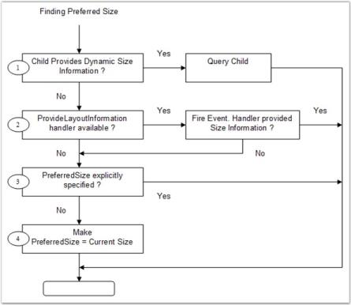

# Child Control Settings

The Child control settings for the Layout Managers are given below.

## Size

## Preferred Size

The Layout Managers usually layout the components based on their preferred sizes. But a .NETcontrol does not provide information regarding it's preferred size. To overcome this, a PreferredSize extended property is provided for each Child control at design time.

In code, you can perform the same using the methods given below.

_Table429: Methods Table_

<table>
<tr>
<th>
Methods</th><th>
Description</th></tr>
<tr>
<td>
SetPreferredSize</td><td>
Associates a preferred size with the specified control.</td></tr>
<tr>
<td>
GetPreferredSize</td><td>
Retrieves the preferred size associated with the specified control.</td></tr>
</table>



this.cardLayout1.SetPreferredSize(this.button1, new System.Drawing.Size(75, 92));

Me.cardLayout1.SetPreferredSize(Me.button1, New System.Drawing.Size(75, 92))


## Minimum Size

You can similarly associate a minimum size for a Child component through the MinimumSize extended property. However, some Layout Managers ignore this setting. Refer to the individual Layout Managers for more information on how the size plays an important part in the layout logic.

In code, you can perform the same using the methods given below.

_Table430: Methods Table_

<table>
<tr>
<th>
Methods</th><th>
Description</th></tr>
<tr>
<td>
SetMinimumSize</td><td>
Associates a minimum size with the specified control.</td></tr>
<tr>
<td>
GetMinimumSize</td><td>
Retrieves the minimum size associated with the specified control.</td></tr>
</table>



this.cardLayout1.SetMinimumSize(this.button1, new System.Drawing.Size(75, 92));

Me.cardLayout1.SetMinimumSize(Me.button1, New System.Drawing.Size(75, 92))


You can also dynamically provide preferred and minimum size information for a Child component at run time. The manner in which a Layout Manager determines the preferred size for a Child control is illustrated below.

* The layout manager checks if the Child control / component implements the IProvideLayoutInformation interface. If so, it calls into that interface to retrieve the preferred size.
* If the above step fails, the Layout Manager fires the ProvideLayoutInformation event, requesting the size information required. If the event is handled and the information provided, that size will be used.
* If the above step fails, the Layout Manager checks if a preferred size was provided statically during design time using the extended PreferredSize property or in code using the SetPreferredSize() method. If so, that size is used. If not, the current size of the Child control is made the preferred size and that size will be used.

 

> Note: The same steps are used to determine the minimum size, if required, for a Child control.

> Note: The above properties are available as the extended properties for the Child controls of CardLayout, FlowLayout and GridBagLayout only.

See Also

BorderLayout – Configuring Child Control, CardLayout - Configuring Child Controls, FlowLayout - Configuring Child Controls, GridLayout - Configuring Child Controls, GridBagLayout - Configuring Child Controls

