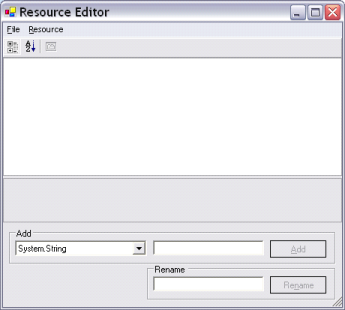
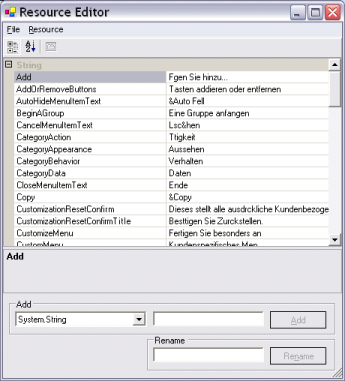

## Localization

Localization is the process of customizing the application to culture-specific resources such as language translation and information formatting for date, time and currency.

Syncfusion components support localizing and have their own neutral resources. These resources can be localized as per the customer requirement.

Localization is made easy with the latest version of Essential Studio (Volume - 2 2011). Earlier versions of the products have a different localization procedure (for the documentation refer [v8.4.0.10](http://help.syncfusion.com/ug_84/User%20Interface/Windows%20Forms/Tools/default.htm?turl=Documents/localizationoftools.htm)). Syncfusion components will continue to support both the procedures.

Use Case Scenarios

Localization helps in transforming the application to be culture-specific. This enables you to customize the application according to the requirements of global customers.

Adding Localization to an Application 

Follow the below procedure to localize Quick Access ToolBar Customization dialog of RibbonControlAdv:

1. Include the required namespaces at the beginning of the source file.

[C#]

using Syncfusion.Windows.Forms;

using Syncfusion.Windows.Forms.Tools;

[VB]

Imports Syncfusion.Windows.Forms

Imports Syncfusion.Windows.Forms.Tools

2. Create a class that implements ILocalizationProvider interface defined in the Syncfusion.Windows.Forms namespace in the Syncfusion.Shared.Base.dll.

[C#]

    class Localizer : ILocalizationProvider

    {

        #region ILocalizationProvider Members

        public string GetLocalizedString(CultureInfo culture, string name)

        {

            return string.Empty;

        }

        #endregion

    }

[VB]

Friend Class Localizer

Implements ILocalizationProvider

#Region "ILocalizationProvider Members"

Public Function GetLocalizedString(ByVal culture As CultureInfo, ByVal name As String) As String

Return String.Empty

End Function

#End Region

End Class

3. Return the localized versions of the strings corresponding to  the string identifiers.

[C#]

      switch (name)

      {

           case ToolsResourceIdentifiers.QuickAccessCustomizeCaption:

                return "Personnaliser Quick Access ToolBar";

           default:

                return string.Empty;

      }

[VB]

Select Case name

Case ToolsResourceIdentifiers.QuickAccessCustomizeCaption

Return "Personnaliser Quick Access ToolBar"

Case Else

Return String.Empty

End Select

4. String identfiers are defined in the ResourceIdentifiers and the ToolsResourceIdentifiers classes in Syncfusion.Shared.Base and Syncfusion.Tools.Windows assemblies respectively.

[C#/VB]

Syncfusion.Windows.Forms.Tools.ToolsResourceIdentifiers

Syncfusion.Windows.Forms.ResourceIdentifiers

5. Leave empty string for the rest of the identifiers that arenot involed in the localization. These identifiers will be loaded with default value.
6. Assign this instance to the Provider property of the LocalizationProvider class, before the InitializeComponent call in the constructor of the Application.

[C#]

LocalizationProvider.Provider = new Localizer();

[VB]

LocalizationProvider.Provider = New Localizer()

7. You will get the following code snippet as the result.

[C#]

  class Localizer : ILocalizationProvider

    {

        #region ILocalizationProvider Members

        public string GetLocalizedString(CultureInfo culture, string name)

        {

            switch (name)

            {

                case ToolsResourceIdentifiers.QuickAccessCustomizeCaption:

                    return "Personnaliser Quick Access ToolBar";

                case ToolsResourceIdentifiers.QuickAccessDialogCommands:

                    return "Choisir les commandes:";

                case ToolsResourceIdentifiers.QuickAccessDialogButtonAdd:

                    return "Ajouter>>";

                case ToolsResourceIdentifiers.QuickAccessDialogButtonRemove:

                    return "<<Supprimer";

                case ToolsResourceIdentifiers.QuickAccessDialogButtonReset:

                    return "Reset";

                case ToolsResourceIdentifiers.QuickAccessDialogButtonOk:

                    return "OK";

                case ToolsResourceIdentifiers.QuickAccessDialogButtonCancel:

                    return "Annuler";

                default:

                    return string.Empty;

            }

        }

        #endregion

    }

// Place this line before the InitalizeComponent call in constructor.

LocalizationProvider.Provider = new Localizer();

[VB]

Friend Class Localizer

Implements ILocalizationProvider

#Region "ILocalizationProvider Members"

Public Function GetLocalizedString(ByVal culture As CultureInfo, ByVal name As String) As String

Select Case name

Case ToolsResourceIdentifiers.QuickAccessCustomizeCaption

Return "Personnaliser Quick Access ToolBar"

Case ToolsResourceIdentifiers.QuickAccessDialogCommands

Return "Choisir les commandes:"

Case ToolsResourceIdentifiers.QuickAccessDialogButtonAdd

Return "Ajouter>>"

Case ToolsResourceIdentifiers.QuickAccessDialogButtonRemove

Return "<<Supprimer"

Case ToolsResourceIdentifiers.QuickAccessDialogButtonReset

Return "Reset"

Case ToolsResourceIdentifiers.QuickAccessDialogButtonOk

Return "OK"

Case ToolsResourceIdentifiers.QuickAccessDialogButtonCancel

Return "Annuler"

Case Else

Return String.Empty

End Select

End Function

#End Region

End Class

' Place this line before the InitalizeComponent call in constructor.

LocalizationProvider.Provider = New Localizer()

{:.image }

> 
{:.image }
 _Note: This localization procedure is applicable only for the UI’s specific to the Syncfusion.Tools.Windows and Syncfusion.Shared.Base assemblies._ 

> _*The German translation in the illustration was done with the help of Google translate._

Sample Link

To view samples:

1. Open the Windows Sample Browser
2. Navigate to Tools Samples > Localization Samples > New Localization Procedure
#### Using ILocalization Provider

##### Use Case Scenarios

Localization helps in transforming the application to be culture-specific. This enables you to customize the application according to the requirements of global customers. 

##### Adding Localization to an Application

Use the following procedure to localize the FindDialogBox in the Edit control:

1. Include the required namespaces at the beginning of the source file.

[C#]

using Syncfusion.Windows.Forms;

using Syncfusion.Windows.Forms.Edit; 

[VB]

Imports Syncfusion.Windows.Forms

Imports Syncfusion.Windows.Forms.Edit

2. Create a class that implements the ILocalizationProvider interface defined in the Syncfusion.Windows.Forms namespace in the Syncfusion.Shared.Base.dll.
3. Return the localized versions of the strings corresponding to the string identifiers.
4. String identifiers are defined in the ResourceIdentifiers and the EditResourceIdentifiers classes in Syncfusion.Shared.Base and Syncfusion.Edit.Windows assemblies respectively.

[C#/VB]

Syncfusion.Windows.Forms.Localization.Localizer.EditResourceIdentifiers Syncfusion.Windows.Forms.ResourceIdentifiers

5. Leave an empty string for the rest of the identifiers that are not involved in the localization. These identifiers will be loaded with a default value.
6. Assign this instance to the Provider property of the LocalizationProvider class, before the InitializeComponent call in the constructor of the application.

[C#]

LocalizationProvider.Provider = new Localizer();

[VB]

LocalizationProvider.Provider = New Localizer()

7. The following code sample is the result:

[C#]

public string GetLocalizedString(System.Globalization.CultureInfo culture, string name,object obj)

        {

            switch (name)

            {

                #region Find Dialog

                case Localizer.EditResourceIdentifiers.FDbtnClose:

                    return "schließen";

                case Localizer.EditResourceIdentifiers.FDbtnFind:

                    return "finden";

                case Localizer.EditResourceIdentifiers.FDbtnMarkAll:

                    return "markieren Sie alle";               

                case Localizer.EditResourceIdentifiers.FDchkCase:

                    return "übereinstimmen Fall";                

                case Localizer.EditResourceIdentifiers.FDchkHidden:

                    return "Suche hidden";

                case Localizer.EditResourceIdentifiers.FDchkRegular:

                    return "Suche regelmäßige";

                case Localizer.EditResourceIdentifiers.FDchkUp:

                    return "Suche Up";

                case Localizer.EditResourceIdentifiers.FDchkWholeWord:

                    return "Ganzes Wort";

                case Localizer.EditResourceIdentifiers.FDchkWrap:

                    return "Zeilenumbruch";

                case Localizer.EditResourceIdentifiers.FDGroupTitle:

                    return "Suchen";

                case Localizer.EditResourceIdentifiers.FDMain:

                    return "Startseite";

                case Localizer.EditResourceIdentifiers.FDrdbDocument:

                    return "Document";

                case Localizer.EditResourceIdentifiers.FDrdbSelection:

                    return "Auswahl";

                case Localizer.EditResourceIdentifiers.FDTitle:

                    return "Kommentar";

                #endregion              

                default:

                    return string.Empty;

            }

        }

[VB]

Public Function GetLocalizedString(ByVal culture As System.Globalization.CultureInfo, ByVal name As String, ByVal obj As Object) As String

        Select Case name

            '#Region "Find Dialog"

            Case Localizer.EditResourceIdentifiers.FDbtnClose

                Return "schließen"

            Case Localizer.EditResourceIdentifiers.FDbtnFind

                Return "finden"

            Case Localizer.EditResourceIdentifiers.FDbtnMarkAll

                Return "markieren Sie alle"

            Case Localizer.EditResourceIdentifiers.FDchkCase

                Return "übereinstimmen Fall"

            Case Localizer.EditResourceIdentifiers.FDchkHidden

                Return "Suche hidden"

            Case Localizer.EditResourceIdentifiers.FDchkRegular

                Return "Suche regelmäßige"

            Case Localizer.EditResourceIdentifiers.FDchkUp

                Return "Suche Up"

            Case Localizer.EditResourceIdentifiers.FDchkWholeWord

                Return "Ganzes Wort"

            Case Localizer.EditResourceIdentifiers.FDchkWrap

                Return "Zeilenumbruch"

            Case Localizer.EditResourceIdentifiers.FDGroupTitle

                Return "Suchen"

            Case Localizer.EditResourceIdentifiers.FDMain

                Return "Startseite"

            Case Localizer.EditResourceIdentifiers.FDrdbDocument

                Return "Document"

            Case Localizer.EditResourceIdentifiers.FDrdbSelection

                Return "Auswahl"

            Case Localizer.EditResourceIdentifiers.FDTitle

                Return "Kommentar"

            Case Else

                '#End Region

                Return String.Empty

        End Select

    End Function

{:.image }

#### Using Satellite Assemblies

Localization is a key feature for providing solutions to global customers. This is true for a desktop applications as well as Syncfusion components. Resources are important for localizing an application; they contain the necessary settings for different languages and cultures. 

Internationalization and localization are different, but related, concepts:

* Internationalization: Ensuring an application can handle resources (e.g., strings) in a language-specific fashion. Internationalization is also known as i18n.
* Localization: Also known as l10n, localization is the process of customizing an application for specific cultures or regions. It is the adaptation of language, content, and design to reflect local cultural sensitivities.

There are three types of cultures:

* Invariant: An invariant culture is always culture-insensitive, primarily used as a “default” culture. You can specify the invariant culture by name using an empty string (""). It is associated with the English language but not with any particular country or region.
* Neutral: A neutral culture is a culture that is associated with a language but not with a country or region. 
* Specific: A specific culture is a culture that is associated with a language and a country or region (e.g., “fr-CA” and “fr-FR”). For example, "fr" is a neutral culture and "fr-FR" is a specific culture. Note that "zh-CHS" (simplified Chinese) and "zh-CHT" (traditional Chinese) are neutral cultures.
##### Steps to Localize Syncfusion Components

Syncfusion components have their own neutral resources, and these resources can be localized as per the needs of the customer. Now, we will examine the steps for localizing the Syncfusion Menu Package.

1. The neutral resources of every Syncfusion component are present in the Localization folder of each component’s source code. For the Tools package, the resources are present in the following path, assuming that “C:\Program Files\” is the installation path for the Syncfusion components:

Tools.Windows:

C:\Program Files\Syncfusion\Essential Studio\&lt;version&gt;\Windows\Tools.Windows\Localization\

Shared.Base:

C:\Program Files\Syncfusion\Essential Studio\&lt;version&gt;\Base\Shared.Base\Localization

1. Inside the NeutralResources folder, there are four resource files corresponding to the Tools package. These resources contain the string representations for the English (default and neutral) culture.
2. Microsoft Visual Studio.NET ships with a tool called Resource Editor (ResEditor) that can be used to localize the string resources. It provides a graphical interface that allows you to construct resource files containing bitmaps, icons, and strings.
3. Compile the source code using the build.bat command in the Microsoft Visual Studio 2008 Command prompt. The following figure shows how the Resource Editor looks when it first opens.

{:.image }

{:.image }

4. Using the Resource Editor, open the resource file named Syncfusion.Windows.Forms.Tools.SR.resources present in the NeutralResources folder. The previous figure shows all string resources displayed in the tool.
5. Now the actual process for localization begins. After opening the resource file in the Resource Editor, start entering the equivalent strings for the required culture. In this example, the German language will be used. In the following figure, all the English strings are replaced by their German equivalent. For instance, the German equivalent of Close is “Ende”.

{:.image }

6. Open the Visual Studio.NET command prompt and enter WinRes to open the Windows Resource Localization Editor. WinRes is used to work with Windows Forms resources. The Resource Editor tool can’t be used to edit Windows Forms resources. It can only be used to work with images and string-based resources.
7. Open the other resources using the WinRes utility and replace the English strings with the German equivalent. The following figure shows the file Syncfusion.Windows.Forms.Tools.XPMenus.CustomizationPanel.resources open in the WinRes tool and with German text. The German text has been added to the form using the Properties window.

{:.image }

8. Click File > Save As and select the culture to be localized (in this case, German-Germany). Now a new resource file with the name Syncfusion.Windows.Forms.Tools.XPMenus.CustomizationPanel.de-DE.resources will be added to the source path.
9. Repeat the process for other resources and save it. Now in the Visual Studio.NET Command Prompt, enter the following command and press Enter. Make sure that you have the sf.publicsnk file from the Localization folder.

Tools.Windows

al /t:lib /culture:de-DE /out:Syncfusion.Tools.Windows.resources.dll /v:2.0.0.0 /delay+ /keyf:sf.publicsnk /embed:Syncfusion.Windows.Forms.Tools.XPMenus.CustomizationPanel.de-DE.resources /embed:Syncfusion.Windows.Forms.MdiWindowDialog.de-DE.resources /embed:Syncfusion.Windows.Forms.Tools.SR.de-DE.resources /embed:Syncfusion.Windows.Forms.Tools.XPMenus.BarCustomizationDialog.de-DE.resources

Shared.Base

al /t:lib /culture:de-DE /out:Syncfusion.Shared.Base.resources.dll /v:1.1.0.0 /delay+ /keyf:sf.publicsnk /embed: Syncfusion.Windows.Forms.Localization.SR.de-DE

10. The version you specify for these DLLs in the _al_ command should be based on the SatelliteContractVersionAttribute setting in the product AssemblyInfo. This also means that when a new version of the product is released (with a newer assembly version), you will have to recreate (adding new resources, if any and if necessary) and recompile your resource DLLs with a new version (if the SatelliteContractVersionAttribute has changed). 
11. On successful execution, an assembly file named Syncfusion.Tools.Windows.resources.dll will be created.
12. Finally, mark this satellite DLL for verification skipping (since it’s not signed with the same strong-name as the product assembly), as follows:

sn –Vr Syncfusion.Tools.Windows.resources.dll

13. Drop this DLL into an appropriate sub-directory under your .EXE’s directory (bin\Debug\), based on the naming conventions enforced in .NET. You should put it in the de-DE sub-directory if this DLL contains resources from the German (Germany) culture.
14. Finally, you should make your application fetch the German resources during run time. The following sample code does that. To change the UI culture of the current thread, add this code in the Forms constructor before the InitializeComponent().

  Thread.CurrentThread.CurrentUICulture = new System.Globalization.CultureInfo("de-DE");

15. Now run your application containing the Syncfusion Toolbar and Menu controls and open the Customization dialog. The dialog will appear in German, as shown in the following figure:

{:.image }

