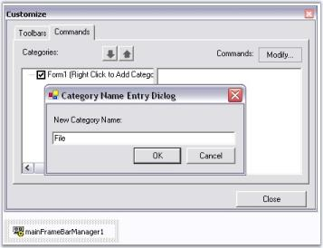
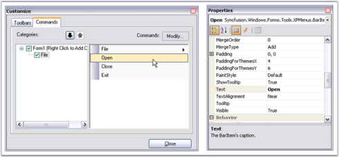

# Adding Bar Items to a BarManager

To add BarItems (menu items) to the menu Bar (note that this step will NOT automatically populate menus and toolbars) during design-time:

* Drag-and-drop one of the BarManagers, MainFrameBarManager (if this is the top-level form) or a ChildFrameBarManager if this is an MDIChild form, onto the form, which will be added to the component tray.
* To invoke the Customize dialog, right click the component and select the Customize... option, or choose the 'Customize...' option from the smart tag.

 

 

* In the customization dialog, go to the Commands tab.
* To add new categories, right click on the Categories' area and select Add.

 

* This will open up a dialog where you can enter the name of a new category. The category name should be unique within this BarManager. 
> Note: The categories do not correspond to any menu entries in the main menu or toolbars, they just provide you a logical grouping of different BarItems.

 

* Now to add bar items into this category, select the category and click the Modify... button (top right corner of the Commands tab) select Add to invoke the Add New BarItem dialog.
* Select the type of BarItem you would like to add, from the list and name it (the BarItem's text property). Take a look at the topic Bar Items for more information on the different types of BarItems.

 

* Once you insert the BarItems, you can select them in the Commands list and modify their properties in the VS .NET design-time property grid.

 

> Note: Remember that you haven't filled your menus and toolbars yet. To display the items refer to_ Adding Toolbars
