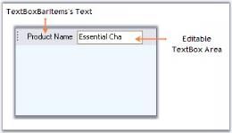

# TextBoxBarItem

A TextBoxBarItem behaves like a normal windows textbox. It lets the end users to enter text in the text area at run time. You can also specify the text in TextBoxValue property. A TextBoxBarItem can be added to a ParentBarItem by a simple drag and drop similar to other bar items. Width of the TextBoxBarItem can be controlled using MinWidth property. 

> Note: Paint Style _should be "ImageAndText" for the TextBoxBarItem to display TextBoxBarItem.Text.



this.textBoxBarItem1.MinWidth = 100;

this.textBoxBarItem1.PaintStyle = Syncfusion.Windows.Forms.Tools.XPMenus.PaintStyle.ImageAndText;

this.textBoxBarItem1.Text = "Product Name";

this.textBoxBarItem1.TextBoxValue = "Essential Chart";




Me.textBoxBarItem1.MinWidth = 100;

Me.textBoxBarItem1.PaintStyle = Syncfusion.Windows.Forms.Tools.XPMenus.PaintStyle.ImageAndText;

Me.textBoxBarItem1.Text = "Product Name";

Me.textBoxBarItem1.TextBoxValue = "Essential Chart";



 

## Behavior Settings

DropDownBarItem supports all the behavior properties of BarItem.

## Other Common properties

For setting images see Image Settings; 

For Editing the text and setting text alignments, See BarItem Text; 

For setting shortcuts for the bar items, see Keyboard shortcuts and 

For changing the Paint Style, see PaintStyle topic. 

Appearance of the Text can be customized. See Foreground Settings for details.

We can set banner text for the TextBoxBarItem. Refer BannerTextProvider Component topic for more details.

See Also

UpdateUIOnAppIdle property in UI Command Update Patterns topic,

Customize Dialog