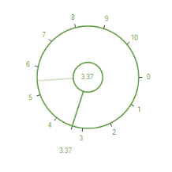
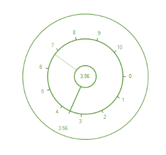

## Radial Slider

The Radial Slider is an advanced control that is capable of calculating the sequence value with the sequence circle sector. It contains additional features like different visual styles, and support to modify minimum and maximum values.

#### Structure of the Control

The following image highlights the different sections of the Range Slider:

{:.image }

#### Creating Radial Slider

##### Through Code

RadialSlider radialSlider = new RadialSlider();

radialSlider.Size = new Size(300, 300);

radialSlider.Location = new Point(50, 50);

radialSlider.MinimumValue = 0;

radialSlider.MaximumValue = 10;

radialSlider.SliderDivision = 10;

this.Controls.Add(radialSlider);

##### Through Designer

The following steps illustrate the creation of Radial Slider.

1. Select RadialSlider from the toolbox.
2. Drag the RadialSlider from the toolbox to the form.
3. The RadialSlider will be created in the form as shown in the following image

{:.image }

#### Interactive Features

The RadialSlidercontrol lets the users to customize it through the following options:

* Slider Style–Supports two different slider styles.
* Minimum Value–Initial value for the radial slider.
* Maximum Value–End value for the radial slider.
* Slider Divisions–Dividend value used to split the slider from minimum to maximum value.
##### Slider style

Radial Slider supports two different visual styles for its appearance through the enumeration SliderStyle: 

* Default
* Frame

Default Slider Style

Default slider style will render the slider control with two hollow circles and a small circle as center, with its dividend ticks available as shown in the following image:

{:.image }

{:.image }

Code sample:

[C#]

this.radialSlider1.SliderStyle = Syncfusion.Windows.Forms.Tools.SliderStyles.Default;

[VB]

Me.radialSlider1.SliderStyle = Syncfusion.Windows.Forms.Tools.SliderStyles.Default

Frame style

This style will paint the background of the slider control with an HQ frame as shown in the following image:

{:.image }

[C#]

   this.radialSlider1.SliderStyle = Syncfusion.Windows.Forms.Tools.SliderStyles.Frame;

[VB]

 Me.radialSlider1.SliderStyle = Syncfusion.Windows.Forms.Tools.SliderStyles.Frame

##### Slider value

###### Minimum Value

The slider initial value depends on its minimum value, and the default minimum value is ‘0’. The minimum value can be changed by using the MinimumValue API in the control.

[C#]

        this.radialSlider1.MinimumValue = 100;

[VB]

         Me.radialSlider1.MinimumValue = 100

> 
{:.image }
_Note: The Slider’s maximum value should be greater than its minimum value._

###### Slider divisions

Slider divisions for the radial slider can be customized using the properties shown in the following code samples. The default slider division is 10.

[C#]

            this.radialSlider1.SliderDivision = 20;

[VB]

             Me.radialSlider1.SliderDivision = 20

> 
{:.image }
_Note: This property will applicable only for default slider._

##### Slider customization

###### Slider background color

The background color for the radial slider can be customized using the BackgroundColor.

[C#]

  this.radialSlider1.BackgroundColor = System.Drawing.SystemColors.Control;

[VB]

 Me.radialSlider1.BackgroundColor = System.Drawing.SystemColors.Control

{:.image }

###### Circle Color

Circle colors of the radial slider can be customized using the properties InnerCircleColor and OuterCircleColor.

[C#]

    this.radialSlider1.InnerCircleColor = System.Drawing.Color.Pink;

    this.radialSlider1.OuterCircleColor = System.Drawing.Color.Pink;

[VB]

   Me.radialSlider1.InnerCircleColor = System.Drawing.Color.Pink
   Me.radialSlider1.OuterCircleColor = System.Drawing.Color.Pink

{:.image }

###### Needle color

The needle color for the Radial slider can be customized using SliderNeedleColor.

[C#]

         this.radialSlider1.SliderNeedleColor = System.Drawing.Color.Pink;

> 

[VB]

         Me.radialSlider1.SliderNeedleColor = System.Drawing.Color.Pink

{:.image }

###### Fore color

The foreground color for the Radial slider can be customized using ForeColor.

[C#]

this.radialSlider1.ForeColor = System.Drawing.Color.BlueViolet;

> 

[VB]

Me.radialSlider1.ForeColor = System.Drawing.Color.BlueViolet

{:.image }

###### Needle type

The needle type for the radial slider can be customized using the NeedleType enumeration. Available needle types in the RadialSlider are:

* Straight Line (Default)
* Dotted Line

[C#]

   this.radialSlider1.NeedleType = Syncfusion.Windows.Forms.Tools.SliderNeedleType.DottedLine;

> 

[VB]

   Me.radialSlider1.NeedleType = Syncfusion.Windows.Forms.Tools.SliderNeedleType.DottedLine

{:.image }

##### Slider Value changed event

###### Slider current value

We can get the current slider value by using the value changed event.

[C#]

    this.radialSlider1.ValueChanged += new Syncfusion.Windows.Forms.Tools.RadialSlider.ValueChangedEventHandler(radialSlider1_ValueChanged);

     private void radialSlider1_ValueChanged(object sender, Syncfusion.Windows.Forms.Tools.RadialSlider.ValueChangedEventArgs args)

        {

      this.richTextBox1.SelectionFont = new System.Drawing.Font(Font.Name, (float)this.radialSlider1.Value);

                this.Refresh();

               }

[VB]

AddHandler Me.radialSlider1.ValueChanged, AddressOf Me.radialSlider1_ValueChanged

    Private Sub radialSlider1_ValueChanged(ByVal sender As Object, ByVal args As Syncfusion.Windows.Forms.Tools.RadialSlider.ValueChangedEventArgs)
        Me.richTextBox1.SelectionFont = New System.Drawing.Font(Font.Name, CType(Me.radialSlider1.Value,Single))
        Me.Refresh
    End Sub

