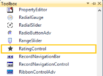
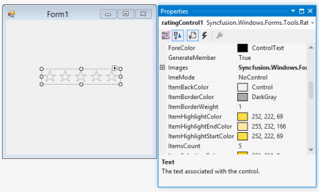
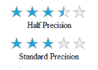
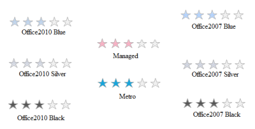

# Rating Control

## Overview

Essential Tools Rating control for Windows Forms provides an intuitive rating experience that allows the end-user to select a number of stars that represent a rating. Rating control allows users to rate items based on a specified list of options.

### Key Features

* Shape – Allows the end-user to rate items from a predefined list of shapes.
* Precision – Rating precision can be customized.
* Tooltip – The control shows Tooltip when the mouse hovers over the Rating item.
* Horizontal and Vertical orientation support.
* Read-only mode support.
* Reset button support.
* Customizable rating.

## Getting Started 

This section briefly describes how to design a Rating control in a Windows Forms Application.

## Add Rating Control

1. Create a new Windows Forms Application Project in VS IDE through New Project Wizard.
2. Drop a RatingControl on the Form.

## Configure Rating Control

The most commonly used settings of Rating Control can be configured either by a Designer using the Smart tag or by the Properties window or by code.

## Concepts and Features

* Shape
* Properties in Rating control 
* Shape Customizations
* VisualStyles
* Events

## Shape Element

It acts like a core element in RatingControl, to illustrate rating values through visual representation.

### Built-in

There are six predefined shapes available for customization. All these shapes support the VisualStyles, Orientation and other customized settings.

* Star
* Circle
* Triangle
* Heart
* Diamond
* Kite



this.ratingControl4.Shape = Syncfusion.Windows.Forms.Tools.Shapes.Heart;





Me.ratingControl4.Shape = Syncfusion.Windows.Forms.Tools.Shapes.Heart



### Custom

User-defined shapes can be used in the form of images.



this.ratingControl4.Shape = Syncfusion.Windows.Forms.Tools.Shapes.CustomImages;

customImageCollection1.NormalImage = global::WindowsFormsApplication20.Properties.Resources.xmen;

            this.ratingControl1.Images = customImageCollection1;





Me.ratingControl4.Shape = Syncfusion.Windows.Forms.Tools.Shapes.CustomImages

customImageCollection1.NormalImage = Global.WindowsFormsApplication20.Properties.Resources.xmen

Me.ratingControl1.Images = customImageCollection1



In Rating control, the working is based on the following criteria for CustomImages.

* If the Shape property is set to CustomImages and the images are null, then Rating control resets the shape as Star.
* If the HoverImage and SelectedImage are null, Rating control makes use of the ItemHighlightColor and ItemSelectedColor for Hover and Selected state.
* If the HoverHalfImage and SelectedHalfImage are null, Rating control Precision is set to Standard.

## Orientation

Control rendering can be done either in a vertical or in a horizontal position. 



this.ratingControl1.Orientation = Syncfusion.Windows.Forms.Tools.Orientationmode.Vertical;





Me.ratingControl1.Orientation = Syncfusion.Windows.Forms.Tools.Orientationmode.Vertical



## Precision

In Rating, Precision can be set either as Standard or as Half, based on user requirement.



this.ratingControl1.Precision = Syncfusion.Windows.Forms.Tools.PrecisionMode.Half;





Me.ratingControl1.Precision = Syncfusion.Windows.Forms.Tools.PrecisionMode.Half



## ToolTip

By enabling this property, Tooltip is set to Rating control. The Tooltip appearance can be customized at the end-user level.



this.ratingControl1.ShowTooltip = true;





Me.ratingControl1.ShowTooltip = True



## Styling

Styling of shapes can be done either by using predefined visual styles or by BackColor, BorderColor, HighlightColor, SelectionColor and GradientColor settings.

### Built-in

Rating control supports predefined visual styles such as Default, Office2007, Office2010 and Metro with all three color schemes for Office Styles. The style can be set by the VisualStyle property.



this.ratingControl1.VisualStyle = Syncfusion.Windows.Forms.Tools.RatingControl.Style.Metro;

this.ratingControl1.OfficeColorScheme = Syncfusion.Windows.Forms.Tools.OfficeColorSchemes.Black;





Me.ratingControl1.VisualStyle = Syncfusion.Windows.Forms.Tools.RatingControl.Style.Metro

Me.ratingControl1.OfficeColorScheme = Syncfusion.Windows.Forms.Tools.OfficeColorSchemes.Black



### Custom

The properties ItemHighlightStartColor, ItemHighlightEndColor, ItemSelectionStartColor, ItemSelectionEndColor are applied only if the ApplyGradientColors property is enabled.



this.ratingControl3.ItemHighlightEndColor = Color.Red;

this.ratingControl3.ItemHighlightStartColor = Color.Green;

this.ratingControl3.ItemSelectionEndColor = Color.Yellow;

this.ratingControl3.ItemSelectionStartColor = Color.LightYellow;





Me.ratingControl3.ItemHighlightEndColor = Color.Red

Me.ratingControl3.ItemHighlightStartColor = Color.Green

Me.ratingControl3.ItemSelectionEndColor = Color.Yellow

Me.ratingControl3.ItemSelectionStartColor = Color.LightYellow





this.ratingControl1.ApplyGradientColors = true;





Me.ratingControl1.ApplyGradientColors = True



## Frequently Asked Questions

### How to add Rating Control through Code

To add Rating control to a Windows Forms Application through code, include the WindowsFormsTools namespace.



using Syncfusion.Windows.Forms.Tools;





Imports Syncfusion.Windows.Forms.Tools



Create an instance of Rating control and add it to the form as given in the following code example. 

 

 Syncfusion.Windows.Forms.Tools.RatingControl ratingcontrol1;

 this.ratingcontrol1 = new Syncfusion.Windows.Forms.Tools.RatingControl();

 this.Controls.Add(ratingcontrol1);





Dim ratingcontrol1 As Syncfusion.Windows.Forms.Tools.RatingControl

Me.ratingcontrol1 = New Syncfusion.Windows.Forms.Tools.RatingControl()

Me.Controls.Add(ratingcontrol1)



### How to get Shape Customization at runtime

QueryShapeInfor event is always triggered in Rating control.This event contains index, HighlightColor, SelectionColor and ToolTip members that provide information.



    void ratingControl1_QueryShapeInfo(object sender, Syncfusion.Windows.Forms.Tools.QueryShapeInformation e)

        {

            int i = e.Index;

        }





 Private Sub ratingControl1_QueryShapeInfo(ByVal sender As Object, ByVal e As Syncfusion.Windows.Forms.Tools.QueryShapeInformation)

            Dim i As Integer = e.Index

        End Sub

End Sub



### How to get Rating value at runtime

ValueChanging event is triggered when Shape is clicked in Rating control. This event contains Value and Cancel members, that provide information with respect to the control.



      void ratingControl1_ValueChanging(object sender, Syncfusion.Windows.Forms.Tools.ValueChangingEventArgs args)

        {

            float value = args.Value;

            args.Cancel = false;

        }





Private Sub ratingControl1_ValueChanging(ByVal sender As Object, ByVal args As Syncfusion.Windows.Forms.Tools.ValueChangingEventArgs)

    Dim value As Single = args.Value

    args.Cancel = False

End Sub



