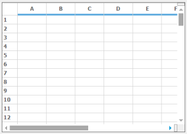
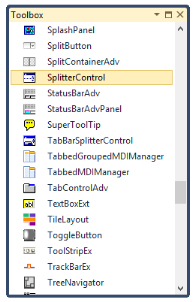

## SplitterControl

SplitterControl is a container control that enables end user to embed Grid and show multiple views of the same grid by using its Splitter. This enables viewing more than one copy of a worksheet and scrolling through each pane of the worksheet independently. The Splitter can be scrolled by placing the mouse pointer over it, holding down the left mouse button, and dragging it to the required position. It can be split horizontally and vertically.

{:.image }

Key Features

* Allows multiple views of the same grid.
* The control also comes with predefined Default and Metro styles. 
#### Getting Started

This section briefly describes how to design the SplitterControl in the WindowsForms application.

* Add the SplitterControl control. 
* Configure the SplitterControl control.
##### Add the SplitterControl

1. Create a new Windows Forms Application Project in VS IDE through the New Project Wizard.
2. Drag and drop the SplitterControl in the Form from the Toolbox.

{:.image }

##### Configure the SplitterControl

To add SplitterControl to the Windows Forms Application through the following code example:

1. Include the namespaces Syncfusion.Windows.Forms and Syncfusion.Windows.Forms.Tools.

[C#]

//Namespaces.

using Syncfusion.Windows.Forms.Tools;

using Syncfusion.Windows.Forms;

[VB]

‘Namespaces.

Imports Syncfusion.Windows.Forms

Imports Syncfusion.Windows.Forms.Tools

2. Create an instance of the SplitterControl and add it to the Form.

[C#]

//Creates the SplitterControl instance.

SplitterControl splitterControl1=new Syncfusion.Windows.Forms.SplitterControl();

this.Controls.Add(splitterControl1);

 [VB]

‘Creates the SplitterControl instance.

Dim splitterControl1 As New Syncfusion.Windows.Forms.SplitterControl()

Me.Controls.Add(splitterControl1)

#### Concept and Features

##### Scrollbar customization

The appearance of the SplitterControl scrollbar can be customized by using the GridOfficeScrollBars property. The scrollbar can be customized to get the following style look and feel.

* Office2007
* Office2010
* Metro
* None

The following code example illustrates this.

[C#]

//Customizes the Scrollbar.

this.splitterControl1.GridOfficeScrollBars= OfficeScrollBars.Office2007;

[VB]

'Customizes the Scrollbar

Me.splitterControl1.GridOfficeScrollBars= OfficeScrollBars.Office2007

##### Hiding the Scrollbars

The Horizontal and Vertical scrollbars in SplitterControl can be hidden by using the ShowHorizontalScrollBar and ShowVerticalScrollBar properties.

The following code example illustrates this.

[C#]

this.splitterControl1.ShowHorizontalScrollBar = false;

this.splitterControl1.ShowVerticalScrollBar = false;

 [VB]

Me.splitterControl1.ShowHorizontalScrollBar = False

Me.splitterControl1.ShowVerticalScrollBar = False

##### Sizing Grip

The Sizing Grip appearance is customized by using ShowSizeGrip property in SplitterControl. The following code example illustrates this.

[C#]

this.splitterControl1.ShowSizeGrip = true;

[VB]

Me.splitterControl1.ShowSizeGrip = False

##### Splitter Behavior

The splitter in the SplitterControl can be supported with Row splitter and Column splitter or both.

* None
* SplitColumns
* SplitRows
* Both

The following code example illustrates this.

[C#]

this.splitterControl1.SplitBars = DynamicSplitBars.SplitColumns;

[VB]

Me.splitterControl1.SplitBars = DynamicSplitBars.SplitColumns

##### Style

SplitterControl supports visual styles such as Default and Metro. The styles can be set by using Style property. 

* Default
* Metro

The following code example allows you to set the style for the SplitterControl.

[C#]

this.splitterControl1.Style = Syncfusion.Windows.Forms.Appearance.Metro;

[VB]

Me.splitterControl1.Style = Syncfusion.Windows.Forms.Appearance.Metro

{:.image }

#### Frequently Asked Questions

##### What are the events implemented in the SplitterControl

The following listed events are implemented in the SplitterControl.

_Table_ _978__: Events Table_

<table>
<tr>
<td>
Events</td><td>
Description</td></tr>
<tr>
<td>
CancelMode</td><td>
Triggers when the Window receives a WM_CANCELMODE message.</td></tr>
<tr>
<td>
SplitBarsChanged</td><td>
Triggers when the SplitBars property has changed.</td></tr>
<tr>
<td>
VSplitPosChanged</td><td>
Triggers when the vertical splitter position has changed.</td></tr>
<tr>
<td>
HSplitPosChanged</td><td>
Triggers when the horizontal splitter position has changed.</td></tr>
<tr>
<td>
SplitterLayoutChanged</td><td>
Triggers when the splitter layout has changed.</td></tr>
<tr>
<td>
ButtonLookChanged</td><td>
Triggers when the ButtonLook property has changed.</td></tr>
<tr>
<td>
Office2007ScrollBarsColorSchemeChanged</td><td>
Triggers when the Office2007ColorScheme property has changed.</td></tr>
<tr>
<td>
ShowToolTipsChanged</td><td>
Triggers when the ShowToolTips property has changed.</td></tr>
<tr>
<td>
ThemeChanged</td><td>
Triggers when the ThemesEnabled property has changed.</td></tr>
</table>
##### How to add Grid Control inside the SplitterControl

The SplitterControl can be embedded with Grid control and the following code example allows addition of a Grid inside the SplitterControl.

[C#]

private Syncfusion.Windows.Forms.Grid.GridControl gridControl1;

this.gridControl1 = new Syncfusion.Windows.Forms.Grid.GridControl();

this.gridControl1.ColCount = 10;

this.gridControl1.RowCount = 100;

this.splitterControl1.Controls.Add(this.gridControl1);

[VB]

Private WithEvents gridControl1 As GridControl

Me.gridControl1 = New Syncfusion.Windows.Forms.Grid.GridControl()

Me.gridControl1.ColCount = 10

Me.gridControl1.RowCount = 100

Me.splitterControl1.Controls.Add(Me.gridControl1)

