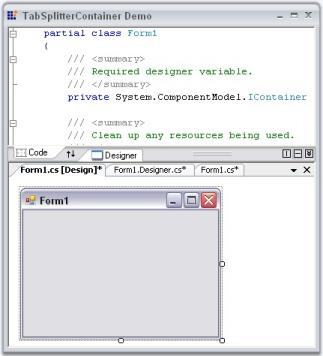

# Overview

Essential Tools TabSplitterContainer control is a VS 2008 control which can have multiple tab pages grouped under primary or secondary pages, in a container, separated by a splitter. The splitter comes with advanced options like swapping of splitter pages, adjustable splitter position, both at design time and run time, collapsing of the splitter panes and supports horizontal and vertical orientation of the splitter. This user guide will easily guide you with the features of TabSplitterContainer control.

The features of the TabSplitterContainer control are listed below.

* Lets you add primary and secondary pages. See Splitter Components topic.
* We can swap the tab pages easily by clicking a button. 
* The splitter orientation can be horizontal and vertical. 
* Splitter panes can be expanded or collapsed.
* Splitter pages has properties which can give great look and feel.

See Also

Concepts and Features

## Creating TabSplitterContainer Control

TabSplitterContainer control can be easily created through designer by just dragging and dropping onto the form. 

 

We can add primary or secondary pages using the below properties.

It can be created programmatically using the below steps.

1. Create or open a Windows Forms project.
2. Add Syncfusion's Tools.Windows and Shared.Base assemblies to the application.
3. Add the Syncfusion.Windows.Forms.Tools namespace.

   ~~~ cs

		using Syncfusion.Windows.Forms.Tools;
		
   ~~~
   {:.prettyprint }

   ~~~ vbnet

		Imports Syncfusion.Windows.Forms.Tools 

   ~~~
   {:.prettyprint }

4. Create and initialize the TabSplitterContainer control and TabSplitterPages.

   ~~~ cs

		private Syncfusion.Windows.Forms.Tools.TabSplitterPage tabSplitterPage1;

		private Syncfusion.Windows.Forms.Tools.TabSplitterPage tabSplitterPage2;

		private Syncfusion.Windows.Forms.Tools.TabSplitterContainer tabSplitterContainer1;

		this.tabSplitterPage1 = new Syncfusion.Windows.Forms.Tools.TabSplitterPage();

		this.tabSplitterPage2 = new Syncfusion.Windows.Forms.Tools.TabSplitterPage();

		this.tabSplitterContainer1 = new Syncfusion.Windows.Forms.Tools.TabSplitterContainer();

   ~~~
   {:.prettyprint }

   ~~~ vbnet

		Private tabSplitterPage1 As Syncfusion.Windows.Forms.Tools.TabSplitterPage

		Private tabSplitterPage2 As Syncfusion.Windows.Forms.Tools.TabSplitterPage

		Private tabSplitterContainer1 As Syncfusion.Windows.Forms.Tools.TabSplitterContainer

		Me.tabSplitterPage1 = New Syncfusion.Windows.Forms.Tools.TabSplitterPage() 

		Me.tabSplitterPage2 = New Syncfusion.Windows.Forms.Tools.TabSplitterPage() 

		Me.tabSplitterContainer1 = New Syncfusion.Windows.Forms.Tools.TabSplitterContainer()

   ~~~
   {:.prettyprint }

5. Add Splitter pages to the TabSplitterContainer.

   ~~~ cs

		this.tabSplitterContainer1.PrimaryPages.AddRange(new Syncfusion.Windows.Forms.Tools.TabSplitterPage[] {this.tabSplitterPage1});

		this.tabSplitterContainer1.SecondaryPages.AddRange(new Syncfusion.Windows.Forms.Tools.TabSplitterPage[] {this.tabSplitterPage2});

   ~~~
   {:.prettyprint }

   ~~~ vbnet

		Me.tabSplitterContainer1.PrimaryPages.AddRange(New Syncfusion.Windows.Forms.Tools.TabSplitterPage() {Me.tabSplitterPage1}) 

		Me.tabSplitterContainer1.SecondaryPages.AddRange(New Syncfusion.Windows.Forms.Tools.TabSplitterPage() {Me.tabSplitterPage2}) 

   ~~~
   {:.prettyprint }

6. Set the size and location of the control.

   ~~~ cs

		this.tabSplitterContainer2.Location = new System.Drawing.Point(195, 29);

		this.tabSplitterContainer2.Name = "tabSplitterContainer1";

		this.tabSplitterContainer2.Size = new System.Drawing.Size(300, 250);

		this.tabSplitterContainer2.SplitterPosition = 50;

		this.tabSplitterPage3.Text = "Code";

		this.tabSplitterPage4.Text = "Design";

   ~~~
   {:.prettyprint }

   ~~~ vbnet

		Me.tabSplitterContainer2.Location = New System.Drawing.Point(195, 29) 

		Me.tabSplitterContainer2.Name = "tabSplitterContainer1" 

		Me.tabSplitterContainer2.Size = New System.Drawing.Size(300, 250) 

		Me.tabSplitterContainer2.SplitterPosition = 50 

		Me.tabSplitterPage3.Text = "Code" 

		Me.tabSplitterPage4.Text = "Design"

   ~~~
   {:.prettyprint }

7. Add the control to the form.

   ~~~ cs

		this.Controls.Add(this.tabSplitterContainer2);

   ~~~
   {:.prettyprint }

   ~~~ vbnet

		Me.Controls.Add(Me.tabSplitterContainer2)

   ~~~
   {:.prettyprint }

