## Tabs Package

XP Tabs is a 100% native .NET TabControl implementation that comes with a lot more configuration and customization capabilities than the Legacy Wrapper that the .NET framework comes with. It provides all the basic functionalities of a standard TabControl and much more. 

{:.image }

The XP Tabs (TabControlAdv) feature provided as part of this package is an advanced TabControl with plenty of appearance styles and configuration capabilities. It makes the creation of custom tabs with custom shapes and styles a snap.

Resembling the class names in the framework, the TabControlAdv and TabPageAdv classes represent the TabControl and the TabPages of the XP Tabs Package. Users can parent one or more tabpages to a tabcontrol which lets them switch between these tabpages via a TabStrip (which is also referred as a TabPanel). The TabPages in turn are panel-derived classes that let users host ChildControls within them. 

The TabControlAdv and the TabPageAdv controls come with full design-time support.

#### Features Overview

The Tabs framework contains the TabControlAdv with a full set of features to support efficient tab usage to create rich user applications.

{:.image }

Features

* TabStyles - Tabs framework provides a number of pre-defined TabStyles and also allows to apply custom - style settings to the control.
* Appearance settings - The Tab appearance can be easily customized by stating the style definitions for the TabItems, TabPages and TabPanels individually.
* TabPrimitives - TabControlAdv provides an easy way to navigate through tabs. By setting TabPrimitives (previously, TabControlAdv's  NavigationControl property), users can traverse between tabs and pages easily which enables to go to the next or previous tab / page and first / last tab, close buttons can be added which closes the active tabpage when clicked and the dropdown with all the tabpages listed can be accessed by the user to select the tabpage to be traversed. NavigationControl offers more flexibility that allows you to change the button's image, show / hide certain buttons and also cancel the navigation and use it as an Add or Remove TabPages through code.
* Alignment and Sizing - The TabStrip can be aligned to the Top, Left, Right or Bottom of the control. Text alignment can be changed using the RotateTextWhenVertical property which will rotate the text and draw it horizontally when the alignment is set to Left. The Tabs can also be set to be displayed in Multiple lines using the Multiline property. The TabItems can be aligned from Left to Right and vice versa using the RightToLeft property. When the RightToLeft mode is activated and RotateTabsWhenRTL property is enabled, tab rotation is allowed. The SizeMode can be set to either Normal, Fixed, ShrinkToFit or FillToRight.
* LabelEdit - TabPage's text can be edited during run-time using LabelEdit property. LabelEdit feature has the following events associated with it.
* BeforeEdit - Occurs when the text enters into the edit mode.
* AfterEdit - Occurs after the new text is entered.
* LabelEditTextChanged - Occurs when the text of the tab is changed.
* LabelEditChanged -__Occurs when the LabelEdit property is toggled.
* Image Support - TabPage's text can be associated with images. Images can be aligned according to the alignment of the tabs.
* Color Properties - TabControlAdv allows the user to set different colors for active and inactive tabs using ActiveTabColor, InactiveTabcolor, TabBackColor, TabForeColor and TabPanelBackColor properties.
* Themes Support - TabControlAdv provides complete theme support. Using the ThemesEnabled property, XP themes can be enabled for this control.
* TabPersistence - Complete persistence support is now available for TabControlAdv using the PersistTabState property.
> 

{:.image }
 _Note: TabState has been saved at the following location: C:\Documents and Settings\Username*\Local Settings\Application Data\IsolatedStorage._

* Close button can be added for each TabPage like IE7 to close the tabpage.

{:.image }

* Lets you set tooltips for every TabPrimitives.
* Added VS2008 TabStyle for TabControlAdv.
* Added Border settings for the control which is implemented especially for VS2008 TabStyle.
* TabPage Closed and Closing events are added.

A sample which illustrates the features of TabControlAdv is available in the following sample installation location.

…\_My Documents\Syncfusion\EssentialStudio\Version Number\Windows\Tools.Windows\Samples\Advanced Editor Functions\ActionGroupingDemo_

#### TabControlAdv

TabControlAdv in Toolbox

TabControlAdv is a control in the Tabs Package that manages a set of TabPages and provides options to customize the TabPages according to the needs of the user. 

{:.image }

The TabControlAdv automatically adds pages to every tabitem being added to the application with uniform dimensions for all the pages. 

{:.image }

TabPanels

TabPanels are used to switch between the various tab pages / tab items in the TabControlAdv.

TabItems

TabItems are items added to the TabControlAdv by default when a tabpage is added. Unlike the usual items, the tabitems when clicked, provide access to the respective tabpages and does not contain any event to hold the user written code.

TabPages

TabPages are the pages included in the TabControl. The TabPages are laid one above the other and only a single tabpage can be viewed at a time. Each page acts as a ContainerControl and can host ChildControls within it using the TabPageAdv panel-derived class.

 The TabPageAdv can be added to the TabControlAdv through designer as well as through code.

Creating a TabControlAdv Through Designer

Creating a TabControlAdv Programmatically

#### Creating TabControlAdv

This tutorial will show you how the TabControlAdv is created through designer and code which are discussed in the below topics.

##### Through Designer

To create a TabControlAdv through designer,

1. Drag and drop a TabControlAdv object from the controls toolbox onto your form.
2. Add TabPages to the control in the designer in the following ways.
3. Right click on the TabControlAdv and select the Add Tab option. This adds a tabpage to the TabControlAdv.

{:.image }

4. In the Properties window, select the TabPages property. The TabPageAdv Collection Editor will be opened. Click Add, a tabpage will be added to the TabControlAdv.

{:.image }

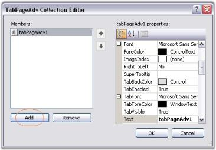
{:.image }

{:.image }

##### Through Code

To create a TabControlAdv programmatically,

1. Add the Syncfusion assembly Tools.Windows to your application.
2. Add the namespace Syncfusion.Windows.Forms.Tools.

[C#]

using Syncfusion.Windows.Forms.Tools;

[VB.NET]

Imports Syncfusion.Windows.Forms.Tools

3. Declare the TabControlAdv and TabPageAdv.

[C#]

private Syncfusion.Windows.Forms.Tools.TabControlAdv tabControlAdv1;

private Syncfusion.Windows.Forms.Tools.TabPageAdv tabPageAdv1;

private Syncfusion.Windows.Forms.Tools.TabPageAdv tabPageAdv2;

private Syncfusion.Windows.Forms.Tools.TabPageAdv tabPageAdv3;

[VB.NET]

Private tabControlAdv1 As Syncfusion.Windows.Forms.Tools.TabControlAdv

Private tabPageAdv1 As Syncfusion.Windows.Forms.Tools.TabPageAdv

Private tabPageAdv2 As Syncfusion.Windows.Forms.Tools.TabPageAdv

Private tabPageAdv3 As Syncfusion.Windows.Forms.Tools.TabPageAdv

4. The following code creates a TabControlAdv with three tabpages.

[C#]

private void Form1_Load(object sender, System.EventArgs e)

{

    //Initialize the tabControlAdv and tabPageAdv

    this.tabControlAdv1 = new TabControlAdv();

    this.tabPageAdv1 = new TabPageAdv();

    this.tabPageAdv2 = new TabPageAdv();

    this.tabPageAdv3 = new TabPageAdv();

    //Add the TabPageAdv to the TabControlAdv.

    this.tabControlAdv1.Controls.AddRange(new Control[]{this.tabPageAdv1, this.tabPageAdv2, this.tabPageAdv3});

    //Set the location of the TabContolAdv

    this.tabControlAdv1.Location = new Point(16, 24);

    //Set the text of the TabPageAdv

    this.tabPageAdv1.Text = "Tab1";

    this.tabPageAdv2.Text = "Tab2";

    this.tabPageAdv3.Text = "Tab3";

    //Add the TabControlAdv to your form                

    this.Controls.AddRange(new Control[] { this.tabControlAdv1});

}

[VB.NET]

Private Sub Form1_Load(ByVal sender As Object, ByVal e As System.EventArgs) Handles MyBase.Load

    'Initialize the tabControlAdv and tabPageAdv

    Me.tabControlAdv1 = New TabControlAdv()

    Me.tabPageAdv1 = New TabPageAdv()

    Me.tabPageAdv2 = New TabPageAdv()

    Me.tabPageAdv3 = New TabPageAdv()

    'Add the TabPageAdv to the TabControlAdv.

    Me.tabControlAdv1.Controls.AddRange(New Control() {Me.tabPageAdv1, Me.tabPageAdv2, Me.tabPageAdv3})

    'Set the location of the TabContolAdv

    Me.tabControlAdv1.Location = New Point(16, 24)

    'Set the text of the TabPageAdv

    Me.tabPageAdv1.Text = "Tab1"

    Me.tabPageAdv2.Text = "Tab2"

    Me.tabPageAdv3.Text = "Tab3"

    'Add the TabControlAdv to your form                

    Me.Controls.AddRange(New Control() {Me.tabControlAdv1})

End Sub

#### Concepts and Features

This section discusses the following topics which describe the concepts and features of TabControlAdv.

##### TabControlAdv

The look and feel of the TabControlAdv can be controlled through the appearance properties of the control. These properties are discussed in detail in the below topics.

###### TabItems Customization

TabItems can be customized using the properties given below.

Renaming TabItems

TabControlAdv comes with the renaming functionality similar to MS Excel. Users can edit TabControlAdv's text at run-time using the LabelEdit property which has to be set to True. 

_Table_ _803__: Property Table_

<table>
<tr>
<td>
TabControlAdv Property</td><td>
Description</td></tr>
<tr>
<td>
LabelEdit</td><td>
Specifies whether the text of the tabitem is editable. Default value is False.</td></tr>
</table>

To bring the text of the tabitem to the edit mode, the following can be done.

1. Select the text of the tabitem to be edited and right-click on the tab to bring the text to edit mode. The text can now be edited and it  can be saved by pressing the Return key.
2. Also, double-clicking on a tab makes the text change to edit mode.

{:.image }

After editing the text, to come out of the edit mode, press the Enter key or click the Left Mouse button.

3. Programmatically the LabelEdit property can be set as follows.

[C#]

// Renaming TabControlAdv’s Text.

this.tabControlAdv.LabelEdit = true;

[VB.NET]

' Renaming TabControlAdv’s Text.

Me.tabControlAdv.LabelEdit = True

> 
{:.image }
 _Note: The visibility of the tab items can be set through TabVisible property. It can be enabled / disabled using TabEnabled property._

Moving TabItems

The order of the tabs within the TabControlAdv can be changed at design-time and also at run-time by simply dragging-and-dropping the tabs in the required places. This can be enabled using the UserMoveTabs property.

[C#]

this.tabControlAdv1.UserMoveTabs = true;

[VB.NET]

Me.tabControlAdv1.UserMoveTabs = True

Padding

Using the Padding property, the space around the text / image of the tabitems can be changed by settings the X-axis and Y-axis values.

Code snippets to set the Padding

[C#]

// Setting the Padding for TabControlAdv through Coding. 

this.tabControlAdv1.Padding = new Point(12, 12); 

[VB.NET]

'Setting the Padding for TabControlAdv through Coding. 

Me.tabControlAdv1.Padding = New Point(12, 12)

{:.image }

> 
{:.image }
 _Note: The TabControlAdv.OnTabPanelBoundsAffected() method forces the TabControlAdv to re-layout it's elements._

###### Multiline Support

Multiple level of tabs can be created by setting the Multiline property of the TabControl to true, which places the tabs in more than one line. This allows the tabs to be arranged in multiple lines when the tabs exceed the width of the control, with all the tabitems in view.

The tabitem's text can be placed in more than one line by setting the MultilineText property.

_Table_ _804__: Property Table_

<table>
<tr>
<td>
TabControlAdv Property</td><td>
Description</td></tr>
<tr>
<td>
Multiline</td><td>
Allows the tabs to be arranged in multiple lines when the tabs exceed the width of the control, with all the tabitems in view.</td></tr>
<tr>
<td>
MultilineText</td><td>
Allows the tabitem's text to be placed in more than one line.</td></tr>
</table>

[C#]

this.tabControlAdv1.Multiline = true;

this.tabControlAdv1.MultilineText = true;

this.tabControlAdv1.KeepSelectedTabInFrontRow = true;

[VB.NET]

Me.tabControlAdv1.Multiline = True

Me.tabControlAdv1.MultilineText = True

Me.tabControlAdv1.KeepSelectedTabInFrontRow = True

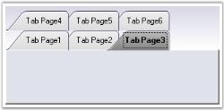
{:.image }

The KeepSelectedTabInFrontRow property will bring the selected tab to the front row (applicable only in the case of Multiline Tabs).

UseMnemonic

This property specifies whether the TabControlAdv interprets the Ampersand character (&) to be an Access key prefix character or not. The default value is set to False.

_Table_ _805__: Property Table_

<table>
<tr>
<td>
TabControlAdv Property</td><td>
Description</td></tr>
<tr>
<td>
UseMnemonic</td><td>
Gets / sets the value which determines whether the TabControlAdv should interpret the Ampersand character (&) to be an Access key prefix character or not.</td></tr>
</table>
###### TabPages

TabPages

On Clicking the TabPages property in the Properties grid, the TabPageAdv Collection Editor will be opened. 

{:.image }

The TabPageAdv Collection Editor can be used to add TabPages to the TabControlAdv and customize the TabPages according to needs of the user. 

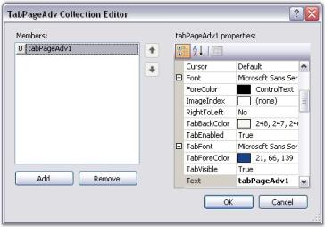
{:.image }

Border Settings

The BorderStyle property of TabControlAdv can be used to set the border styles for the TabPages.

The three types of border styles are given below.

* FixedSingle
* Fixed 3D
* None

_Table_ _806__: Property Table_

<table>
<tr>
<td>
TabControlAdv Property</td><td>
Description</td></tr>
<tr>
<td>
BorderStyle</td><td>
Gets / sets the border styles for the tabpages. It includes the following styles:FixedSingleFixed3DNone</td></tr>
</table>

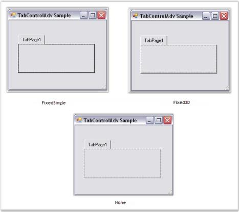
{:.image }

FixedSingleBorderColor

The FixedSingleBorderColor property is used to set a color for the border of the TabPage in the TabControlAdv when the BorderStyle is set to FixedSingle.

_Table_ _807__: Property Table_

<table>
<tr>
<td>
TabControlAdv Property</td><td>
Description</td></tr>
<tr>
<td>
FixedSingleBorderColor</td><td>
Gets / sets a color for the border of the TabPage in the TabControlAdv when the BorderStyle is set to FixedSingle.</td></tr>
</table>

{:.image }

> 
{:.image }
 _Note: The TabControlAdv.ResetFixedSingleBorderColor() method resets the border color of the TabPage to the default value._

###### Other Settings

TabControlAdv now supports animation on tab pages. Animated image in GIF can be inserted in a tab page. The format supports up to 8 bits per pixel with a palette of up to 256 distinct colors chosen from the 24-bit RGB color space. Both 3D and 2D formats are supported.

Users can insert graphics or logos with solid areas of color, small animations, low-resolution film clips etc. to make the tab page more interactive and lively. The size of the image can also be adjusted. 

There are two major properties which come into picture:

* Image
* Image size

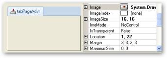
{:.image }

The following table lists the properties of the GIF image:

_Table_ _808__: Property Table_

<table>
<tr>
<td>
 Property</td><td>
Description</td><td>
Type of Property</td></tr>
<tr>
<td>
Image</td><td>
Allows the user to insert the required image using the location where the image is saved.</td><td>
Image</td></tr>
<tr>
<td>
ImageSize</td><td>
Allows the users to modify the size of the image.</td><td>
Size</td></tr>
</table>
Inserting GIF Image

The code should be in the following format:

[C#]

this.tabPageAdv.Image = Image.FromFile(imagepath);

this.tabPageAdv.ImageSize = new System.Drawing.Size(height,width);

The following code illustrates insertion of the required GIF image.

[C#]

this.tabPageAdv.Image = Image.FromFile(“sample.gif”);

this.tabPageAdv.ImageSize = new System.Drawing.Size(16,16);

> 
{:.image }
_Note: Only when the ImageIndex property is -1, Image from the Image property will be displayed or else Image from ImageList will be displayed._

Run the code. The required image is displayed.

###### Prevent moving a specific Tab in TabControlAdv 

TabControlAdv now allows to prevent a specific tab control from being moved on a TabControlAdv. This is achieved with the newly added API TabMoving.

[C#]

// Prevents moving the tab.

this this.tabControlAdv1.TabMoving += new Syncfusion.Windows.Forms.Tools.TabMovingEventHandler(tabControlAdv1_TabMoving);

void tabControlAdv1_TabMoving(object sender, Syncfusion.Windows.Forms.Tools.TabMovingEventArgs e)

        {

            if(e.From == 1 || e.Target == 1)

            {

                e.Cancel = true;

            }

        }     

[VB.NET]

‘Prevents moving the tab.

Private Me.tabControlAdv1.TabMoving += New Syncfusion.Windows.Forms.Tools.TabMovingEventHandler(AddressOf tabControlAdv1_TabMoving)

Private Sub tabControlAdv1_TabMoving(ByVal sender As Object, ByVal e As Syncfusion.Windows.Forms.Tools.TabMovingEventArgs)

If e.From = 1 OrElse e.Target = 1 Then

e.Cancel = True

End If

End Sub

#### TabPrimitives

TabPrimitives is a collection of NavigationControls used to navigate through the TabPages of the TabControlAdv. 

The various TabPrimitives are,

* FirstTab - Goes to the first tab among the pages.
* LastTab - Goes to the last tab among the pages.
* PreviousTab - Goes to the previous tab of the active tab.
* NextTab - Goes to the next tab of the active tab.
* PreviousPage - Goes to the previous page of the active page.
* NextPage - Goes to the next page of the active page.
* DropDown - This pops-up a list of the available tabpages in the control from which the user can select the page to be traversed.
* Close - This button is used to close the TabControlAdv. It can be set to appear for the whole control or individual tabpages. 
* Custom - User can add more buttons through Custom TabPrimitive. This helps the user to create / add more buttons and handle their own click events.

{:.image }

> 
{:.image }
 _Note: The TabControlAdv.HitTestTabs() method can be used to return the tab at the specified location._ 

TabPrimitives Features

Apart from doing the defined task of Navigation, TabPrimitivesHost comes with options for adding Images, ToolTips and enabling the Visible property for each TabPrimitive.

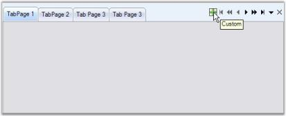
{:.image }

> 
{:.image }
 _Note: You can set the other properties for adding Images and ToolTips for the TabPrimitives using the TabPrimitives Collection Editor._ 

ToolTips feature is available for TabPrimitives.

##### Creating TabPrimitives

Creating TabPrimitives Through Designer

To create Tab Primitives through designer, follow the steps given below.

1. After adding a TabControlAdv with a set of TabPages in it, select the TabPrimitivesHost.TabPrimitives property in the Properties window.

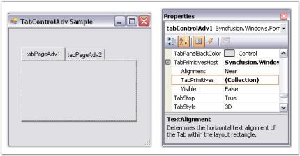
{:.image }

2. ATabPrimitives Collection Editor will be opened. Click the Add option in the Editor to add a TabPrimitive.

{:.image }

3. Set the TabPrimitiveType as required and click Ok.

{:.image }

Code snippets to add TabPrimitives programmatically

[C#]

//Adds a TabPrimitive of type DropDown.

this.tabControlAdv4.TabPrimitivesHost.TabPrimitives.Add(new Syncfusion.Windows.Forms.Tools.TabPrimitive(Syncfusion.Windows.Forms.Tools.TabPrimitiveType.DropDown, null, System.Drawing.Color.Empty, true, 1, "TabPrimitive0"));

//Adds a TabPrimitive of type Close.

this.tabControlAdv1.TabPrimitivesHost.TabPrimitives.Add(new Syncfusion.Windows.Forms.Tools.TabPrimitive(Syncfusion.Windows.Forms.Tools.TabPrimitiveType.Close, null, System.Drawing.Color.Empty, true, 1, "TabPrimitive1"));

//Similarly other TabPrimitive types are added.

//Makes the TabPrimitive visible in the control.

this.tabControlAdv1.TabPrimitivesHost.Visible = true;

[VB.NET]

'Adds a TabPrimitive of type DropDown.

Me.tabControlAdv4.TabPrimitivesHost.TabPrimitives.Add(New Syncfusion.Windows.Forms.Tools.TabPrimitive(Syncfusion.Windows.Forms.Tools.TabPrimitiveType.DropDown, Nothing, System.Drawing.Color.Empty, True, 1, "TabPrimitive0"))

'Adds a TabPrimitive of type Close.

Me.tabControlAdv1.TabPrimitivesHost.TabPrimitives.Add(New Syncfusion.Windows.Forms.Tools.TabPrimitive(Syncfusion.Windows.Forms.Tools.TabPrimitiveType.Close, Nothing, System.Drawing.Color.Empty, True, 1, "TabPrimitive1"))

'Similarly other TabPrimitive types are added.

'Makes the TabPrimitive visible in the control.

Private Me.tabControlAdv1.TabPrimitivesHost.Visible = True

> 
{:.image }
 _Note: After adding TabPrimitives, set the TabPrimitiveHost.Visible property to True. Now the TabPrimitives added will be visible in the TabControlAdv._

#### TabNavigation

TabControlAdv provides an easy way to navigate through tabs. Setting TabPrimitives (previously, NavigationControl) allows the users to move to the next or previous tab / page and easily traverse to the first / last tab.

TabPrimitives are more flexible, which provides aCloseButton to close tabs and a DropDown that pops-up with a list of all the available TabPages from which the user can choose from.

The Visible property must be set to True to display the tabprimitives added to the control.

SwitchPagesForDialogKeys property available for the TabControlAdv specifies if the control should switch tabpages on pressing Ctrl+Tab or Ctrl+Shift+Tab.

The TabPrimitiveHost property allows to customize the navigation and close buttons by defining it through the TabPrimitives Property Collection. The tabprimitives can be added and each primitive can be assigned with the type to be used, which includes primitives to traverse to the First / Previous / Next / LastTab, Next / PreviousPage and Close / DropDown options.

{:.image }

#### Styles Settings

This section discusses the various Style Settings available in TabControlAdv.

The topics discussed are given below.

##### ITabRenderer

ITabRenderer interface (or derive from TabRendererBase, a base implementation of ITabRenderer), could be implemented to gain more control over the display of tabs. 

The Renderer property returns the current Syncfusion.Windows.Forms.Tools.ITabRenderer used by the TabControl to render the TabPanel.

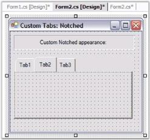
{:.image }

> 
{:.image }
 _Note: Refer to CustomTabControl sample which demonstrates this feature._ 

Once you have a Custom ITabRenderer implementation, you can, if necessary, make it available to the TabControlAdv at design-time. To do so, 

1. First select the Add Custom Tabs entry in the drop-down list that pops-up from the TabStyle property editor. This will insert a new DesignTimeTabTypeLoader component into your forms designer. 

{:.image }

2. Insert the fully qualified type name of your Custom TabRenderer class (for example: Syncfusion.Samples.Tools.TabRendererNotched) to the DesignTimeTabTypeLoader's TypesToLoadList. This will try to load your class into the DesignTimeTabTypeLoader's TypesToLoadList, assuming the type is in the same project as the designer or the assembly in which this type resides is referenced. You will now find an entry in the TabControlAdv.TabStyle editor list corresponding to your Custom TabRenderer. 

{:.image }

See Also

TabStyles

###### TabAlignment

Alignment of the Tabs can be set through the below properties.

_Table_ _809__: Property Table_

<table>
<tr>
<td>
TabControlAdv Property</td><td>
Description</td></tr>
<tr>
<td>
Alignment</td><td>
Specifies the alignment of tabitems with respect to the tab pages. The options include:TopBottomLeftRight</td></tr>
<tr>
<td>
VerticalAlignment</td><td>
Specifies whether the tabs are aligned to the Top, Bottom or based on the RightToLeft property when aligned vertically.</td></tr>
<tr>
<td>
TabGap</td><td>
Specifies the space between the tabitems.</td></tr>
<tr>
<td>
Top</td><td>
Gets / sets the distance, in pixels, between the top edge of the control and the top edge of the container's client area.</td></tr>
<tr>
<td>
Right</td><td>
Gets / sets the distance, in pixels, between the right edge of the control and the left edge of the container's client area.</td></tr>
</table>

{:.image }

[C#]

this.tabControlAdv1.Alignment = System.Windows.Forms.TabAlignment.Left;

this.tabControlAdv1.TabGap = 2;

[VB.NET]

Me.tabControlAdv1.Alignment = System.Windows.Forms.TabAlignment.Left

Me.tabControlAdv1.TabGap = 2

See Also

TabStyles

##### Text Alignment

The below properties deals with alignment of the text in the TabControlAdv.

_Table_ _810__: Property Table_

<table>
<tr>
<td>
TabPageAdv Property</td><td>
Description</td></tr>
<tr>
<td>
TextAlignment</td><td>
Specifies horizontal alignment for the text of the tabitem.</td></tr>
<tr>
<td>
TextLineAlignment</td><td>
Specifies vertical alignment for the text of the tabitem.</td></tr>
</table>

[C#]

this.tabControlAdv1.TextAlignment = System.Drawing.StringAlignment.Far;

this.tabControlAdv1.TextLineAlignment = System.Drawing.StringAlignment.Near;

[VB.NET]

Me.tabControlAdv1.TextAlignment = System.Drawing.StringAlignment.Far

Me.tabControlAdv1.TextLineAlignment = System.Drawing.StringAlignment.Near

##### TabSize Settings

SizeMode

The SizeMode of the tabstrip allows to position the tabitems according to the selected options.

_Table_ _811__: Property Table_

<table>
<tr>
<td>
TabControlAdv property</td><td>
Description</td></tr>
<tr>
<td>
SizeMode</td><td>
Specifies how the tabs should be sized and aligned. The options include:Normal,Fixed,FillToRight,ShrinkToFit.</td></tr>
</table>

* In Normal mode, the size of each tab depends on the text and image settings of the tab.
* In Fixed mode, the size of each tab is the same and is the value specified in the ItemSize property.
* In ShrinkToFit mode, the width of each tab is shrunk so that all the tabs are visible (this is only applicable to the tabcontrols in the single-line mode). 
* In FillToRight mode, the width of each tab is sized so that each row of tabs occupies the entire width of the ContainerControl (this is only applicable to tabcontrols with more than one row).

[C#]

this.tabControlAdv1.SizeMode = Syncfusion.Windows.Forms.Tools.TabSizeMode.Normal;

this.tabControlAdv1.SizeMode = Syncfusion.Windows.Forms.Tools.TabSizeMode.Fixed;

this.tabControlAdv1.SizeMode = Syncfusion.Windows.Forms.Tools.TabSizeMode.ShrinkToFit;

this.tabControlAdv1.SizeMode = Syncfusion.Windows.Forms.Tools.TabSizeMode.FillToRight;

[VB.NET]

Me.tabControlAdv1.SizeMode = Syncfusion.Windows.Forms.Tools.TabSizeMode.Normal

Me.tabControlAdv1.SizeMode = Syncfusion.Windows.Forms.Tools.TabSizeMode.Fixed

Me.tabControlAdv1.SizeMode = Syncfusion.Windows.Forms.Tools.TabSizeMode.ShrinkToFit

Me.tabControlAdv1.SizeMode = Syncfusion.Windows.Forms.Tools.TabSizeMode.FillToRight

{:.image }

 The below methods are raised when the tabcontroladv is resized.

_Table_ _812__: Methods Table_

<table>
<tr>
<td>
Methods</td><td>
Description</td></tr>
<tr>
<td>
AutoSize</td><td>
Specifies whether a control should automatically resize itself to fit it's contents. The default value is set to False.</td></tr>
<tr>
<td>
AutoSizeMode</td><td>
Specifies the mode by which the user interface element automatically resizes itself. The options include:GrowOnly - This is used only when the controls have to be expanded.GrowAndShrink - This is used when the controls have to be expanded and shrunk. </td></tr>
</table>
##### TabStyles

TabControl provides options to customize the TabStyle settings. Styles can be set through TabStyle property.

_Table_ _813__: Property Table_

<table>
<tr>
<td>
TabControlAdv Property</td><td>
Description</td></tr>
<tr>
<td>
TabStyle</td><td>
Specifies the look and feel of the Tabcontrol. The options include,2D,3D,Workbook,InternetExplorer7Style,OneNoteStyle,VS2005DockingStyle,Office2007Style,VS2005Style,VS2005DockingStyleBeta,Office2003Style and VS2008Style.</td></tr>
</table>

[C#]

this.tabControlAdv1.TabStyle = typeof(Syncfusion.Windows.Forms.Tools.TabRendererWorkbookMode);

[VB.NET]

Me.tabControlAdv1.TabStyle = GetType(Syncfusion.Windows.Forms.Tools.TabRendererWorkbookMode)

Given below are the various TabStyles along with the Office 2007 Style supporting all the three color schemes (Blue, Silver and Black).

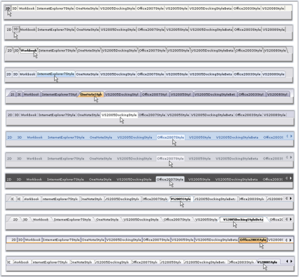
{:.image }

> 
{:.image }
 _Note: We can apply border styles when TabStyle is set to VS2008Style. Refer_ Border for TabControlAdv _topic to know more._

Custom Color Schemes

Custom colors can also be applied to the TabControlAdv. Use the below code snippet.

[C#]

//Set the below code for applying the managed color scheme.

this.FormTabControl.TabStyle = typeof(TabRendererOffice2007);

this.FormTabControl.Office2007ColorScheme = Office2007Theme.Managed;

Office2007Colors.ApplyManagedColors(this, Color.Green);

[VB.NET]

'Set the below code for applying the managed color scheme.

Me.FormTabControl.TabStyle = GetType(TabRendererOffice2007)

Me.FormTabControl.Office2007ColorScheme = Office2007Theme.Managed

Office2007Colors.ApplyManagedColors(Me, Color.Green)

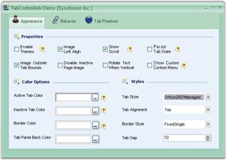
{:.image }

A sample which illustrates CustomTab control and Flat Tabs is available in the below sample location.

…\_My Documents\Syncfusion\EssentialStudio\Version Number\Windows\Tools.Windows\Samples\Advanced Editor Functions\ActionGroupingDemo_

*  VS 2010 Style for TabControlAdv 
* TabControlAdv’s TabStyle can be changed to VS2010 style. 
* VS2010Style is added to the TabStyle’s collection.  

{:.image }

Add VS 2010 Style for TabControlAdv, by using the following code. 

[C# .Net]

  this.tabControlAdv1.TabStyle = typeof(Syncfusion.Windows.Forms.Tools.TabRendererVS2010)

[VB .Net]

Me. tabControlAdv1.TabStyle= GetType(Syncfusion.Windows.Forms.Tools.TabRendererVS2010)

#### Appearance Settings

The various appearance settings for TabControlAdv are discussed in this section. 

It includes the below topics.

##### Background Settings

This section discusses the various Background Settings available in TabControlAdv.

It includes the below topics.

###### BackgroundImage Settings

Essential Tabs provide a set of options to customize the TabControlAdv with images. 

The TabControlAdv can have,

* Images inside the TabItems.
* Images outside the TabBounds.
* Image as Background for the TabPage.

Images in TabItems

To set images to the TabItems, add an ImageListControl and populate it with the required images. Then set the ImageIndex property of the TabPage to one of the indices, to display the corresponding image to the left of the text by default.

{:.image }

ImageAlignmentR of the TabControlAdv allows you to set the tab's text and image. By default the image appears to the left and the text appears to the right. This setting can be changed using one of the below given options.

_Table_ _814__: Property Table_

<table>
<tr>
<td>
TabControlAdv Property</td><td>
Description</td></tr>
<tr>
<td>
ImageAlignmentR</td><td>
Specifies the alignment of the image relative to the text. The options include,LeftOfText,RightOfText,AboveText,BelowText andOverlap.</td></tr>
<tr>
<td>
ImageIndex</td><td>
Gets / sets the image for the tabitem.</td></tr>
</table>
Code snippets showing the Image Settings

[C#]

this.tabControlAdv1.ImageAlignmentR = Syncfusion.Windows.Forms.Tools.RelativeImageAlignment.RightOfText;

this.tabPageAdv1.ImageIndex = 0;

[VB]

Me.tabControlAdv1.ImageAlignmentR = Syncfusion.Windows.Forms.Tools.RelativeImageAlignment.RightOfText

Me.tabPageAdv1.ImageIndex = 0

Images outside the TabBounds

TabControlAdv can have images set outside the TabBounds.

{:.image }

To move the image outside the TabBounds, set the below given properties.

_Table_ _815__: Property Table_

<table>
<tr>
<td>
TabControlAdv Property</td><td>
Description</td></tr>
<tr>
<td>
ImageOffset</td><td>
Adjusts Y-axis position of the image.</td></tr>
<tr>
<td>
AdjustTopGap</td><td>
Adjusts the gap between the tabcontroladv's top and tabs.</td></tr>
<tr>
<td>
LevelTextAndImage</td><td>
Indicates whether the text and image should be in the same level.</td></tr>
<tr>
<td>
ItemSize</td><td>
Sets the size of the tabs.</td></tr>
</table>
Background Image for TabPages

The below properties sets the background image for the pages.

_Table_ _816__: Property Table_

<table>
<tr>
<td>
TabPageAdv Property</td><td>
Description</td></tr>
<tr>
<td>
BackgroundImage</td><td>
Specifies the background image for the tabpage.</td></tr>
<tr>
<td>
BackgroundImageLayout</td><td>
Specifies the layout for the background image when set. The options include:None,Tile,Center,Stretch andZoom.</td></tr>
</table>

[C#]

this.tabPageAdv1.BackgroundImage = imageList1.Images[0];

this.tabPageAdv1.BackgroundImageLayout = System.Windows.Forms.ImageLayout.Right;

[VB]

Private Me.tabPageAdv1.BackgroundImage = imageList1.Images(0)

Private Me.tabPageAdv1.BackgroundImageLayout = System.Windows.Forms.ImageLayout.Right

DisableInactivePageImage

The DisableInactivePageImage property specifies the value which determines whether the image should be disabled when the TabPage is not selected. The default value is set to True.

_Table_ _817__: Property Table_

<table>
<tr>
<td>
TabControlAdv Property</td><td>
Description</td></tr>
<tr>
<td>
DisableInactivePageImage</td><td>
Gets / sets the value which determines whether the image should be disabled when the TabPage is not selected.</td></tr>
</table>

[C#]

this.tabPageAdv1.DisableInactivePageImage = imageList1.Images[0];

[VB]

Private Me.tabPageAdv1.DisableInactivePageImage = imageList1.Images(0)

###### BackColor Settings

BackColor Settings for the TabControl

The look and feel of the tabcontrols can be customized using the below Tab and Panel properties. 

_Table_ _818__: Property Table_

<table>
<tr>
<td>
TabControlAdv Property</td><td>
Description</td></tr>
<tr>
<td>
ActiveTabColor</td><td>
Specifies the backcolor for the selected tab.</td></tr>
<tr>
<td>
BackColor</td><td>
Specifies the backcolor for all the tabpages.</td></tr>
<tr>
<td>
InactiveTabColor</td><td>
Specifies the backcolor to be used for the inactive tabs.</td></tr>
<tr>
<td>
TabPanelBackColor</td><td>
Specifies the color for the tabpanel over which the tabitems are laid.</td></tr>
</table>
BackColor Settings for the TabItems

The backcolor of the individual tabitems can be customized by setting the TabBackColor property of the corresponding tabpages.

_Table_ _819__: Property Table_

<table>
<tr>
<td>
TabControlAdv Property</td><td>
Description</td></tr>
<tr>
<td>
TabBackColor</td><td>
Specifies the backcolor for the tabitem.</td></tr>
</table>

[C#]

this.tabControlAdv1.ActiveTabColor = System.Drawing.Color.Ivory;

this.tabControlAdv1.InactiveTabColor = System.Drawing.Color.Silver;

this.tabControlAdv1.TabPanelBackColor = System.Drawing.Color.White;

this.tabControlAdv1.BackColor = System.Drawing.Color.Yellow;

this.tabPageAdv1.TabBackColor = System.Drawing.Color.Pink;

[VB.NET]

Private Me.tabControlAdv1.ActiveTabColor = System.Drawing.Color.Ivory

Private Me.tabControlAdv1.InactiveTabColor = System.Drawing.Color.Silver

Private Me.tabControlAdv1.TabPanelBackColor = System.Drawing.Color.White

Private Me.tabControlAdv1.BackColor = System.Drawing.Color.Yellow

Private Me.tabPageAdv1.TabBackColor = System.Drawing.Color.Pink

{:.image }

{:.image }

##### Foreground Settings

This section discusses the various Foreground Settings available in TabControlAdv.

It includes the below topics.

###### Font Settings

Font Settings for the TabControl

The font settings for the TabControlAdv can be controlled through Font and ActiveTabFont properties.

_Table_ _820__: Property Table_

<table>
<tr>
<td>
TabControlAdv Property</td><td>
Description</td></tr>
<tr>
<td>
ActiveTabFont</td><td>
Specifies the font of the selected tabitem text.</td></tr>
<tr>
<td>
Font</td><td>
Specifies the font for all the tabitems' text.</td></tr>
</table>

[C#]

this.tabControlAdv1.ActiveTabFont = new System.Drawing.Font("Verdana", 8.25F, System.Drawing.FontStyle.Bold, System.Drawing.GraphicsUnit.Point, ((byte)(0)));

this.tabControlAdv1.Font = new System.Drawing.Font("Verdana", 8.25F, System.Drawing.FontStyle.Regular, System.Drawing.GraphicsUnit.Point, ((byte)(0)));

[VB.NET]

Private Me.tabControlAdv1.ActiveTabFont = New System.Drawing.Font("Verdana", 8.25F, System.Drawing.FontStyle.Bold, System.Drawing.GraphicsUnit.Point, (CByte(0)))

Private Me.tabControlAdv1.Font = New System.Drawing.Font("Verdana", 8.25F, System.Drawing.FontStyle.Regular, System.Drawing.GraphicsUnit.Point, (CByte(0)))

Font Settings for the TabItems

_Table_ _821__: Property Table_

<table>
<tr>
<td>
TabPageAdv Property</td><td>
Description</td></tr>
<tr>
<td>
TabFont</td><td>
Specifies the font for the tabitem.</td></tr>
</table>

[C#]

this.tabPageAdv1.TabFont = new System.Drawing.Font("Trebuchet MS", 8.25F, System.Drawing.FontStyle.Regular, System.Drawing.GraphicsUnit.Point, ((byte)(0)));

[VB.NET]

Me.tabPageAdv1.TabFont = New System.Drawing.Font("Trebuchet MS", 8.25F, System.Drawing.FontStyle.Regular, System.Drawing.GraphicsUnit.Point, CType((0), Byte))

{:.image }

To set image for tab items, see BackgroundImage Settings.

###### ForeColor Settings

ForeColor Settings for the TabItems

The text color of the tabitems can be customized by setting the TabForeColor property of the corresponding tabpages.

_Table_ _822__: Property Table_

<table>
<tr>
<td>
TabPageAdv Property</td><td>
Description</td></tr>
<tr>
<td>
TabForeColor</td><td>
Specifies the color for the text of the tabitem.</td></tr>
</table>

[C#]

this.tabPageAdv1.TabForeColor = System.Drawing.Color.Sienna;

[VB.NET]

Private Me.tabPageAdv1.TabForeColor = System.Drawing.Color.Sienna

{:.image }

##### Border for TabControlAdv

This section discusses the border settings available for the TabControlAdv when TabStyles is set to VS2008Style. Set TabControlAdv.BorderVisible property to true to display the control border. By default it is false.

[C#]

this.tabControlAdv1.BorderVisible = true;

[VB.NET]

Me.tabControlAdv1.BorderVisible = True

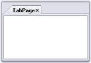
{:.image }

We can set width for the border using BorderWidth property. Default value is 5.

[C#]

this.tabControlAdv1.BorderWidth = 10;

[VB.NET]

Me.tabControlAdv1.BorderWidth = 10

{:.image }

> 
{:.image }
 _Note: These border properties are especially implemented for "VS2008Style"_ TabStyles.

#### Applying Themes

The TabControlAdv can be themed by enabling the ThemesEnabled property.

> 
{:.image }
 _Note: On setting this property, all the tabpages will be themed. This can be disabled or enabled for individual pages using the TabPageAdv.ThemesEnabled property._

[C#]

this.tabControlAdv1.ThemesEnabled = true;

[VB.NET]

Me.tabControlAdv1.ThemesEnabled = True

{:.image }

##### Interactive Features

This section discusses the CloseButton features of TabControlAdv.

It includes the below topics

###### CloseButton Settings

TabControl can have CloseButtons for all the TabPages as in Internet Explorer 7 to close the corresponding TabPages irrespective of the Style set.

{:.image }

Close Button on all the TabItems can be made visible by setting the ShowTabCloseButton property to True.

[C#]

this.tabControlAdv1.ShowTabCloseButton = true;

[VB]

Me.tabControlAdv1.ShowTabCloseButton = True

Also the Tab Close Button can be restricted to be shown only for Active TabPages. This can be done by setting the ShowCloseButtonForActiveTabOnly property to True.

[C#]

this.tabControlAdv1.ShowCloseButtonForActiveTabOnly = true;

[VB]

Me.tabControlAdv1.ShowCloseButtonForActiveTabOnly = True

{:.image }

> 
{:.image }
 _Note: Close Button can be set for the whole TabControlAdv by using_ TabPrimitives_._

###### ToolTip Support

ToolTips for the TabControlAdv can be enabled using the ShowToolTip property and the tooltip text for the tabpages can be specified using the ToolTipText property of individual pages which allows to provide a unique tip for each page.

[C#]

this.tabControlAdv1.ShowToolTips = true;

this.tabPageAdv1.ToolTipText = "Tooltips for tab page 1";

[VB.NET]

Me.tabControlAdv1.ShowToolTips = True

Me.tabPageAdv1.ToolTipText = "Tooltips for tab page 1"

{:.image }

SuperTooltip Support

TabControlAdv can now display supertooltip on the tabs when mouse hovered on the tabs.

[C#]

this.tabControlAdv1.ShowSuperToolTips  = true;

this.tabPageAdv1.SuperToolTips  = true;

[VB.NET]

Me.tabControlAdv1.ShowSuperToolTips  = True

Me.tabPageAdv1.SuperToolTips  = True

##### Advanced Settings

This section discusses the Advanced Settings of TabControlAdv that enhances the appearance and usage of the control.

It includes the below topics.

###### Persistence Support

The PersistTabState property specifies the value which determines whether the TabState (ActivePage, TabOrder and Text) should be automatically persisted or not. The default value is set to False.

_Table_ _823__: Property Table_

<table>
<tr>
<td>
TabControlAdv Property</td><td>
Description</td></tr>
<tr>
<td>
PersistTabState</td><td>
Gets / sets the value which determines whether the TabState should be automatically persisted or not.</td></tr>
</table>
_Table_ _824__:Methods Table_

<table>
<tr>
<td>
Methods</td><td>
Description</td></tr>
<tr>
<td>
TabControlAdv.SaveState()</td><td>
Persists the TabState (ActivePage, TabOrder and Text).</td></tr>
<tr>
<td>
TabControlAdv.LoadState()</td><td>
Gets / sets the previously serialized TabState using the AppStateSerializer object. </td></tr>
</table>
###### RTL Support

RightToLeft

Tabs framework allows the tabitems in the TabControlAdv to be drawn from right to left. This can be done by setting the RightToLeft property to Yes.

This property aligns the tabs and the text from right to left which proves to be helpful for the Right-To-Left languages.

_Table_ _825__: Property Table_

<table>
<tr>
<td>
TabControlAdv Property</td><td>
Description</td></tr>
<tr>
<td>
RightToLeft</td><td>
Specifies to draw the tabs and the text from right to left. The default value is No.</td></tr>
</table>

{:.image }

Rotating Tabs

RotateTabsWhenRTL property can be used to rotate the tabs of the tabcontroladv that are aligned to the left and right of the tabpages. This specifies whether a tab should be drawn from left to right or from right to left. The default value is False.

When the RightToLeft mode is activated and RotateTabsWhenRTLproperty is enabled, tab rotation is allowed.

_Table_ _826__: Property Table_

<table>
<tr>
<td>
TabControlAdv Property</td><td>
Description</td></tr>
<tr>
<td>
RotateTabsWhenRTL</td><td>
Gets / sets the value that decides whether the tabs can be rotated, when the RightToLeft mode is activated.</td></tr>
</table>

{:.image }

[C#]

this.tabControlAdv1.RightToLeft = System.Windows.Forms.RightToLeft.Yes;

this.tabControlAdv1.RotateTabsWhenRTL = true;

[VB.NET]

Me.tabControlAdv1.RightToLeft = System.Windows.Forms.RightToLeft.Yes

Me.tabControlAdv1.RotateTabsWhenRTL = True

> 
{:.image }
 _Note: Only VS2005Style, OneNoteStyle and DockingWhidbeyStyle support RotateTabsWhenRTL property._

###### Rotating Text

RotateTextWhenVertical property can be used to rotate the text of the tabitems that are aligned to the left and right of the pages. This displays the tabs horizontally and provides better user readability by displaying the tabitems' text in a horizontal fashion.

_Table_ _827__: Property Table_

<table>
<tr>
<td>
TabControlAdv Property</td><td>
Description</td></tr>
<tr>
<td>
RotateTextWhenVertical</td><td>
Specifies to rotate the text along with the tab to draw the text horizontally.</td></tr>
</table>

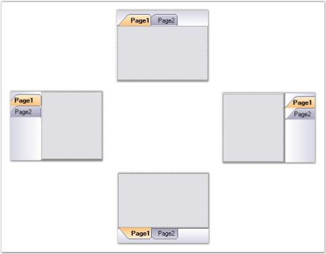
{:.image }

[C#]

this.tabControlAdv1.RotateTextWhenVertical = true;

[VB.NET]

Me.tabControlAdv1.RotateTextWhenVertical = True

###### Scroll Settings

This section discusses about the Scrolling Properties available for the TabControlAdv.

ScrollButton

TabControlAdv has the ability to add scrollbuttons on the TabPanel when the number of Tab items increase. These scrollbuttons allow the user to navigate through the tabpages in the front and back. For this, the ShowScroll property of the TabControl must be set.

_Table_ _828__: Property Table_

<table>
<tr>
<td>
TabControlAdv Property</td><td>
Description</td></tr>
<tr>
<td>
ShowScroll</td><td>
Specifies whether to show the scrollbutton.</td></tr>
</table>

By default, scrollbuttons are set to 2D, 3D and Workbook tabstyles.

{:.image }

For all other styles, scrollbuttons are set to normal button-look.

{:.image }

ScrollButtons can have a VS .NET - TabbedMDI scrollbutton-look, when the VSLikeScrollButton property is set to true.

[C#]

this.tabControlAdv1.ShowScroll = true;

this.tabControlAdv1.VSLikeScrollButton = true;

[VB.NET]

Me.tabControlAdv1.ShowScroll = True

Me.tabControlAdv1.VSLikeScrollButton = True

ScrollBars

ScrollBars can be set for the tabpages for which the AutoScroll property has to be set to true. The AutoScrollMinSize is set to a value, which if exceeded, enables the tabcontroladv to automatically add a scrollbar to the tabpage. Setting AutoScrollMargin, allows to maintain a minimum distance between the end margin of any control that is placed and the margin of the tabpage.

ScrollIncrement property is used to specify whether to scroll through tabs or pages.

_Table_ _829__: Property Table_

<table>
<tr>
<td>
TabPageAdv Property</td><td>
Description</td></tr>
<tr>
<td>
AutoScroll</td><td>
Specifies to add a scrollbar to the tabpage. Default value is False.</td></tr>
<tr>
<td>
AutoScrollMargin</td><td>
Specifies the distance to be maintained between any control that is placed inside the page and the tabmargin.</td></tr>
<tr>
<td>
AutoScrollMinSize</td><td>
Specifies the size of the tabpage, which if exceeded, would  enable scrollbars to be added.</td></tr>
</table>

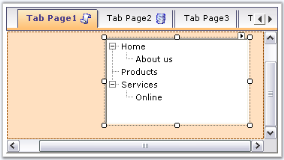
{:.image }

> 
{:.image }
_Note: The TabControlAdv.BringSelectedTabToView() method is used to bring the selected tab to view, if scrolled out of view._

[C#]

this.tabPageAdv1.AutoScroll = true;

this.tabPageAdv1.AutoScrollMargin = new System.Drawing.Size(20, 20);

this.tabPageAdv1.AutoScrollMinSize = new System.Drawing.Size(50, 50);

this.tabControlAdv1.ScrollIncrement = Syncfusion.Windows.Forms.Tools.ScrollIncrement.Page;

[VB.NET]

Private Me.tabPageAdv1.AutoScroll = True

Private Me.tabPageAdv1.AutoScrollMargin = New System.Drawing.Size(20, 20)

Private Me.tabPageAdv1.AutoScrollMinSize = New System.Drawing.Size(50, 50)

Private Me.tabControlAdv1.ScrollIncrement = Syncfusion.Windows.Forms.Tools.ScrollIncrement.Page

#### TabControlAdv Events

The list of events and a detailed explanation about each of them is given in the following sections.

_Table_ _830__: Events Table_

<table>
<tr>
<td>
TabControlAdv Events</td><td>
Description</td></tr>
<tr>
<td>
AfterEdit Event</td><td>
This event occurs after text editing is complete. It is fired even if no changes are made.</td></tr>
<tr>
<td>
BeforeEdit Event</td><td>
This event occurs when the text enters into Edit mode.</td></tr>
<tr>
<td>
BackgroundImageChanged Event</td><td>
This event is fired when the value of the BackgroundImage property is changed in the TabControlAdv.</td></tr>
<tr>
<td>
BackgroundImageLayoutChanged Event</td><td>
This event is fired when the value of the BackgroundImageLayout property is changed in the TabControlAdv.</td></tr>
<tr>
<td>
BackColorChanged Event</td><td>
This event is fired when the value of the BackColor property is changed in the TabControlAdv.</td></tr>
<tr>
<td>
ControlAdded Event</td><td>
This event occurs when a new control is added to the TabControlAdv.</td></tr>
<tr>
<td>
ControlRemoved Event</td><td>
This event occurs when a new control is removed from this TabControlAdv.</td></tr>
<tr>
<td>
DrawItem Event</td><td>
This event is triggered whenever a particular item or area needs to be painted. Below is an example which draws the background and the interior by handling this event.</td></tr>
<tr>
<td>
ForeColorChanged Event</td><td>
This event is raised when the value of the ForeColor property is changed on the TabControlAdv.</td></tr>
<tr>
<td>
LabelEditChanged Event</td><td>
This event is triggered when the LabelEdit property is changed in the TabControlAdv.</td></tr>
<tr>
<td>
LabelEditTextChanged Event</td><td>
This event is triggered when the original text of the tab is changed.</td></tr>
<tr>
<td>
PaddingChanged Event</td><td>
This event occurs when the Padding property is changed in the TabControlAdv.</td></tr>
<tr>
<td>
Paint Event</td><td>
This event occurs when a TabControlAdv needs re-painting.</td></tr>
<tr>
<td>
PreviewKeyDown Event</td><td>
This event occurs before the KeyDown event when a key is pressed, while focus is on the TabControlAdv.</td></tr>
<tr>
<td>
RegionChanged Event</td><td>
This event is raised when the value of the Region property is changed in the TabControlAdv.</td></tr>
<tr>
<td>
TabPrimitiveClick Event</td><td>
This event occurs before the NavigationButton click.</td></tr>
<tr>
<td>
TabsOrderChanged Event</td><td>
This event occurs when the order of the tabs is changed in the TabControlAdv.</td></tr>
<tr>
<td>
TextChanged Event</td><td>
This event occurs when value of the Text property is changed in the TabControlAdv.</td></tr>
<tr>
<td>
TabPageAdv.Closed</td><td>
Handled when the tabpage is closed.</td></tr>
<tr>
<td>
TabPageAdv.Closing</td><td>
Handled when the tabpage is closing.</td></tr>
</table>
##### AfterEdit Event

This event occurs after text editing is complete. It is fired even if no changes are made.

Event Data

The Edit Event Handler receives an argument of type EditEventArgs containing data related to this event. The following EditEventArgs property provides information specific to this event.

_Table_ _831__: Member Table_

<table>
<tr>
<td>
Member</td><td>
Description</td></tr>
<tr>
<td>
EditText</td><td>
Gets the edited text.</td></tr>
</table>

[C#]

private void tabControlAdv1_AfterEdit(object sender, Syncfusion.Windows.Forms.Tools.EditEventArgs e)

{

//Below line will be displayed in the output window at run-time, when this event is fired.

Console.Write(" AfterEdit event is triggered");

//Gets the edited text in the output window.

Console.Write("Edit text :" + e.EditText.ToString());

}

[VB.NET]

Private Sub tabControlAdv1_AfterEditEvent(ByVal sender As Object, ByVal e As Syncfusion.Windows.Forms.Tools.EditEventArgs)

'Below line will be displayed in the output window at run-time, when this event is fired.

Console.Write(" AfterEdit event is triggered")

'Gets the edited text in the output window.

Console.Write("Edit text :" + e.EditText.ToString())

End Sub

##### BeforeEdit Event

This event occurs when the text enters into Edit mode.

Event Data

This Event Handler receives an argument of type EditEventArgs containing data related to this event. The following EditEventArgs property provides information specific to this event.

_Table_ _832__: Member Table_

<table>
<tr>
<td>
Member</td><td>
Description</td></tr>
<tr>
<td>
EditText</td><td>
Gets the edited text.</td></tr>
</table>

[C#]

private void tabControlAdv1_BeforeEditEvent(object sender, Syncfusion.Windows.Forms.Tools.EditEventArgs e)

{

//Below line will be displayed in the output window, when this event is fired.

Console.Write("BeforeEdit event is triggered");

//Gets the edited text in the output window.

Console.Write("Edit text :" + e.EditText.ToString());

}

[VB.NET]

Private Sub tabControlAdv1_BeforeEditEvent(ByVal sender As Object, ByVal e As Syncfusion.Windows.Forms.Tools.EditEventArgs)

'Below line will be displayed in the output window, when this event is fired.

Console.Write("BeforeEdit event is triggered")

'Gets the edited text in the output window.

Console.Write("Edit text :" + e.EditText.ToString())

End Sub

##### BackgroundImageChanged Event

This event is fired when the value of the BackgroundImage property is changed in the TabControlAdv.

[C#]

private void tabControlAdv1_BackgroundImageChanged(object sender, System.Windows.Forms.EventArgs e)

{

//Below line will be displayed in the output window at run-time, when this event is fired.

Console.Write("Background Image event is raised");

}

[VB.NET]

Private Sub tabControlAdv1_BackgroundImageChanged(ByVal sender As Object, ByVal e As System.Windows.Forms.EventArgs)

'Below line will be displayed in the output window at run-time, when this event is fired.

Console.Write("Background Image event is raised")

End Sub

##### BackgroundImageLayoutChanged Event

This event is fired when the value of the BackgroundImageLayout property is changed in the TabControlAdv.

[C#]

private void tabControlAdv1_BackgroundImageLayoutChanged(object sender, System.Windows.Forms.EventArgs e)

{

//Below line will be displayed in the output window at run-time, when this event is fired.

Console.Write("BackgroundImageLayoutChanged event is raised");

}

[VB.NET]

Private Sub tabControlAdv1_BackgroundImageLayout(ByVal sender As Object, ByVal e As System.Windows.Forms.EventArgs)

'Below line will be displayed in the output window at run-time, when this event is fired.

Console.Write("BackgroundImageLayoutChanged event is raised")

End Sub

##### BackColorChanged Event

This event is fired when the value of the BackColor property is changed in the TabControlAdv.

[C#]

// Set the new back color.

this.tabControlAdv1.BackColor = System.Drawing.Color.Aqua;

// Set the active tab color for the TabControlAdv to highlight the activated tab in the control.

this.tabControlAdv1.ActiveTabColor = System.Drawing.Color.Bisque;

// Handle the BackColorChanged event.

this.tabControlAdv1.BackColorChanged+=new EventHandler(tabControlAdv1_BackColorChanged);

private void tabControlAdv1_BackColorChanged(object sender, EventArgs e)

{

Console.Write("BackColorChanged event is raised");

}

[VB.NET]

' Set the new back color. 

Me.tabControlAdv1.BackColor = System.Drawing.Color.Aqua 

' Set the active tab color for the TabControlAdv to highlight the activated tab in the control. 

Me.tabControlAdv1.ActiveTabColor = System.Drawing.Color.Bisque 

' Handle the BackColorChanged event. 

AddHandler Me.tabControlAdv1.BackColorChanged, AddressOf tabControlAdv1_BackColorChanged 

Private Sub tabControlAdv1_BackColorChanged(ByVal sender As Object, ByVal e As EventArgs)

    Console.Write("BackColorChanged event is raised")

End Sub

##### ControlAdded Event

This event occurs when a new control is added to the TabControlAdv.

Event Data

This Event Handler receives an argument of type ControlEventArgs containing data related to this event. The following ControlEventArgs property provides information specific to this event.

_Table_ _833__: Member Table_

<table>
<tr>
<td>
Member</td><td>
Description</td></tr>
<tr>
<td>
Control</td><td>
Gets the control object used by this event.</td></tr>
</table>

[C#]

private void tabControlAdv1_ControlAdded(object sender, System.Windows.Forms.ControlEventArgs e)

{

//Below line will be displayed in the output window at run-time, when this event is fired.

Console.Write("Control Added event is raised");

//Gets the control object used by this event.

Console.Write("Control Name :" + e.Control.ToString());

}

[VB.NET]

Private Sub tabControlAdv1_ControlAdded(ByVal sender As Object, ByVal e As System.Windows.Forms.ControlEventArgs)

'Below line will be displayed in the output window at run-time, when this event is fired.

Console.Write("Control Added event is raised")

'Gets the control object used by this event.

Console.Write("Control Name :" + e.Control.ToString())

End Sub

##### ControlRemoved Event

This event occurs when a new control is removed from this TabControlAdv.

Event Data

This Event Handler receives an argument of type ControlEventArgs containing data related to this event. The following ControlEventArgs property provides information specific to this event.

_Table_ _834__: Member Table_

<table>
<tr>
<td>
Member</td><td>
Description</td></tr>
<tr>
<td>
Control</td><td>
Gets the control object used by this event.</td></tr>
</table>
> 
{:.image }
 _Note: The TabControlAdv.RemoveAll() method removes all the TabPages and additional controls from the TabControlAdv._

[C#]

private void tabControlAdv1_ControlRemoved(object sender, System.Windows.Forms.ControlEventArgs e)

{

//Below line will be displayed in the output window at run-time, when this event is fired.

Console.Write("Control Removed event is raised");

//Gets the control object used by this event.

Console.Write("Control Name :" + e.Control.ToString());

}

[VB.NET]

Private Sub tabControlAdv1_ControlRemoved(ByVal sender As Object, ByVal e As System.Windows.Forms.ControlEventArgs)

'Below line will be displayed in the output window at run-time, when this event is fired.

Console.Write("Control Removed event is raised")

'Gets the control object used by this event.

Console.Write("Control Name :" + e.Control.ToString())

End Sub

##### DrawItem Event

This event is triggered whenever a particular item or area needs to be painted. Below is an example which draws the background and the interior by handling this event.

Event Data

This Event Handler receives an argument of type DrawTabEventArgs containing data related to this event. The following DrawTabEventArgs properties provide information specific to this event.

_Table_ _835__: Members Table_

<table>
<tr>
<td>
Members</td><td>
Description</td></tr>
<tr>
<td>
BackColor</td><td>
Gets or sets the background color.</td></tr>
<tr>
<td>
Bounds</td><td>
Returns the rectangle that represents the bounds of the item that is being drawn.</td></tr>
<tr>
<td>
BoundsInterior</td><td>
Represents the interior of the tab minus the borders.</td></tr>
<tr>
<td>
Font</td><td>
Gets / sets the font assigned to the tab that is being drawn.</td></tr>
<tr>
<td>
ForeColor</td><td>
Gets / Sets the color of the text.</td></tr>
<tr>
<td>
Graphics</td><td>
Returns the graphics surface on which the item has to be drawn.</td></tr>
<tr>
<td>
Index</td><td>
Returns the index value of the item that is being drawn.</td></tr>
<tr>
<td>
State</td><td>
Gets / sets the state of the item that is being drawn.</td></tr>
<tr>
<td>
TextBrush</td><td>
Gets / sets the text brush to draw text in the tabs.</td></tr>
</table>
> 
{:.image }
 _Note: The TabControlAdv.OnDrawItem() method raises the DrawItem event._  

[C#]

private void tabControlAdv1_DrawItem(object sender, Syncfusion.Windows.Forms.Tools.DrawTabEventArgs drawItemInfo)

{

drawItemInfo.DrawBackground();

drawItemInfo.DrawInterior();

switch(this.comboBox1.SelectedIndex)

{

case 0:this.Tab_DrawItemYahooMessengerLike(sender, drawItemInfo);

break;

case 1: this.Tab_DrawItemMSNMessengerLike(sender, drawItemInfo);

break;

}

}

[VB.NET]

Private Sub tabControlExt1_DrawItem(ByVal sender As System.Object, ByVal drawItemInfo As Syncfusion.Windows.Forms.Tools.DrawTabEventArgs) Handles tabControlExt1.DrawItem

drawItemInfo.DrawBackground()

drawItemInfo.DrawInterior()

Select Case Me.comboBox1.SelectedIndex

Case 0

Me.Tab_DrawItemYahooMessengerLike(sender, drawItemInfo)

'End Section

Case 1

Me.Tab_DrawItemMSNMessengerLike(sender, drawItemInfo)

'End Section

End Select

End Sub

##### ForeColorChanged Event

This event is raised when the value of the ForeColor property is changed on the TabControlAdv.

[C#]

private void tabControlAdv1_ForeColorChanged(object sender, System.Windows.Forms.EventArgs e)

{

//Below line will be displayed in the output window at run-time, when this event is fired.

Console.Write("ForeColor Changed event is raised");

}

[VB.NET]

Private Sub tabControlAdv1_ForeColorChanged(ByVal sender As Object, ByVal e As System.Windows.Forms.EventArgs)

'Below line will be displayed in the output window at run-time, when this event is fired.

Console.Write("ForeColor Changed event is raised")

End Sub

##### LabelEditChanged Event

This event is triggered when the LabelEdit property is changed in the TabControlAdv.

[C#]

// Set the LabelEdit property.

this.tabControlAdv1.LabelEdit = true;

// Handle the LabelEditChanged event.

this.tabControlAdv1.LabelEditChanged+=new EventHandler(tabControlAdv1_LabelEditChanged);

private void tabControlAdv1_LabelEditChanged(object sender, EventArgs e)

{

// Below line will be displayed in the output window at runtime, when this event is fired.

Console.Write("LabelEditChanged event is raised");

}

[VB.NET]

' Set the LabelEdit property. 

Me.tabControlAdv1.LabelEdit = True 

' Handle the LabelEditChanged event. 

AddHandler Me.tabControlAdv1.LabelEditChanged, AddressOf tabControlAdv1_LabelEditChanged 

Private Sub tabControlAdv1_LabelEditChanged(ByVal sender As Object, ByVal e As EventArgs)

    ' Below line will be displayed in the output window at runtime, when this event is fired. 

    Console.Write("LabelEditChanged event is raised")

End Sub

##### LabelEditTextChanged Event

This event is triggered when the original text of the tab is changed.

[C#]

// Set the LabelEdit property to True, to enable editing of the TabPages' captions.

this.tabControlAdv1.LabelEdit = true;

// Set the text for the TabPage.

this.tabPageAdv1.Text = "Tab1";

// Set the font of the text for the TabPage.

this.tabControlAdv1.Font = new System.Drawing.Font("Comic Sans MS", 8.25F, System.Drawing.FontStyle.Bold, System.Drawing.GraphicsUnit.Point, ((byte)(0)));

// Handle the LabelEditTextChanged event.

this.tabControlAdv1.LabelEditTextChanged+=new EventHandler(tabControlAdv1_LabelEditTextChanged);

private void tabControlAdv1_LabelEditTextChanged(object sender, EventArgs e)

{

// Below line will be displayed in the output window at runtime, when text is edited.

Console.Write("LabelEditTextChanged event is raised");

}

[VB.NET]

' Set the LabelEdit property to True, to enable editing of the TabPages' captions. 

Me.tabControlAdv1.LabelEdit = True 

' Set the text for the TabPage. 

Me.tabPageAdv1.Text = "Tab1" 

' Set the font of the text for the TabPage. 

Me.tabControlAdv1.Font = New System.Drawing.Font("Comic Sans MS", 8.25F, System.Drawing.FontStyle.Bold, System.Drawing.GraphicsUnit.Point, CByte((0))) 

' Handle the LabelEditTextChanged event. 

AddHandler Me.tabControlAdv1.LabelEditTextChanged, AddressOf tabControlAdv1_LabelEditTextChanged 

Private Sub tabControlAdv1_LabelEditTextChanged(ByVal sender As Object, ByVal e As EventArgs)

    ' Below line will be displayed in the output window at runtime, when text is edited. 

    Console.Write("LabelEditTextChanged event is raised")

End Sub

##### PaddingChanged Event

This event occurs when the Padding property is changed in the TabControlAdv.

[C#]

private void tabControlAdv1_PaddingChanged(object sender, System.Windows.Forms.EventArgs e)

{

//Below line will be displayed in the output window at run-time, when this event is fired.

Console.Write("Padding Changed event is raised");

}

[VB.NET]

Private Sub tabControlAdv1_PaddingChanged(ByVal sender As Object, ByVal e As System.Windows.Forms.EventArgs)

'Below line will be displayed in the output window at run-time, when this event is fired.

Console.Write("Padding Changed event is raised")

End Sub

##### Paint Event

This event occurs when a TabControlAdv needs re-painting.

Event Data

This Event Handler receives an argument of type EditEventArgs containing data related to this event. The following EditEventArgs property provides information specific to this event.

_Table_ _836__: Members Table_

<table>
<tr>
<td>
Members</td><td>
Description</td></tr>
<tr>
<td>
ClipRectangle</td><td>
Gets the rectangle in which to paint.</td></tr>
<tr>
<td>
Graphics</td><td>
Gets the graphics used to paint.</td></tr>
</table>

[C#]

private void tabControlAdv1_Paint(object sender, System.Windows.Forms.PaintEventArgs e)

{

if(this.ClientRectangle.Width > 0 && this.ClientRectangle.Height > 0)

{

LinearGradientBrush lgb = new LinearGradientBrush(this.ClientRectangle, SystemColors.Control, SystemColors.ControlDark, LinearGradientMode.Horizontal);

e.Graphics.FillRectangle(lgb, this.ClientRectangle);

}

}

[VB.NET]

Private Sub tabControlAdv1_Paint(ByVal sender As Object, ByVal e As System.Windows.Forms.PaintEventArgs)

If Me.ClientRectangle.Width > 0 AndAlso Me.ClientRectangle.Height > 0 Then

Dim lgb As LinearGradientBrush = New LinearGradientBrush(Me.ClientRectangle, SystemColors.Control, SystemColors.ControlDark, LinearGradientMode.Horizontal)

e.Graphics.FillRectangle(lgb, Me.ClientRectangle)

End If

End Sub

##### PreviewKeyDown Event

This event occurs before the KeyDown event when a key is pressed, while focus is on the TabControlAdv.

Event Data

This Event Handler receives an argument of type EditEventArgs containing data related to this event. The following EditEventArgs properties provide information specific to this event.

_Table_ _837__: Members Table_

<table>
<tr>
<td>
Members</td><td>
Description</td></tr>
<tr>
<td>
Alt</td><td>
Gets a value indicating whether ALT key was pressed.</td></tr>
<tr>
<td>
Control</td><td>
Gets a value indicating whether CTRL key was pressed.</td></tr>
<tr>
<td>
IsInputKey</td><td>
Gets / sets a value indicating whether a key is a regular input key.</td></tr>
<tr>
<td>
KeyCode</td><td>
Gets the keyboard code for a System.Windows.Forms.Controls.KeyUp / System.Windows.Forms.Controls.KeyDown event.</td></tr>
<tr>
<td>
KeyData</td><td>
Gets the key data code for a System.Windows.Forms.Controls.KeyUp / System.Windows.Forms.Controls.KeyDown event.</td></tr>
<tr>
<td>
KeyValue</td><td>
Gets the keyboard value for a System.Windows.Forms.Controls.KeyUp / System.Windows.Forms.Controls.KeyDown event.</td></tr>
<tr>
<td>
Modifiers</td><td>
Gets the modifiers flag for a System.Windows.Forms.Controls.KeyUp / System.Windows.Forms.Controls.KeyDown event.</td></tr>
<tr>
<td>
Shift</td><td>
Gets a value indicating whether SHIFT key was pressed.</td></tr>
</table>

[C#]

private void tabControlAdv1_PreviewKeyDown(object sender, System.Windows.Forms.PreviewKeyDownEventArgs e)

{

//Below line will be displayed in the output window at run-time, when this event is fired.

Console.Write("PreviewKeyDown event is raised");

//The below code prints the KeyCode, KeyValue, KeyData and Modifiers in the output window at run-time.

Console.Write("Key code :" + e.KeyCode.ToString() + "\n" + "Key Value :" + e.KeyValue.ToString() + "\n" + "Key Data:" + e.KeyData.ToString() + "\n" + "Modifiers:" + e.Modifiers.ToString());

}

[VB.NET]

Private Sub tabControlAdv1_PreviewKeyDown(ByVal sender As Object, ByVal e As System.Windows.Forms.PreviewKeyDownEventArgs)

//Below line will be displayed in the output window at run-time, when this event is fired.

Console.Write("PreviewKeyDown event is raised")

'The below code prints the Keycode, KeyValue, KeyData and Modifiers in the output window at run-time.

Console.Write("Key code :" + e.KeyCode.ToString() + "\n" + "Key Value :" + e.KeyValue.ToString() + "\n" + "Key Data:" + e.KeyData.ToString() + "\n" + "Modifiers:" + e.Modifiers.ToString())

End Sub

##### RegionChanged Event

This event is raised when the value of the Region property is changed in the TabControlAdv.

[C#]

private void tabControlAdv1_RegionChanged(object sender, System.Windows.Forms.EventArgs e)

{

//Below line will be displayed in the output window at run-time, when this event is fired.

Console.Write("Region Changed event is raised");

}

[VB.NET]

Private Sub tabControlAdv1_RegionChanged(ByVal sender As Object, ByVal e As System.Windows.Forms.EventArgs)

'Below line will be displayed in the output window at run-time, when this event is fired.

Console.Write("Region Changed event is raised")

End Sub

##### TabPrimitiveClick Event

This event occurs before the NavigationButton click.

Event Data

This Event Handler receives an argument of type TabPrimitiveClickEventArgs containing data related to this event. The following TabPrimitiveClickEventArgs properties provide information specific to this event.

_Table_ _838__: Members Table_

<table>
<tr>
<td>
Members</td><td>
Description</td></tr>
<tr>
<td>
Cancel</td><td>
Gets / sets a value indicating whether the event should be canceled.</td></tr>
<tr>
<td>
TabPrimitive</td><td>
Gets the primitive that gets clicked.</td></tr>
</table>

[C#]

private void tabControlAdv4_TabPrimitiveClick(object sender, Syncfusion.Windows.Forms.Tools.TabPrimitiveClickEventArgs e)

{

if(e.TabPrimitive.Name == "CustomAbout")

{

DemoCommon.AboutForm ab=new DemoCommon.AboutForm( AppDomain.CurrentDomain.GetAssemblies());

ab.ShowDialog();

}

//This event can be canceled using the code given below.

e.Cancel = true;

//This code displays the primitive that gets clicked during this event.

Console.Write("TabPrimitiveClick:" + e.TabPrimitive.ToString());

}

[VB.NET]

Private Sub tabControlAdv4_TabPrimitiveClick(ByVal sender As Object, ByVal e As Syncfusion.Windows.Forms.Tools.TabPrimitiveClickEventArgs)

If e.TabPrimitive.Name = "CustomAbout" Then

Dim ab As DemoCommon.AboutForm = New DemoCommon.AboutForm(AppDomain.CurrentDomain.GetAssemblies)

ab.ShowDialog()

End If

'this event can be canceled using the code given below.

e.Cancel = True

'This code displays the primitive that gets clicked during this event.

Console.Write("TabPrimitiveClick:" + e.TabPrimitive.ToString())

End Sub

##### TabsOrderChanged Event

This event occurs when the order of the tabs is changed in the TabControlAdv.

[C#]

// Set the UserMoveTabs property to True, to drag and drop tabs during runtime.

this.tabControlAdv1.UserMoveTabs = true;

// Handle the TabsOrderChanged event.

this.tabControlAdv1.TabsOrderChanged+=new EventHandler(tabControlAdv1_TabsOrderChanged);

}

private void tabControlAdv1_TabsOrderChanged(object sender, EventArgs e)

{

// Below line will be displayed in the output window at run-time, when a tab is dragged and dropped at another location.

Console.Write("TabsOrderChanged event is raised");

}

[VB.NET]

' Set the UserMoveTabs property to True, to drag and drop tabs during runtime. 

Me.tabControlAdv1.UserMoveTabs = True 

' Handle the TabsOrderChanged event. 

AddHandler Me.tabControlAdv1.TabsOrderChanged, AddressOf tabControlAdv1_TabsOrderChanged 

Private Sub tabControlAdv1_TabsOrderChanged(ByVal sender As Object, ByVal e As EventArgs)

    ' Below line will be displayed in the output window at run-time, when a tab is dragged and dropped at another location. 

    Console.Write("TabsOrderChanged event is raised")

End Sub

> 
{:.image }
 _Note: The TabControlAdv.OnTabsOrderChanged() method raises the OnTabsOrderChanged event._

##### TextChanged Event

This event occurs when value of the Text property is changed in the TabControlAdv.

[C#]

private void tabControlAdv1_TextChanged(object sender, System.Windows.Forms.EventArgs e)

{

//Below line will be displayed in the output window at run-time, when this event is fired.

Console.Write("TextChanged event is raised");

}

[VB.NET]

Private Sub tabControlAdv1_TextChanged(ByVal sender As Object, ByVal e As System.Windows.Forms.EventArgs)

'Below line will be displayed in the output window at run-time, when this event is fired.

Console.Write("TextChanged event is raised")

End Sub

##### Closed Event

The TabPageAdv.Closed event is raised when a TapPage is closed using close button.

[C#]

private void tabPageAdv1_Closed(object sender, EventArgs e)

{

    this.tabPageAdv5 = new Syncfusion.Windows.Forms.Tools.TabPageAdv();

    this.tabPageAdv5.Text = "New Tab";

    this.tabControlAdv1.TabPages.Add(this.tabPageAdv5);

}

[VB.NET]

Private Sub tabPageAdv1_Closed(ByVal sender As Object, ByVal e As EventArgs)

Me.tabPageAdv5 = New Syncfusion.Windows.Forms.Tools.TabPageAdv() 

Me.tabPageAdv5.Text = "New Tab" 

Me.tabControlAdv1.TabPages.Add(Me.tabPageAdv5)

End Sub

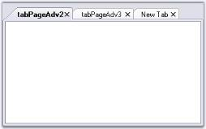
{:.image }

##### Closing Event

The TabPageAdv.Closing event is raised when a Tabpage is closing.

[C#]

private void tabPageAdv1_Closing(object sender, TabPageAdvClosingEventArgs args)

{

    tabControlAdv1.BorderStyle = BorderStyle.FixedSingle;

    tabControlAdv1.BorderColor = Color.Red;

    //Cancels the tab page closing

   args.Cancel = true;

}

[VB.NET]

Private Sub tabPageAdv1_Closing(ByVal sender As Object, ByVal args As TabPageAdvClosingEventArgs)

    tabControlAdv1.BorderStyle = BorderStyle.FixedSingle

    tabControlAdv1.BorderColor = Color.Red

    'Cancels the tab page closing 

    args.Cancel = True

End Sub

{:.image }

#### Frequently Asked Questions

This section will help you become more familiar in using the Tabs Package.

##### How to create MultilineText in TabPages' ToolTipText

Setting the ShowToolTipText property of TabControlAdv to 'True' will wrap the text when using the new line character (\n) in the ToolTipText property of TabPageAdv. The new line character (\n) is not supported at design-time.

[C#]

//Setting the ShowToolTipText property in TabControlAdv.

this.tabControlAdv1.ShowToolTips=true;

//Setting the text into the ToolTipText property of TabPageAdv.

this.tabPageAdv1.ToolTipText="Tab\nPageAdv1";

this.tabPageAdv1.ToolTipText="Tab\nPage\nAdv2";

[VB]

'Setting the ShowToolTipText property in TabControlAdv.

Me.tabControlAdv1.ShowToolTips=True

'Setting the text into the ToolTipText property of TabPageAdv.

Me.tabPageAdv1.ToolTipText="Tab" & Constants.vbLf & "PagAdv1"

Me.tabPageAdv2.ToolTipText="Tab" & Constants.vbLf & "Page" & Constants.vbLf & "Adv2"

##### How to Customize TabRendering

The simplest way to customize TabDrawing is to handle the DrawItem event. A departure from the normal is the TabControlAdv's ability to let you selectively draw portions of the tab. For this purpose, TabDrawing is classified into three portions:Background,Border and Interior (text and image). The event args lets you delegate drawing of one or more portions of the tab to the default drawing code while custom drawing the other portions of the tab. 

> 
{:.image }
 _Note: The following code provides a sample discussion of the Custom TabControls._ 

* The following code sample demonstrates how to create Yahoo Messenger-like tabs.

[C#]

private void Tab_DrawItemYahooMessengerLike(object sender, DrawTabEventArgs drawItemInfo)

{

// This will work only when the TabStyle is set to 3D (typeof(TabRenderer3D)).

// Draw the default background and interior in all cases by delegating the drawing to the default drawing code.

drawItemInfo.DrawBackground();

drawItemInfo.DrawInterior();

// The border should be drawn only when the item is selected or highlighted.

if(((int)drawItemInfo.State & ((int)DrawItemState.Selected | (int)DrawItemState.HotLight)) > 0)

{

// Draw the borders.

drawItemInfo.DrawBorders();

}

}

[VB.NET]

Private Sub Tab_DrawItemYahooMessengerLike(ByVal sender As Object, ByVal drawItemInfo As DrawTabEventArgs)

' This will work only when the TabStyle is set to 3D (typeof(TabRenderer3D)).

' Draw the default background and interior in all cases by delegating the drawing to the default drawing code.

drawItemInfo.DrawBackground()

drawItemInfo.DrawInterior()

' The border should be drawn only when the item is selected or highlighted.

If (CInt(drawItemInfo.State) And (CInt(DrawItemState.Selected) Or CInt(DrawItemState.HotLight))) > 0 Then

' Draw the borders.

drawItemInfo.DrawBorders()

End If

End Sub

* The following code sample demonstrates how to create MSN Messenger-like tabs.

[C#]

private void Tab_DrawItemMSNMessengerLike(object sender, DrawTabEventArgs drawItemInfo)

{

Rectangle rectTab = drawItemInfo.Bounds;

Graphics g = drawItemInfo.Graphics;

g.SmoothingMode = SmoothingMode.AntiAlias;

// Create a path for the border.

GraphicsPath gp = new GraphicsPath();

gp.AddBezier(rectTab.Right - 1, rectTab.Bottom + 6, rectTab.Right-1, rectTab.Bottom + 2,rectTab.Left, rectTab.Bottom-3,rectTab.Left, rectTab.Bottom-7);

gp.AddLine(rectTab.Left, rectTab.Bottom-4, rectTab.Left, rectTab.Top + 5);

Point[] curvePoints1 = {new Point(rectTab.Left, rectTab.Top + 5), new Point(rectTab.Left+2, rectTab.Top+2),

new Point(rectTab.Left+3, rectTab.Top+1), new Point(rectTab.Left+5, rectTab.Top)};

gp.AddCurve(curvePoints1);

gp.AddBezier(curvePoints1[0], curvePoints1[1], curvePoints1[2], curvePoints1[3]);

gp.AddLine(curvePoints1[3], new Point(rectTab.Right-6, rectTab.Top));

Point[] curvePoints2 = {new Point(rectTab.Right-6, rectTab.Top), new Point(rectTab.Right-2, rectTab.Top-1),

new Point(rectTab.Right-2, rectTab.Top-3), new Point(rectTab.Right-1, rectTab.Top - 5)};

gp.AddCurve(curvePoints2); 

if(((int)drawItemInfo.State & (int)DrawItemState.Selected) > 0)

{

g.FillPath(new SolidBrush(drawItemInfo.BackColor), gp);

drawItemInfo.DrawInterior();

}

else

{

// Draw the text and image first.

drawItemInfo.DrawInterior();

// Then alpha-blend active tab color over it.

g.FillPath(new SolidBrush(Color.FromArgb(128, this.tabControlExt1.ActiveTabColor)),gp);

}

}

[VB.NET]

Private Sub Tab_DrawItemMSNMessengerLike(ByVal sender As Object, ByVal drawItemInfo As DrawTabEventArgs)

Dim rectTab As Rectangle = drawItemInfo.Bounds

Dim g As Graphics = drawItemInfo.Graphics

g.SmoothingMode = SmoothingMode.AntiAlias

' Create a path for the border.

Dim gp As New GraphicsPath()

gp.AddBezier(rectTab.Right - 1, rectTab.Bottom + 6, rectTab.Right - 1, rectTab.Bottom + 2, rectTab.Left, rectTab.Bottom - 3,               rectTab.Left, rectTab.Bottom - 7)

gp.AddLine(rectTab.Left, rectTab.Bottom - 4, rectTab.Left, rectTab.Top + 5)

Dim curvePoints1 As Point() = {New Point(rectTab.Left, rectTab.Top + 5), New Point(rectTab.Left + 2, rectTab.Top + 2), New                Point(rectTab.Left + 3, rectTab.Top + 1), New Point(rectTab.Left + 5, rectTab.Top)}

gp.AddCurve(curvePoints1)

gp.AddBezier(curvePoints1(0), curvePoints1(1), curvePoints1(2), curvePoints1(3))

gp.AddLine(curvePoints1(3), New Point(rectTab.Right - 6, rectTab.Top))

Dim curvePoints2 As Point() = {New Point(rectTab.Right - 6, rectTab.Top), New Point(rectTab.Right - 2, rectTab.Top - 1), New              Point(rectTab.Right - 2, rectTab.Top - 3), New Point(rectTab.Right - 1, rectTab.Top - 5)}

gp.AddCurve(curvePoints2)

If (CInt(drawItemInfo.State) And CInt(DrawItemState.Selected)) > 0 Then

g.FillPath(New SolidBrush(drawItemInfo.BackColor), gp)

drawItemInfo.DrawInterior()

Else

' Draw the text and image first.

drawItemInfo.DrawInterior()

' Then alpha-blend active tab color over it.

g.FillPath(New SolidBrush(Color.FromArgb(128, Me.tabControlExt1.ActiveTabColor)), gp)

End If

End Sub

{:.image }

##### How to Display TabStrip when there are no TabPages

The TabStrip can be made visible even if there are no TabPages added. The TabControlAdv has a ReserveTabSpace property which makes the tabstrip visible when set to True and ReservedSpace property that is used to specify the height of the tabstrip when the above bool property is enabled.

[C#]

//Setting the visibility of tabstrip.

this.tabControlAdv1.ReserveTabSpace = true;

//Specifying the height of the tabstrip.

this.tabControlAdv1.ReservedSpace = 25;

[VB.NET]

'Setting the visibility of tabstrip.

Me.tabControlAdv1.ReserveTabSpace =  True

'Specifying the height of the tabstrip.

Me.tabControlAdv1.ReservedSpace = 25

{:.image }

##### How to draw Gradient Tabs

You can handle the DrawItem Event of TabControlAdv and then set the gradient by using the LinearGradientBrush.

This can be done programmatically using the code snippet given below.

[C#]

private void tabControlAdv1_DrawItem(object sender, Syncfusion.Windows.Forms.Tools.DrawTabEventArgs drawItemInfo)

{

    // Use LinearGradientBrush to set gradient. 

    // Use GetTabRect to get the rectangle of the tabs. 

    if (drawItemInfo.Index != this.tabControlAdv1.SelectedIndex)

    {

        // For the non-selected tabs. 

        lgb = new System.Drawing.Drawing2D.LinearGradientBrush(

        this.tabControlAdv1.GetTabRect(drawItemInfo.Index), Color.FromArgb(197, 197, 173), Color.FromArgb(228, 228, 212), LinearGradientMode.Horizontal);

    }

    else

    {

        // For the selected tab. 

        lgb = new System.Drawing.Drawing2D.LinearGradientBrush(

        this.tabControlAdv1.GetTabRect(drawItemInfo.Index), Color.White, Color.WhiteSmoke, LinearGradientMode.Horizontal);

    }

    float[] positions = { 0.0f, 0.05f, 0.95f, 1.0f };

    float[] factors = { 0.4f, 1.0f, 0.05f, 0.04f };

    // Blend Settings

    Blend blend = new Blend();

    blend.Factors = factors;

    blend.Positions = positions;

    lgb.Blend = blend;

    drawItemInfo.Graphics.FillRectangle(lgb, this.tabControlAdv1.GetTabRect(drawItemInfo.Index));

    lgb.Dispose();

    // Draw the default borders and interior (text and image). 

    drawItemInfo.DrawBorders();

    drawItemInfo.DrawInterior();

} 

        private void Form1_Load(object sender, EventArgs e)

        {

            this.tabControlAdv1.Padding = new Point(12, 12); 

        }

        private void tabPageAdv1_Click(object sender, EventArgs e)

        {

        }

        private void tabControlAdv1_SelectedIndexChanged(object sender, EventArgs e)

        {

        }

        private void tabPageAdv1_Click_1(object sender, EventArgs e)

        {

        }

        private void autoLabel1_Click(object sender, EventArgs e)

        {

        }

    }

}

##### How to dynamically create a Form and add it to a Tab

Here is a code sample which demonstrates how you could dynamically create a Form and add that form to a new Tab.

[C#]

//Form2 is the dynamically created form in your project that needs to be added to a Tab.

//Create the form and set it’s TopLevel property to false to enable setting it’s parent.

Form2 frm2 = new Form2();

frm2.TopLevel = false;

//Create the new tab which will display Form2TabPageAdv newtab = new TabPageExt("FORM_2");

this.tabControlAdv1.Controls.Add(newtab);

//Set the parent of Form2 to be the new tab and display the form in the newly created tab.

frm2.Parent = newtab;

frm2.Visible = true;

frm2.Dock = DockStyle.Fill;

[VB.NET]

'Form2 is the dynamically created form in your project that needs to be added to a Tab.

'Create the form and set it’s TopLevel property to false to enable setting it’s parent.

Dim frm2 As Form2 = New Form2()

frm2.TopLevel = False 

'Create the new tab which will display Form2.

Dim Newtab As TabPageAdv = New TabPageExt("FORM_2")

Me.tabControlAdv1.Controls.Add(Newtab) 

'Set the parent of Form2 parent to be the new tab and display the form in the newly created tab.

frm2.Parent = Newtab

frm2.Visible = True

frm2.Dock = DockStyle.Fill

##### How to hide the Focus Rectangle which gets displayed on the selected Tab

The focus rectangle can be hidden by setting the FocusOnTabClick property to False. This can be done programmatically using the code snippet given below.

[C#]

this.tabControlAdv1.FocusOnTabClick = false;

[VB]

Me.tabControlAdv1.FocusOnTabClick = False

> 
{:.image }
 _Note: The TabControlAdv.GetTabRect() method is used to get the Rectangle region of a Tab in client co-ordinates, given it's TabIndex._

##### How to highlight the TabPage text using HotTrack property

The TabPage text can be highlighted using the HotTrack property of the TabControlAdv when the mouse hovers over it. This can be enabled programmatically using the code snippet given below.

[C#]

this.tabControlAdv1.HotTrack = true;

[VB.NET]

Me.tabControlAdv1.HotTrack = True

##### How to prevent Tabs from getting realigned when in Multiline mode

We will be making this a property based feature in a future version. For now, derive from our base TabControlExt class and do the following. 

This code will not move the selected Tab to the front row when in Multiline mode.

[C#]

// Custom tabcontrol will prevent tab realignment in Multiline mode.

public class MyTabControlExt : TabControlExt

{

// Plug-in the custom MyMultilineTabPanelRenderer class.

protected override void RendererChanged(TabPanelRenderer rendererNew)

{

if(rendererNew == null

&& this.Multiline)

{

rendererNew = new MyMultilineTabPanelRenderer(this);

}

base.RendererChanged(rendererNew);

}

}

// Custom MyMultilineTabPanelRenderer to prevent tab realignment.

public class MyMultilineTabPanelRenderer : MultilineTabPanelRenderer

{

public MyMultilineTabPanelRenderer(ITabControl parent)

: base(parent)

{

}

protected override void ValidateSelectedTabsPosition()

{

// Don’t call the base class method which will try to move the selected tab

// to the front row.

}

}

[VB.NET]

'Custom tabcontrol will prevent tab realignment in Multiline mode.

Public Class MyTabControlExt

Inherits TabControlExt

'Plug-in the custom MyMultilineTabPanelRenderer class.

Protected Overrides Sub RendererChanged(ByVal rendererNew As TabPanelRenderer)

If rendererNew Is Nothing AndAlso Me.Multiline Then

rendererNew = New MyMultilineTabPanelRenderer(Me)

End If

MyBase.RendererChanged(rendererNew)

End Sub 'RendererChanged

End Class 'MyTabControlExt

'Custom MyMultilineTabPanelRenderer to prevent tab realignment.

Public Class MyMultilineTabPanelRenderer

Inherits MultilineTabPanelRenderer

Public Sub New(ByVal parent As ITabControl)

MyBase.New(parent)

End Sub 'New

Protected Overrides Sub ValidateSelectedTabsPosition()

End Sub 'ValidateSelectedTabsPosition

End Class 'MyMultilineTabPanelRenderer ’ Don’t call the base class method which will try to move the selected tab.

##### How to prevent the Focus Rectangle from being drawn in the Tabs

You can easily do this by handling the DrawItem event, adjusting the DrawTabEventArgs and delegating drawing to the default drawing logic.

[C#]

private void TabControlExt_DrawItem(object sender, Syncfusion.Windows.Forms.Tools.DrawTabEventArgs drawItemInfo)

{

// To indicate that the tab gets drawn as if it’s not focused (without the focus rect).

drawItemInfo.State &= ~DrawItemState.Focus;

// Then forward drawing to default drawing logic.

drawItemInfo.DrawBackground();

drawItemInfo.DrawInterior();

drawItemInfo.DrawBorders();

}

[VB]

'To indicate that the tab gets drawn as if it’s not focused (without the focus rect).

Dim & As drawItemInfo.State = ~DrawItemState.Focus

'Then forward drawing to default drawing logic.

drawItemInfo.DrawBackground()

drawItemInfo.DrawInterior()

drawItemInfo.DrawBorders()

End Sub

##### How to programmatically select a Tab

The following code snippet illustrates the ways to select a Tab programmatically.

[C#]

//Select Second Tab.

this.tabControlAdv1.SelectedTab = this.tabPageAdv2;

or

//Select Second Tab.

this.tabControlAdv1.SelectedIndex= 1;

[VB.NET]

Private Sub TabControlAdv1_SelectedIndexChanged(ByVal sender As System.Object, ByVal e As System.EventArgs) Handles TabControlAdv1.SelectedIndexChanged

'Select Second Tab.

Me.tabControlAdv1.SelectedTab = Me.tabPageAdv2

or

'Select Second Tab.

Me.tabControlAdv1.SelectedIndex = 1

End Sub

