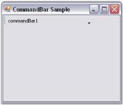
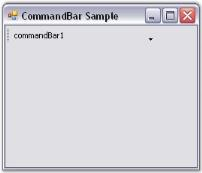

# Getting Started

## Creating CommandBar

This section will give a step by step procedure to design a CommandBar control through designer, through programmatical approach and also through the XP Menus framework.

### Through Designer

The CommandBar framework makes it an effortless process to add, remove and design the CommandBars in an application. With the WYSIWYG designer that it provides, all that is involved in setting up the CommandBar layout is to drag and drop the various CommandBars to the target location. The layout state is then serialized by the designer along with the form's resources and is used when the form is loaded at run time.

The following steps are involved in creating and setting up a simple CommandBar layout.

* Drag the CommandBarController component from the toolbox onto the form. The CommandBarController will be created in the components area of the form.

  

To add a CommandBar using the properties window, follow the procedure given below.

* In the properties window, select the CommandBars property. The CommandBar Collection Editor will be opened. Click Add, a CommandBar will be added to the form.

The CommandBars can also be added or removed using the Add CommandBar design time verb or smart tag that is found in the property grid.

New CommandBars will be initially docked to the top border of the form. The commandbars can then be dragged, redocked or floated to the desired location.

  

  

  

> See Also
>
> [Through Code ](#through-code), [Through XP Menus Framework](#through-xp-menus-framework)

### Through Code

In addition to using the designer for designing the CommandBar layout, it is also feasible to use the CommandBar's programmatic API for creating and setting up the application's CommandBars.

The following section covers the steps involved in creating, initializing and setting up CommandBars in a Windows Forms application programmatically.

1. Include the required namespace.

   ~~~ cs

		using Syncfusion.Windows.Forms.Tools;
   ~~~
   {:.prettyprint}

   ~~~ vbnet

		Imports Syncfusion.Windows.Forms.Tools
   ~~~
   {:.prettyprint}

2. Create instances of the Essential Tools CommandBarController class and CommandBar control within the application's main form.
3. Call the CommandBarController's BeginInit method to signal the start of initialization.
   ~~~ cs

		

		private Syncfusion.Windows.Forms.Tools.CommandBarController commandBarController1;

		private Syncfusion.Windows.Forms.Tools.CommandBar commandBar1;

		private System.Windows.Forms.Panel panel1;

		this.commandBarController1 = new Syncfusion.Windows.Forms.Tools.CommandBarController();

		((System.ComponentModel.ISupportInitialize)(this.commandBarController1)).BeginInit();

		this.commandBar1 = new Syncfusion.Windows.Forms.Tools.CommandBar();

		this.panel1 = new System.Windows.Forms.Panel();
   ~~~
   {:.prettyprint}

   ~~~ vbnet

		

		Private commandBarController1 As Syncfusion.Windows.Forms.Tools.CommandBarController

		Private commandBar1 As Syncfusion.Windows.Forms.Tools.CommandBar

		Private panel1 As System.Windows.Forms.Panel

		Me.commandBarController1 = New Syncfusion.Windows.Forms.Tools.CommandBarController()

		CType(Me.commandBarController1, System.ComponentModel.ISupportInitialize).BeginInit()

		Me.commandBar1 = New Syncfusion.Windows.Forms.Tools.CommandBar()

		Me.panel1 = New System.Windows.Forms.Panel()

   ~~~
   {:.prettyprint}

4. Set the form to be the host for all the CommandBars using the CommandBarController's HostForm property.

   ~~~ cs
		

		// Set the CommandBarController.HostForm property.

		this.commandBarController1.HostForm = this;
   ~~~
   {:.prettyprint}

   ~~~ vbnet

		

		' Set the CommandBarController.HostForm property.

		Me.commandBarController1.HostForm = Me

   ~~~
   {:.prettyprint}

5. Assign a client control to the CommandBar by adding it to the CommandBar's Controls collection property.

   ~~~ cs

		

		// Add the panel control containing the toolbar to the CommandBar.

		this.commandBar1.Controls.AddRange(new System.Windows.Forms.Control[] {this.panel1});
   ~~~
   {:.prettyprint}

   ~~~ vbnet

		

		' Add the panel control containing the toolbar to the CommandBar.

		Me.commandBar1.Controls.AddRange(New System.Windows.Forms.Control() {Me.panel1})
   ~~~
   {:.prettyprint}

6. Add the CommandBar to the CommandBarController through the CommandBarController's CommandBars collectionproperty.

   ~~~ cs

		

		this.commandBarController1.CommandBars.Add(this.commandBar1);

		// Set the text for the CommandBar.

		this.commandBar1.Text = "commandBar1";

   ~~~
   {:.prettyprint}

   ~~~ vbnet

		

		Me.commandBarController1.CommandBars.Add(Me.commandBar1)

		' Set the text for the CommandBar.

		Me.commandBar1.Text = "commandBar1"

   ~~~
   {:.prettyprint}

7. Call the CommandBarController's EndInit method to signal the end of initialization.

   ~~~ cs

		((System.ComponentModel.ISupportInitialize)(this.commandBarController1)).EndInit();
   ~~~
   {:.prettyprint}

   ~~~ cs

		CType(Me.commandBarController1, System.ComponentModel.ISupportInitialize).EndInit()

   ~~~
   {:.prettyprint}

8. Run the application.

    

>See Also
>
> [Through Designer](#through-designer), [Through XP Menus Framework](#through-xp-menus-framework)

### Through XP Menus Framework

The XP Menus framework provides the flexibility to add detached toolbars that can host any .NET control. These toolbars are detached from the framework, i.e., they cannot participate in user customization. Otherwise, they are seamless in look and feel.

1. Right click on the MainFrameBarManager component and choose the Add Detached CommandBar option to add a detached toolbar.
2. Add that control by dragging and dropping to any .NET control. If you need to host multiple controls, you will need to first add a panel to the CommandBar and then add the controls to this panel.

   ~~~ cs

		// Declare the controls.

		private Syncfusion.Windows.Forms.Tools.XPMenus.MainFrameBarManager mainFrameBarManager2;

		private Syncfusion.Windows.Forms.Tools.CommandBar commandBar2;

		// Initialize the controls.

		this.mainFrameBarManager2 = new Syncfusion.Windows.Forms.Tools.XPMenus.MainFrameBarManager(this);

		this.commandBar2 = new Syncfusion.Windows.Forms.Tools.CommandBar();

		// Set the properties.

		this.mainFrameBarManager2.DetachedCommandBars.Add(this.commandBar2);

		this.mainFrameBarManager2.Form = this;

		this.commandBar1.Text = "commandBar1";

   ~~~
   {:.prettyprint}

   ~~~ vbnet

		' Declare the controls.

		Private mainFrameBarManager2 As Syncfusion.Windows.Forms.Tools.XPMenus.MainFrameBarManager

		Private commandBar2 As Syncfusion.Windows.Forms.Tools.CommandBar

		' Initialize the controls.

		Me.mainFrameBarManager2 = New Syncfusion.Windows.Forms.Tools.XPMenus.MainFrameBarManager(Me)

		Me.commandBar2 = New Syncfusion.Windows.Forms.Tools.CommandBar()

		' Set the properties.

		Me.mainFrameBarManager2.DetachedCommandBars.Add(Me.commandBar2)

		Me.mainFrameBarManager2.Form = Me

		Me.commandBar1.Text = "commandBar1"

   ~~~
   {:.prettyprint}

  

  

> See Also
> 
> [Through Designer](#through-designer), [Through Code](#through-code)

