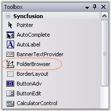
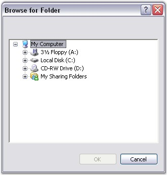

# Creating FolderBrowser

FolderBrowser control can be created in the following ways.

## Through Designer 

The designer based approach for creating and initializing the FolderBrowser component is shown below.

1. Select the FolderBrowser control from the Visual Studio .NET toolbox window and drop it onto the design form. An instance of the FolderBrowser component will be added to the design form's component tray.
  
   

2. Select a suitable value for the FolderBrowser.StartLocation property from the enumerator list provided by the property grid. This specifies the location at which browsing should be started in the folder hierarchy. This property is the functional equivalent of the Win32 PIDL's.
3. Specify an appropriate value for the FolderBrowser.Style property. The FolderBrowserStyles enumeration specifies various options for the FolderBrowser Dialog.
4. To display the FolderBrowser window, simply invoke the FolderBrowser.ShowDialog() method from within your application's code.

This method is a modal function and if the return code indicates success, the FolderBrowser.DirectoryPath property may be used to access the selected folder.



this.folderBrowser1.ShowDialog();





Me.folderBrowser1.ShowDialog()



 

See Also

Through Code

## Through Code

The programmatic approach for using the FolderBrowser component is shown below.

1. Create an instance of the FolderBrowser component.
   
   ~~~ cs
   // Declare the FolderBrowser component.
   private Syncfusion.Windows.Forms.FolderBrowser folderBrowser1;
   
   // Create an instance of the FolderBrowser component.
   this.folderBrowser1 = new Syncfusion.Windows.Forms.FolderBrowser(this.components);
   ~~~
   {:.prettyprint}
   
   
   ~~~vbnet
   ' Declare the FolderBrowser component.
   Private folderBrowser1 As Syncfusion.Windows.Forms.FolderBrowser
   
   ' Create an instance of the FolderBrowser component.
   Me.folderBrowser1 = New Syncfusion.Windows.Forms.FolderBrowser(Me.components)
   ~~~
   {:.prettyprint}

2. Set the FolderBrowser.StartLocation and FolderBrowser.Style property values.
   
   ~~~ cs
   // Specify the Start location.
   this.folderBrowser1.StartLocation = Syncfusion.Windows.Forms.FolderBrowserFolder.MyComputer;
   
   // Specify the styles for the FolderBrowser Dialog.
   this.folderBrowser1.Style = (Syncfusion.Windows.Forms.FolderBrowserStyles.RestrictToFilesystem | Syncfusion.Windows.Forms.FolderBrowserStyles.BrowseForComputer);
   ~~~
   {:.prettyprint}
   
   
   ~~~vbnet
   ' Specify the Start location.
   Me.folderBrowser1.StartLocation = Syncfusion.Windows.Forms.FolderBrowserFolder.MyComputer
   
   ' Specify the styles for the FolderBrowser Dialog.
   Me.folderBrowser1.Style = Syncfusion.Windows.Forms.FolderBrowserStyles.RestrictToFilesystem Or Syncfusion.Windows.Forms.FolderBrowserStyles.BrowseForComputer
   ~~~
   {:.prettyprint}

3. Invoke the FolderBrowser.ShowDialog() method to display the FolderBrowser Dialog.
   
   ~~~ cs
   this.folderBrowser1.ShowDialog();
   ~~~
   {:.prettyprint}
   
   ~~~vbnet
   Me.folderBrowser1.ShowDialog()
   ~~~
   {:.prettyprint}

    

See Also

Through Designer