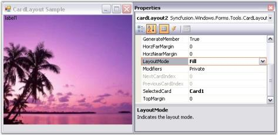

# Configuring Child Controls

Deriving from the Layout Manager base, the CardLayout inherits all the functionality that the Layout Manager type exposes.

For example, when the CardLayout is added to a form, and a Panel control is added to it, then this Panel control acts as Card1, where the user can add the needed controls. Then another Panel control can be added which will act as Card2 and so on. During runtime, only one Card will be visible at a time. You can traverse through these cards by adding buttons and setting the appropriate code.

In the following screen shot, Panel control acts as the Container control and Label control acts as a card.

 

## Image Settings

In the selected card, you can insert an image using the Child (Label) controlproperty as shown below.

_Table438: Property Table_

<table>
<tr>
<th>
Child Control Property</th><th>
Description</th></tr>
<tr>
<td>
Image</td><td>
Gets / sets the image that will be displayed on the control.</td></tr>
</table>



this.label1.Image = ((System.Drawing.Bitmap)(resources.GetObject("label1.Image")));

Me.label1.Image = DirectCast((resources.GetObject("label1.Image")), System.Drawing.Bitmap)


 

## Size

The preferred size and minimum size of the Child controls can be set using the PreferredSize and MinimumSize extended properties of the Child controls that are added to the CardLayout. Refer Child Control Settings to know about this topic.

## Layout Mode

The CardLayout provides two modes to layout the Child controls. The mode can be set using the property given below.

_Table439: Property Table_

<table>
<tr>
<th>
CardLayout Property</th><th>
Description</th></tr>
<tr>
<td>
LayoutMode</td><td>
Specifies the layout mode for the Child controls. The default value is set to 'Default'.The options included are as follows.Default andFill.</td></tr>
</table>

When the layout mode of CardLayout is set to 'Default', the Child control is simply centered within the Container when the Container's size is bigger than the Child control's preferred size. However, if the Container's size is smaller than the Child controls's preferred size, the Child control's size will shrink down to its minimum size. When shrunk, you have an option to specify whether the preferred width / height aspect ratio should be maintained for that Child control, which is specified using the extended MaintainAspectRatio property of each Child.

When the layout mode is set to 'Fill', it simply resizes the Child control to fill the entire Container client area.



this.cardLayout1.LayoutMode = Syncfusion.Windows.Forms.Tools.CardLayoutMode.Fill;

Me.cardLayout1.LayoutMode = Syncfusion.Windows.Forms.Tools.CardLayoutMode.Fill



  

See Also

Configuring CardLayout, Child Control Settings, 