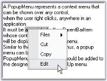

# Associating Popup Menu to a Control

In the previous topic, we saw how to add and fill a popup menu with menu items. This section will guide you on how to associate a popup menu to a control like RichTextBox (in this example), through designer without a single piece of code. 

Drag and Drop a PopupMenusManager control onto the form. Also add a RichTextBox control. When PopupMenusManager class is dragged onto the design surface, it will provide an extended property, XPContextMenu on popupMenusManager1 for all the controls in the form, letting the users to easily associate a popup menu with a control. 

 

> Note: A single PopupMenu can be associated with multiple controls.



// Create and initialize a ParentBarItem.

this.editBarItem = new Syncfusion.Windows.Forms.Tools.ParentBarItem();

this.editBarItem.Text = "&Edit";

this.editBarItem.Items.AddRange(new BarItem[] { this.cutItem, this.copyItem});

// Associate the ParentBarItem with the PopupMenu.

this.popupMenu1 = new Syncfusion.Windows.Forms.Tools.PopupMenu();

this.popupMenu1.ParentBarItem = this.editBarItem;

// Then associate it with a RichTextBox.

this.popupMenusManager = new PopupMenusManager();

this.popupMenusManager.SetXPContextMenu(this.richTextBox1, this.popupMenu1);





' Create and initialize a ParentBarItem.

Me.editBarItem = New Syncfusion.Windows.Forms.Tools.ParentBarItem()

Me.editMenu.Text = "&Edit"

Me.editMenu.Items.AddRange(New BarItem() {Me.cutItem, Me.copyItem})

' Associate the ParentBarItem with the PopupMenu.

Me.popupMenu1 = New Syncfusion.Windows.Forms.Tools.PopupMenu()

Me.popupMenu1.ParentBarItem = Me.editBarItem

' Then associate it with a RichTextBox.

Me.popupMenusManager = New PopupMenusManager()

Me.popupMenusManager.SetXPContextMenu(Me.richTextBox1, Me.popupMenu1)



 

> Note: We can even show the popup menu without implementing the PopupMenusManager class by calling PopupMenu.Show method. Click here for more details.

See Also

* Adding and filling a popup menu
* Grouping Items in a Popup Menu
* How to programmatically show a Popup Menu
