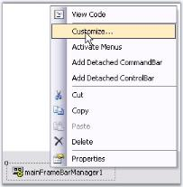

# BarManagers

There are two kinds of BarManagers.

* MainFrameBarManager 
* ChildFrameBarManager

The MainFrameBarManager is associated with a MDI container form in the MDI scenario or with the top-level form in a single document scenario. 

The ChildFrameBarManager should be associated with a MDIChild in the MDI scenario.

These two classes are derived from the BarManager and hence will be referred as such when discussing features common to both these classes. 

> Note: At run-time, a ChildFrameBarManager does not show the menus and toolbars inside a child form. It is merely a place holder for the menus and toolbars during design-time, which will be merged into the main form's menus during run-time.

BarManagers come with full design-time support and lets users add menus and toolbars and fill them with items, all without writing a single line of code. The Customize dialog facilitates customization of the menus. It is available to the developer during design-time and to the end user during runtime. 

 

 

See Also

MainFrameBarManager Properties,

ChildFrameBarManager Properties, MDI Child Forms

Detached CommandBar, Detached ControlBars