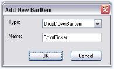

# DropDownBarItem

A DropDownBarItem is a BarItem that gets drawn with an arrow button to its right, which when clicked, will pop-up a window (note: not a menu) represented by a PopupControlContainer. This is identical to the Undo menu item in VS .NET code editor.

 

The type should be selected as DropDownBarItem in the Add New BarItem dialog.

 

## Displaying the Popup Menu

We need to associate a PopupControlContainer for showing the popup. Drag-and-drop a PopupControlContainer component and associate it with the DropDownBarItem using PopupControlContainer property of DropDownBarItem.



this.dropDownBarItem1.PopupControlContainer = this.popupControlContainer1;

Me.dropDownBarItem1.PopupControlContainer = Me.popupControlContainer1


We can add controls like ColorPickerUI control to this container and customize the popup for the DropDownBarItem.

 | markdownify }

## Behavior Settings

DropDownBarItem supports all the behavior properties of the BarItem.

## Other Common properties

For setting images see Image Settings; 

For Editing the text and setting text alignments, See BarItem Text; 

For setting shortcuts for the bar items, see Keyboard shortcuts and 

For changing the Paint Style, see PaintStyle topic. 

Appearance of the Text can be customized. See Foreground Settings for details.

See Also

UpdateUIOnAppIdle property in UI Command Update Patterns topic,

Customize Dialog