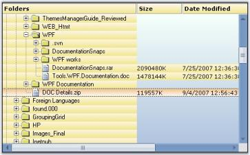

# Standard Style

Setting a Common Style for all the Nodes in the TreeViewAdv

We can modify the background for all the children of a parent node by editing the StandardStyle property. 

 
Figure : StandardStyle settings using the Property Grid

The below image displays a gradient style for all the columns of the MultiColumnTreeView control.

 
Figure : Gradient = "BackwardDiagonal; DarkKhaki, OldLace"

## StandardStyle Settings

The below properties lets you customize the standard style settings.

_Table_ _533__: Styles Table_

<table>
<tr>
<td>
TreeNodeAdvSubItemStyleInfo Property</td><td>
Description</td></tr>
<tr>
<td>
Background</td><td>
Sets the background for the node.</td></tr>
<tr>
<td>
CheckColor</td><td>
Indicates the check color.</td></tr>
<tr>
<td>
CheckState</td><td>
Indicates the Check state of the node.</td></tr>
<tr>
<td>
Enabled</td><td>
Specifies if the node is enabled.</td></tr>
<tr>
<td>
EnabledButtons</td><td>
Specifies if the buttons are enabled for the node.</td></tr>
<tr>
<td>
Font</td><td>
Sets the font for the node text.</td></tr>
<tr>
<td>
Height</td><td>
Sets the height for the node.</td></tr>
<tr>
<td>
HelpText</td><td>
Sets the tooltip for the node.</td></tr>
<tr>
<td>
IntermediateCheckColor</td><td>
Specifies the color of intermediate check symbol.</td></tr>
<tr>
<td>
Multiline</td><td>
Indicate whether multiline is enabled for the node.</td></tr>
<tr>
<td>
OptionButtonColor</td><td>
Sets the color of the option button.</td></tr>
<tr>
<td>
SelectedOptionButtonColor</td><td>
Sets the color of the selected option button.</td></tr>
<tr>
<td>
ShowCheckBox</td><td>
Sets the visibility of the Checkbox.</td></tr>
<tr>
<td>
ShowOptionButton</td><td>
Sets the visibility of the option button.</td></tr>
<tr>
<td>
ShowPlusMinus</td><td>
Sets the visibility of the plus / minus control.</td></tr>
<tr>
<td>
TextColor</td><td>
Sets the text color.</td></tr>
<tr>
<td>
ThemesEnabled</td><td>
Indicated if the node's controls will be themed.</td></tr>
<tr>
<td>
BaseStyle</td><td>
Specifies the base style of the node.</td></tr>
<tr>
<td>
EnsureDefaultOptionedChild</td><td>
Specifies if atleast one child of the parent node should be optioned at all times.</td></tr>
<tr>
<td>
InteractiveCheckbox</td><td>
Sets the visibility of the InteractiveCheckbox for the node.</td></tr>
<tr>
<td>
ClosedImageIndex</td><td>
Indicates the imageindex for closed node.</td></tr>
<tr>
<td>
CollapseImageIndex</td><td>
Indicates the imageindex in the NodeStateImageList, when the node is collapsed.</td></tr>
<tr>
<td>
ExpandImageIndex</td><td>
Indicates the imageindex in the NodeStateImageList, when the node is Expanded.</td></tr>
<tr>
<td>
LeftImageIndices</td><td>
Specifies the ImageIndex for the left image.</td></tr>
<tr>
<td>
LeftImagePadding</td><td>
Padding for the left image.</td></tr>
<tr>
<td>
LeftStateImagePadding</td><td>
Padding for the left state image.</td></tr>
<tr>
<td>
NoChildrenImageIndex</td><td>
Indicates the imageindex in the StateImageList where node has no children.</td></tr>
<tr>
<td>
OpenImageIndex</td><td>
Indicates the imageindex for the open node.</td></tr>
<tr>
<td>
RightImageIndices</td><td>
Specifies the imageindex for the right image.</td></tr>
<tr>
<td>
RightImagePadding</td><td>
Padding for the right image.</td></tr>
<tr>
<td>
RightStateImagePadding</td><td>
Padding for the right state image.</td></tr>
<tr>
<td>
ComparerOptions</td><td>
Comparer options during sorting.</td></tr>
<tr>
<td>
Comparer</td><td>
IComparer object that compares two nodes.</td></tr>
<tr>
<td>
Culture</td><td>
Indicates the culture of the nodes during sorting.</td></tr>
<tr>
<td>
SortOrder</td><td>
Specifies the sort order of the node.</td></tr>
<tr>
<td>
SortType</td><td>
Specifies the sort type of the node.</td></tr>
</table>

