## Wizard Package

Wizard Package enables to build a rich interactive and customizable interface that holds many pages together that helps to break up a complex task and guides the end user through a set of simple procedures to perform or to obtain data that are categorically divided in every page.

The Wizard Package is a collection of controls implementing the Wizard interface (with a layout of navigation buttons) to perform a variety of tasks.

It consists of two controls.

* Wizard Control - It provides a quick and easy way to create such applications.
* XPTaskPane - It provides a different view to wizards as seen in the Task Pane feature in Office XP.
#### WizardControl

The WizardControl can display a set of wizard pages in the given order. It also provides the user, the ability to browse between these pages using the 'browsing' buttons. The WizardControl implements the classic Wizard interface used in many windows applications. It also contains inbuilt child controls like labels, picturebox and gradient panel to let the user customize it effectively.

{:.image }

##### Features

This section discusses the Features of Wizard control.

* User friendly design environment - The Wizard control allows the user to add/remove the pages at design-time very easily by using verbs or by WizardControl Page Collection editor. You can also easily add images, title and description for the wizard control. 
* Navigation - The Wizard control allows the user to navigate through different pages at design time by using verbs or by clicking on the Next and Back buttons.
* Customizable user interface properties - The Wizard control creates child controls representing the different portions of the wizard and also exposes them in the designer to let users customize it.
*  Automatic and programmatic page sequencing - The Wizard control allows the user to reorder the wizard pages or to reorder the buttons of the wizard control at design time or through code.
* Show / Hide Button state - The Wizard control allows the user to show / hide / enable / disable the different buttons when a wizard page is activated.
* Event handling - We can handle events at the general Wizard level or at the Wizard Page-specific level. Global renderer child controls that appears on all the different pages of the Wizard control.
* Page validation - WizardControl Pages can be validated when the browsing button is clicked or when the page is selected.
##### Overview

Components of a Wizard Control

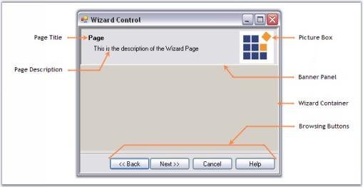
{:.image }

* The Banner Panel is a GradientPanel control that is docked on top of the WizardControl and hosts the title, description and banner picture box. This control is selectable during design-time, where you can change its properties. This control will be hidden when a wizard control page's FullPage property is set to True. 
* The Page Title is a label control that displays the title of the current wizard page. This control is selectable in the designer. In code, you can access the label control directly or through the WizardControl.Title property. 
* The Description label, another child of the Banner Panel, is a label control that shows the title of the current wizard page. This control is selectable in the designer. In code, you can access the label control directly or through the WizardControl.Description property.
* The Banner control, a child of the Banner Panel, is a picture box control that lets you show a picture on the top-right corner. This picture remains the same on all the different pages of the Wizard control. This control is selectable in the designer. In code, you can access it directly or through the WizardControl.Banner property. 
* The WizardContainer is the control within which the selected WizardControl Page will be shown. This control is selectable in the designer. In code, you can access it directly or through the WizardControl.WizardPages property. 
* The Browsing Buttons lets you browse through the different wizard pages. 

See Also

Creating a Basic Wizard

Concepts and Features

##### Creating a Basic Wizard

This section will guide you to create a basic wizard using the Wizard control.

To create a basic wizard, follow the below steps.

* Add the WizardControl from the Toolbox to the form, in the designer.

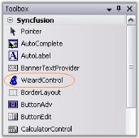
{:.image }

* Set the WizardControl.Dock property to Fill.

{:.image }

* Wizard Control lets you add multiple pages in a single wizard. You can add pages to the wizard container by four different ways. They are, 
* "Add Page" option in the smart tag. 
* Accessing Add Page command in properties grid. 
* Context menu of the Wizard control. 

See Options to Add Page, Remove Page, Previous page and Next Page topic for more details.

* Accessing WizardControl.WizardPages property will invoke WizardControlPage Collection Editor which also lets you add or remove pages.

{:.image }

Programmatically, the pages can be added to the wizard container as follows.

[C#]

this.wizardControl1.WizardPages = new Syncfusion.Windows.Forms.Tools.WizardControlPage[] {this.wizardControlPage1,

this.wizardControlPage2,this.wizardControlPage3};

this.wizardControl1.SelectedWizardPage = this.wizardControlPage2;

[VB.NET]

Me.wizardControl1.WizardPages = New Syncfusion.Windows.Forms.Tools.WizardControlPage() {Me.wizardControlPage1, Me.wizardControlPage2,Me.wizardControlPage3}

Me.wizardControl1.SelectedWizardPage = Me.wizardControlPage2

* Wizard Control comes with properties which controls its appearance and behavior. Set FullPage property of WizardControlPage1 to True if you wish to hide the header portion in the first page. Put a label control on this wizard page with introductory text. Also set BackVisible property of wizard page to False to hide the back button since this is the first page. 

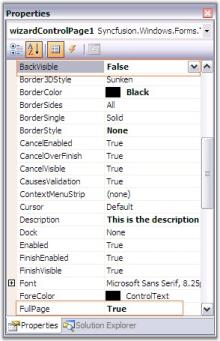
{:.image }

* The output will be as follows.

{:.image }

##### Concepts and Features

This section discusses the concepts of Wizard Package in detail, in the following topics.

###### Banner Settings

The controls inside the Banner Control include Banner Panel, Title, description and a picture box. The section will walk you through the properties which customizes these controls.

Banner Panel

A Banner Panel is a simple gradient panel which holds a Title label, a Description label and a Picture box controls. 

_Table_ _939__: Property Table_

<table>
<tr>
<td>
Property</td><td>
Description</td></tr>
<tr>
<td>
Banner</td><td>
Gets or sets the picture box for the wizard using the Image property.</td></tr>
<tr>
<td>
Description</td><td>
Sets the label that can describe the current page.</td></tr>
<tr>
<td>
Title</td><td>
Sets the title of the current page.</td></tr>
</table>
> 
{:.image }
 _Note: The Title and Description settings can be set for individual Wizard Pages using WizardPage.Title and WizardPage.Description properties respectively. See_ Wizard Page Settings_._

[C#]

this.wizardControl1.Banner = this.pictureBox2;

this.pictureBox2.Image = ((System.Drawing.Image)(resources.GetObject("pictureBox2.Image")));

this.label1.Text = "Page Title";

this.label2.Text = "This is the description of the Wizard Page";

this.gradientPanel1.Controls.Add(this.label1);

this.gradientPanel1.Controls.Add(this.label2);

[VB.NET]

Me.wizardControl1.Banner = Me.pictureBox2 

Me.pictureBox2.Image = DirectCast((resources.GetObject("pictureBox2.Image")), System.Drawing.Image) 

Me.label1.Text = "Page Title" 

Me.label2.Text = "This is the description of the Wizard Page" 

Me.gradientPanel1.Controls.Add(Me.label1) 

Me.gradientPanel1.Controls.Add(Me.label2)

{:.image }

> 
{:.image }
 _Note: The appearance of a Banner panel can be customized using the properties of the gradient panel. See_ Border styles _for border settings of a Banner Panel._

Layout of the Banner Controls

The below properties controls the layout of the respective banner controls.

_Table_ _940__: Property Table_

<table>
<tr>
<td>
Property</td><td>
Description</td></tr>
<tr>
<td>
AutoLayoutBanner</td><td>
When set to true, the picture box will be automatically laid out at a specific position, in the banner control. Setting false will not layout the picture box automatically.</td></tr>
<tr>
<td>
AutoLayoutDescription</td><td>
When set to true, the description text will be automatically laid out at a specific position, in the Description control. Setting false will not layout the text automatically.</td></tr>
<tr>
<td>
AutoLayoutTitle</td><td>
When set to true, the title will be automatically laid out at a specific position, in the banner control. Setting false will not layout the title automatically.</td></tr>
</table>

[C#]

this.wizardControl1.AutoLayoutBanner = true;

this.wizardControl1.AutoLayoutDescription = true;

this.wizardControl1.AutoLayoutTitle = true;

[VB.NET]

Me.wizardControl1.AutoLayoutBanner = True

Me.wizardControl1.AutoLayoutDescription = True

Me.wizardControl1.AutoLayoutTitle = True

See Also

Border styles

Background Settings

Title and Description Settings 

Title Text

The font style and the fore color for the Title text can be edited through Label.Font and Label.Font property.

_Table_ _941__: Property Table_

<table>
<tr>
<td>
Property</td><td>
Description</td></tr>
<tr>
<td>
Font</td><td>
Sets the font style for the Page Title in the Wizard Control.</td></tr>
<tr>
<td>
ForeColor</td><td>
Sets the forecolor for the Page Title in the Wizard Control.</td></tr>
</table>

{:.image }

[C#]

//Setting Font Style for the Label

this.label1.Font = new System.Drawing.Font("Verdana", 9F, System.Drawing.FontStyle.Bold);

this.label1.ForeColor = System.Drawing.Color.DarkBlue;

[VB.NET]

'Setting Font Style for the Label

Me.label1.Font = New System.Drawing.Font("Verdana", 9F, System.Drawing.FontStyle.Bold)

this.label1.ForeColor = System.Drawing.Color.DarkBlue;

{:.image }

Description Text

The appearance of the description text for a wizard control can be edited using the description label properties.

_Table_ _942__: Property Table_

<table>
<tr>
<td>
Property</td><td>
Description</td></tr>
<tr>
<td>
Font</td><td>
Sets the font style for the Page description in the Wizard Control.</td></tr>
<tr>
<td>
ForeColor</td><td>
Sets the forecolor for the Page description in the Wizard Control.</td></tr>
</table>

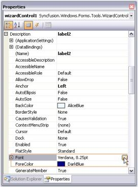
{:.image }

[C#]

//Setting Font Style for the Label

this.label1.Font = new System.Drawing.Font("Verdana", 8F);

this.label1.ForeColor = System.Drawing.Color.DarkBlue;

[VB.NET]

'Setting Font Style for the Label

Me.label1.Font = New System.Drawing.Font("Verdana", 8F)

this.label1.ForeColor = System.Drawing.Color.DarkBlue

{:.image }

> 
{:.image }
 _Note: A WizardControl can have only one page title label and one page description label. We can change only the text of these two labels for individual pages using WizardPage.Title and WizardPage.Description properties and not their appearance. Hence Font and ForeColor settings will be similar in all the page._

###### Wizard Page Settings 

A Wizard Page can include a collection of controls implementing an interactive Wizard interface. The Wizard pages are added to the Wizard Container. You can drag and drop any control into a wizard page. Wizard Control lets you to customize the individual Wizard pages to give a unique functionality for each page. 

Creating a Basic Wizard topic discussed how to add Wizard Pages. Let us see how to customize the Wizard pages. 

Setting Title and Description

You can specify the title and description in the Banner Panel, for a particular Wizard Page using the WizardPage.Title and WizardPage.Description properties. The appearance of the title and description can be controlled through Label properties. See Title and Description Settings for details.

_Table_ _943__: Property Table_

<table>
<tr>
<td>
Property</td><td>
Description</td></tr>
<tr>
<td>
Title</td><td>
Specifies the title of the page.</td></tr>
<tr>
<td>
Description</td><td>
Specifies the description for the page.</td></tr>
</table>

[C#]

this.wizardControlPage1.Title = "Registration Details";

this.wizardControlPage1.Description = "Please enter your Details:";

[VB.NET]

Me.wizardControlPage1.Title = "Registration Details"

Me.wizardControlPage1.Description = "Please enter your Details:"

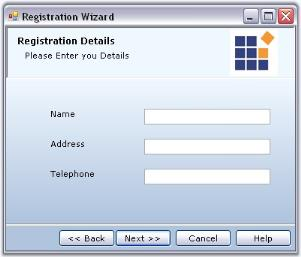
{:.image }

Accessing Wizard Pages

We can also access the properties of a Wizard Page using SelectedWizardPage property of the WizardControl in the Designer.

_Table_ _944__: Property Table_

<table>
<tr>
<td>
Property</td><td>
Description</td></tr>
<tr>
<td>
SelectedWizardPage</td><td>
Specifies the selected wizard page.</td></tr>
<tr>
<td>
WizardPage.LayoutName</td><td>
The individual Wizard page is identified using its LayoutName in the SelectedWizardPage property. By default the LayoutName is set as Card1 for the first page added, Card2 for the next page and so on. </td></tr>
</table>

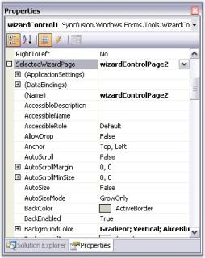
{:.image }

The header section (GradientPanel and its child controls) can be hidden by setting FullPage property to true. This makes the page occupy the entire space without the header.

_Table_ _945__: Property Table_

<table>
<tr>
<td>
Property</td><td>
Description</td></tr>
<tr>
<td>
FullPage</td><td>
Gets/sets the boolean value whether the Banner Panel should  be shown for that page. Default value is false.</td></tr>
</table>

[C#]

this.wizardControlPage1.FullPage = true;

[VB.NET]

Me.wizardControlPage1.FullPage = True

{:.image }

A sample which demonstrates a Wizard Control with interactive Wizard pages is available in the below location.

…\_My Documents\Syncfusion\EssentialStudio\Version Number\Windows\Tools.Windows\Samples\Advanced Editor Functions\ActionGroupingDemo_

See also

Foreground Settings

Background Settings

ValidatePage Event

How to Programmatically control the Page Sequence?

Reordering Wizard Pages

By default, the WizardControl will use the order in which the pages are added to determine the next/previous pages. To reorder the pages, use any one of the following methods. 

* Select the WizardControl and choose WizardPages property in the Property Editor. This will bring out the collection editor, where you can reorder the pages using Up and Down arrow keys. 

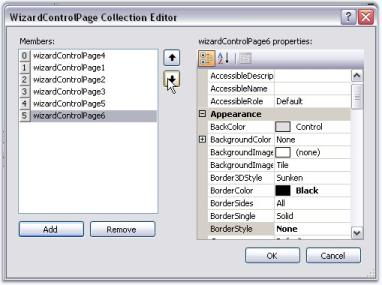
{:.image }

* In the designer, right click on a page and choose 'Bring To Front' or 'Send To Back' options which will move the page to the beginning or to the end of the collection, respectively.

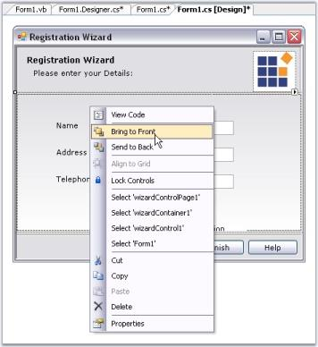
{:.image }

* The WizardControlPage has the NextPage and PreviousPage properties with which you can specify the order of page selection. Users may set these properties in the designer for all the pages. If set, the WizardControl will use that as a cue to determine the new page to be selected at run time.

_Table_ _946__: Property Table_

<table>
<tr>
<td>
WizardControlPage Property</td><td>
Description</td></tr>
<tr>
<td>
NextPage</td><td>
It sets the next page of the wizard.</td></tr>
<tr>
<td>
PreviousPage</td><td>
It sets the previous page of the wizard.</td></tr>
</table>

[C#]

this.wizardControlPage2.NextPage = this.wizardControlPage3;

this.wizardControlPage2.PreviousPage = this.wizardControlPage1;

[VB.NET]

Me.wizardControlPage2.NextPage = Me.wizardControlPage3

Me.wizardControlPage2.PreviousPage = Me.wizardControlPage1

See Also

Page Selection at Design time

ValidatePage Event

How to Programmatically control the Page Sequence?

###### Browse Buttons

The default buttons which are available for the Wizard control are Back, Next, Cancel and Help. The Next and the Back buttons facilitates users to navigate between wizard pages. 

> 
{:.image }
 _Note: You can navigate between the pages at Design Time also. See Page Navigation at Design time topic for more details._

Button Visibility

By default, all the buttons are visible for all the Wizard pages. To change their visibility, use the below properties in individual pages.

_Table_ _947__: Property Table_

<table>
<tr>
<td>
Wizard Page Property</td><td>
Description</td></tr>
<tr>
<td>
BackVisible</td><td>
Specifies whether to display the 'Back' button.</td></tr>
<tr>
<td>
CancelVisible</td><td>
Specifies whether to display 'Cancel' the button.</td></tr>
<tr>
<td>
FinishVisible</td><td>
Specifies whether to display the 'Finish' button.</td></tr>
<tr>
<td>
HelpVisible</td><td>
Specifies whether to display the 'Help' button.</td></tr>
<tr>
<td>
NextVisible</td><td>
Specifies whether to display the 'Next' button.</td></tr>
</table>
> 
{:.image }
 _Note: When you use more than one wizard page, you may set the BackVisible property of the first page to true to hide the back button._

[C#]

this.wizardControlPage1.BackVisible = true;

this.wizardControlPage1.NextVisible = true;

this.wizardControlPage1.CancelVisible = true;

this.wizardControlPage1.HelpVisible = true;

this.wizardControlPage1.FinishVisible = true;

[VB.NET]

Me.wizardControlPage1.BackVisible = True

Me.wizardControlPage1.NextVisible = true

Me.wizardControlPage1.CancelVisible = True

Me.wizardControlPage1.HelpVisible = true

Me.wizardControlPage1.FinishVisible = True

You can enable or disable the buttons using the respective button enabled properties.

_Table_ _948__: Property Table_

<table>
<tr>
<td>
WizardControlPage Property</td><td>
Description</td></tr>
<tr>
<td>
BackEnabled</td><td>
Specifies whether the state of 'Back' button should be enabled or disabled.</td></tr>
<tr>
<td>
CancelEnabled</td><td>
Specifies whether the state of 'Cancel' button should be enabled or disabled.</td></tr>
<tr>
<td>
FinishEnabled</td><td>
Specifies whether the state of 'Finish' button should be enabled or disabled.</td></tr>
<tr>
<td>
HelpEnabled</td><td>
Specifies whether the state of 'Help' button should be enabled or disabled.</td></tr>
<tr>
<td>
NextEnabled</td><td>
Specifies whether the state of 'Next' button should be enabled or disabled.</td></tr>
</table>
Adding Finish Button

In order to display the 'Finish' button in the last wizard page, user should set CancelOverFinish property in the WizardControlPage Collection Editor to false. This property determines if the Cancel button is positioned over the Finish button. If this property is set to true, it will override the FinishVisible property. 

[C#]

this.finishPage.CancelOverFinish = false;

[VB.NET]

Me.finishPage.CancelOverFinish = False

A sample which includes button settings is available in the below sample installation location.

…\_My Documents\Syncfusion\EssentialStudio\Version Number\Windows\Tools.Windows\Samples\Advanced Editor Functions\ActionGroupingDemo_

See Also

How to set spacing between the browsing buttons?

Adding and Reordering Buttons

Adding new Button to a Page

The following code snippet shows how to add a button to the wizard control browse buttons.

[C#]

// To add a new button 

Button btn = new Button(); 

btn.Text = "New Button"; 

// Add button to the WizardControl

this.wizardControl1.Controls.Add(btn); 

// Set the constraints for the newly created Button 

this.wizardControl1.GridBagLayout.GetConstraintsRef(btn).GridPosX = 6; 

this.wizardControl1.GridBagLayout.GetConstraintsRef(btn).GridPosY = 5; 

[VB.NET]

' To add a new button 

Private btn As Button = New Button()

Private btn.Text = "New Button"

'Add button to the WizardControl

Me.wizardControl1.Controls.Add(btn)

' Set the constraints for the newly created Button 

Me.wizardControl1.GridBagLayout.GetConstraintsRef(btn).GridPosX = 6

Me.wizardControl1.GridBagLayout.GetConstraintsRef(btn).GridPosY = 5

{:.image }

Reordering the Button Sequence

In order to change the position of the buttons, user should handle the GridPosX property and change the position programmatically.

> 
{:.image }
 _Note: Wizard control automatically sets position for some buttons after page change. Setting the position for controls manually, is not supported in those cases._

[C#]

//Setting the GridPosX property for changing the position of buttons

this.wizardControl1.GridBagLayout.GetConstraintsRef(this.wizardControl1.BackButton).GridPosX = 5;

this.wizardControl1.GridBagLayout.GetConstraintsRef(this.wizardControl1.NextButton).GridPosX = 6;

this.wizardControl1.GridBagLayout.GetConstraintsRef(this.wizardControl1.CancelButton).GridPosX = 4;

this.wizardControl1.GridBagLayout.GetConstraintsRef(this.wizardControl1.FinishButton).GridPosX = 3;

this.wizardControl1.GridBagLayout.GetConstraintsRef(this.wizardControl1.HelpButton).GridPosX = 2; 

[VB.NET]

'Setting the GridPosX property for changing the position of buttons

Me.wizardControl1.GridBagLayout.GetConstraintsRef(Me.wizardControl1.BackButton).GridPosX = 5

Me.wizardControl1.GridBagLayout.GetConstraintsRef(Me.wizardControl1.NextButton).GridPosX = 6

Me.wizardControl1.GridBagLayout.GetConstraintsRef(Me.wizardControl1.CancelButton).GridPosX = 4

Me.wizardControl1.GridBagLayout.GetConstraintsRef(Me.wizardControl1.FinishButton).GridPosX= 3

Me.wizardControl1.GridBagLayout.GetConstraintsRef(Me.wizardControl1.HelpButton).GridPosX = 2

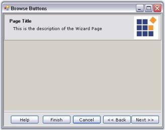
{:.image }

Button Appearance

The default browse buttons are the normal windows button controls. Appearance of the buttons can be controlled using the properties available. Some appearance properties are listed below.

_Table_ _949__: Property Table_

<table>
<tr>
<td>
Button Property</td><td>
Description</td></tr>
<tr>
<td>
FlatStyle</td><td>
Sets the appearance of the button control. The flat style are, Flat,Popup, Standard and System.</td></tr>
<tr>
<td>
FlatAppearance</td><td>
Sets the appearance of the border, color for mouse state and check state. This setting will be effective only when FlatStyle is set to Flat.</td></tr>
<tr>
<td>
Font</td><td>
Sets the Font Style for the button text.</td></tr>
<tr>
<td>
ForeColor</td><td>
Sets the fore color for the button text.</td></tr>
<tr>
<td>
Image</td><td>
Sets an image icon for the button.</td></tr>
<tr>
<td>
ImageAlign</td><td>
Specifies the image alignment in the control.</td></tr>
<tr>
<td>
ImageIndex</td><td>
Specifies the image index for the button, when ImageList property is used.</td></tr>
<tr>
<td>
ImageList</td><td>
Specifies the image list.</td></tr>
<tr>
<td>
Text</td><td>
Specifies the button text.</td></tr>
<tr>
<td>
TextAlign</td><td>
Specifies the alignment of the text.</td></tr>
<tr>
<td>
TextImageRelation</td><td>
Specifies the relative location of the image to the text on the button.</td></tr>
</table>

[C#]

//Sets the flat style settings for the Cancel button

this.wizardControl1.CancelButton.FlatStyle = System.Windows.Forms.FlatStyle.Flat;

this.wizardControl1.CancelButton.ForeColor = System.Drawing.Color.SteelBlue;

this.wizardControl1.CancelButton.FlatAppearance.BorderSize = 1;

this.wizardControl1.CancelButton.FlatAppearance.BorderColor = System.Drawing.Color.DarkBlue;

this.wizardControl1.CancelButton.FlatAppearance.MouseOverBackColor = System.Drawing.Color.PowderBlue;

[VB.NET]

'Sets the flat style settings for the Cancel button

Me.wizardControl1.CancelButton.FlatStyle = System.Windows.Forms.FlatStyle.Flat 

Me.wizardControl1.CancelButton.ForeColor = System.Drawing.Color.SteelBlue

this.wizardControl1.CancelButton.FlatAppearance.BorderSize = 1;

this.wizardControl1.CancelButton.FlatAppearance.BorderColor = System.Drawing.Color.DarkBlue;

this.wizardControl1.CancelButton.FlatAppearance.MouseOverBackColor = System.Drawing.Color.PowderBlue;

{:.image }

> 
{:.image }
 _Note: You can access the properties of CancelButton, FinishButton, HelpButton and NextButton using WizardControl.CancelButton, WizardControl.FinishButton, WizardControl.HelpButton and WizardControl.NextButton properties respectively._

{:.image }

###### DesignTime Features

The below topics are discussed in this particular section.

Options to Add Page, Remove Page, Previous page and Next Page

This section will guide you with various options available in the designer to add page, remove page, go to previous page and next page.

Using Property Grid

{:.image }

Using Smart Tag

{:.image }

Using Context menu

{:.image }

Property Grid Commands

{:.image }

Page Selection at Design time

This section will guide you with page selection options at design time.

* We can easily navigate between the Wizard pages using the Next and Back buttons in the designer. These buttons are selectable at design time. 

{:.image }

* Another way to navigate is to access the Next Page or Previous Page option in the context menu or Smart Tag of the Wizard control.
* See Options to Add Page, Remove Page, Previous page and Next Page topic, to see the Next page and Previous page options in smart tag and context menu.
* You can also do the page selection using SelectedWizardPage or CardLayout property.

{:.image }

See Also

Wizard Page Settings

###### Wizard Control Appearance

This section discusses the various appearance settings of the Wizard controls.

Foreground Settings

Wizard Control Foreground

The appearance of the text in the Wizard control can be controlled using the Font and ForeColor properties. 

_Table_ _950__: Property Table_

<table>
<tr>
<td>
Property</td><td>
Description</td></tr>
<tr>
<td>
Font</td><td>
Sets the font style for the display text in the wizard control.</td></tr>
<tr>
<td>
ForeColor</td><td>
Sets the fore color for the display text in the control.</td></tr>
</table>
> 
{:.image }
 _Note: These WizardControl.Font property will be applied only to the Description text and the Button texts of the Wizard Page. WizardControl.ForeColor property will be applied to the Page Title and description text alone. To set Font style for Title and description, see Title and Description Settings topic._

[C#]

//Foreground Settings for the display text 

this.wizardControl1.Font = new System.Drawing.Font("Verdana", 8.25F, System.Drawing.FontStyle.Regular);

this.wizardControl1.ForeColor = System.Drawing.Color.DarkBlue;

[VB.NET]

'Foreground Settings for the display text 

Me.wizardControl1.Font = New System.Drawing.Font("Verdana", 8.25F, System.Drawing.FontStyle.Regular) 

Me.wizardControl1.ForeColor = System.Drawing.Color.DarkBlue

{:.image }

> 
{:.image }
 _Note: These settings can be overridden by the individual WizardPage.Font and WizardPage.ForeColor settings._ 

The foreground settings for the Button text can be overridden by the WizardPage.Button.Font and WizardPage.Button.ForeColor settings also. See Button Appearance topic.

Wizard Page Foreground

The font and fore color for the display text in a Wizard page can be controlled through below properties.

_Table_ _951__: Property Table_

<table>
<tr>
<td>
Property</td><td>
Description</td></tr>
<tr>
<td>
Font</td><td>
Sets the font style for the display text in the wizard page.</td></tr>
<tr>
<td>
ForeColor</td><td>
Sets the fore color for the display text in the wizard page.</td></tr>
</table>

[C#]

this.wizardControl1.Font = new System.Drawing.Font("Verdana", 8.25F, System.Drawing.FontStyle.Regular);

this.wizardControl1.ForeColor = System.Drawing.Color.Black;

[VB.NET]

Me.wizardControl1.Font = New System.Drawing.Font("Verdana", 8.25F, System.Drawing.FontStyle.Regular) 

Me.wizardControl1.ForeColor = System.Drawing.Color.Black

{:.image }

Background Settings

Wizard Control Background

The background of the Wizard control can be customized through the below properties.

_Table_ _952__: Property Table_

<table>
<tr>
<td>
Property</td><td>
Description</td></tr>
<tr>
<td>
BackColor</td><td>
Sets the back color for the Wizard control.</td></tr>
<tr>
<td>
BackgroundImage</td><td>
Sets the background image for the Wizard control.</td></tr>
<tr>
<td>
BackgroundImageLayout</td><td>
Sets the layout for the background image in the Wizard Control.</td></tr>
</table>

[C#]

this.wizardControl1.BackColor = System.Drawing.Color.LightSteelBlue;

[VB.NET]

Me.wizardControl1.BackColor = System.Drawing.Color.LightSteelBlue

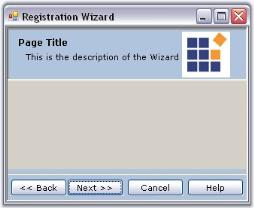
{:.image }

> 
{:.image }
 _Note: By default the background settings of the Wizard control will be overridden by the Wizard Container background settings._

Banner Panel Background

The below properties lets you customize the banner panel in a Wizard Control.

_Table_ _953__: Property Table_

<table>
<tr>
<td>
Property</td><td>
Description</td></tr>
<tr>
<td>
BackColor</td><td>
Sets the back color for the banner panel.</td></tr>
<tr>
<td>
BackgroundColor</td><td>
Sets a gradient background for the banner panel in the Wizard control. This overrides the BackColor property of the Banner panel.</td></tr>
<tr>
<td>
BackgroundImage</td><td>
Sets the background image for the banner panel.</td></tr>
<tr>
<td>
BackgroundImageLayout</td><td>
Sets the layout for the background image in the banner panel.</td></tr>
</table>

[C#]

this.gradientPanel1.BackgroundColor = new Syncfusion.Drawing.BrushInfo(Syncfusion.Drawing.GradientStyle.Vertical, System.Drawing.Color.AliceBlue, System.Drawing.Color.LightSteelBlue);

[VB.NET]

Me.gradientPanel1.BackgroundColor = New Syncfusion.Drawing.BrushInfo(Syncfusion.Drawing.GradientStyle.Vertical, System.Drawing.Color.AliceBlue, System.Drawing.Color.LightSteelBlue) 

{:.image }

Wizard Page Background

The below properties lets you customize the Wizard page in a Wizard Control.

_Table_ _954__: Property Table_

<table>
<tr>
<td>
Property</td><td>
Description</td></tr>
<tr>
<td>
BackColor</td><td>
Sets the back color for the banner panel.</td></tr>
<tr>
<td>
BackgroundColor</td><td>
Sets a gradient background for the banner panel in the Wizard control. This overrides the BackColor property of the Banner panel.</td></tr>
<tr>
<td>
BackgroundImage</td><td>
Sets the background image for the banner panel.</td></tr>
<tr>
<td>
BackgroundImageLayout</td><td>
Sets the layout for the background image in the banner panel.</td></tr>
</table>

[C#]

this.wizardControlPage2.BackgroundColor = new Syncfusion.Drawing.BrushInfo(Syncfusion.Drawing.GradientStyle.PathRectangle, System.Drawing.Color.AliceBlue, System.Drawing.Color.LightSteelBlue);

[VB.NET]

Me.wizardControlPage2.BackgroundColor = New Syncfusion.Drawing.BrushInfo(Syncfusion.Drawing.GradientStyle.PathRectangle, System.Drawing.Color.AliceBlue, System.Drawing.Color.LightSteelBlue) 

{:.image }

Border Styles 

Wizard Control

The various border styles for a Wizard control are as follows.

* None
* FixedSingle and 
* Fixed3D

[C#]

this.wizardControl1.BorderStyle = System.Windows.Forms.BorderStyle.FixedSingle;

[VB.NET]

Me.wizardControl1.BorderStyle = System.Windows.Forms.BorderStyle.FixedSingle

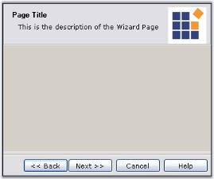
{:.image }

Banner Panel

Banner Panel is a simple gradient panel whose 3D border styles are as follows. 

* RaisedOuter
* SunkenOuter
* RaisedInner
* Raised
* Etched
* SunkenInner
* Bump
* Sunken
* Adjust
* Flat
> 

{:.image }
 _Note: The GradientPanel.BorderStyle property should be set to "Fixed3D" to make this setting effective._

[C#]

this.gradientPanel1.Border3DStyle = System.Windows.Forms.Border3DStyle.Sunken;

this.gradientPanel1.BorderStyle = System.Windows.Forms.BorderStyle.Fixed3D;

[VB.NET]

Me.gradientPanel1.Border3DStyle = System.Windows.Forms.Border3DStyle.Sunken

Me.gradientPanel1.BorderStyle = System.Windows.Forms.BorderStyle.Fixed3D

{:.image }

You can use the below properties to set 2D border style for the Banner Control when GradientPanel.BorderStyle property is set to "FixedSingle".

_Table_ _955__: Property Table_

<table>
<tr>
<td>
Banner Panel Property</td><td>
Description</td></tr>
<tr>
<td>
BorderColor</td><td>
Sets the border color for the Banner panel.</td></tr>
<tr>
<td>
BorderSides</td><td>
Specifies the sides of the control which should have border.</td></tr>
<tr>
<td>
BorderSingle</td><td>
Specifies the 2D Border style for the panel when BorderStyle property is set to FixedSingle.</td></tr>
</table>
Wizard Page Border

The below properties controls the border settings for a Wizard control page.

_Table_ _956__: Property Table_

<table>
<tr>
<td>
Wizard Page Property</td><td>
Description</td></tr>
<tr>
<td>
BorderStyle</td><td>
Specifies the border style for Wizard page. The available styles are Fixed3D and FixedSingle.</td></tr>
<tr>
<td>
Border3DStyle</td><td>
Specifies the 3D border style for Wizard page. The available styles are,RaisedOuter,SunkenOuter,RaisedInner,Raised,Etched,SunkenInner,Bump,Sunken,Adjust andFlat.</td></tr>
<tr>
<td>
BorderColor</td><td>
Sets the border color for the Wizard page.</td></tr>
<tr>
<td>
BorderSides</td><td>
Specifies the sides of the control which should have border.</td></tr>
<tr>
<td>
BorderSingle</td><td>
Specifies the 2D Border style for the Wizard page when BorderStyle property is set to FixedSingle. The available styles are,Dotted,Dashed,Solid,Inset and Outset.</td></tr>
</table>
##### Event Handling 

This section comprises the below events:

###### Wizard Control Events

The events available for Wizard control and the methods which raises these events are listed in the below tables.

_Table_ _957__: Events Table_

<table>
<tr>
<td>
Wizard Control Events</td><td>
Description</td></tr>
<tr>
<td>
Back</td><td>
This event is handled when the Back button is clicked or when PreviousPage method is called.</td></tr>
<tr>
<td>
Next</td><td>
This event is handled when the Next button is clicked or when NextPage method is called.</td></tr>
<tr>
<td>
Cancel</td><td>
This event is handled before the Cancel button is clicked.</td></tr>
<tr>
<td>
Finish</td><td>
This event is handled before the Finish button is clicked.</td></tr>
<tr>
<td>
Help</td><td>
This event is handled before the Help button is clicked.</td></tr>
<tr>
<td>
BannerControlLocationChanging</td><td>
Handled when banner panel controls are laid out.</td></tr>
<tr>
<td>
BeforePageSelect</td><td>
Handled when the selected page is about to change.</td></tr>
<tr>
<td>
BeforeBack</td><td>
Handled before the back button is clicked.</td></tr>
<tr>
<td>
BeforeFinish</td><td>
Handled before the finish button is clicked.</td></tr>
<tr>
<td>
BeforeNext</td><td>
Handled before the Next button is clicked.</td></tr>
</table>
_Table_ _958__: Methods Table_

<table>
<tr>
<td>
Wizard Control Methods</td><td>
Description</td></tr>
<tr>
<td>
PreviousPage</td><td>
Selects the previous page.</td></tr>
<tr>
<td>
NextPage</td><td>
Selects the next page.</td></tr>
</table>
BannerControlLocationChanging Event

This event is discussed in How to Cancel the AutoLayout of the Banner panel controls.

###### Wizard Page Events

The events available for the Wizard Page and the methods which raises these events are listed in the below tables.

_Table_ _959__: Events Table_

<table>
<tr>
<td>
Wizard Page Events</td><td>
Description</td></tr>
<tr>
<td>
BackClick</td><td>
This event is handled to notify that Back button was clicked. It can be raised by calling RaiseBackClick method.</td></tr>
<tr>
<td>
NextClick</td><td>
This event is handled to notify that Next button was clicked. It can be raised by calling RaiseNextClick method.</td></tr>
<tr>
<td>
CancelClick</td><td>
This event is handled to notify that Cancel button was clicked. It can be raised by calling RaiseCancelClick method.</td></tr>
<tr>
<td>
FinishClick</td><td>
This event is handled to notify that Finish button was clicked. It can be raised by calling RaiseFinishClick method.</td></tr>
<tr>
<td>
HelpClick</td><td>
This event is handled to notify that Help button was clicked. It can be raised by calling RaiseHelpClick method.</td></tr>
<tr>
<td>
PageLoad</td><td>
This event is handled when the page is selected. It can be raised by calling RaisePageLoad method.</td></tr>
<tr>
<td>
ValidatePage</td><td>
Handled to validate a page before a new page is selected. It can be raised by calling RaiseValidatePage method.</td></tr>
<tr>
<td>
SettingChanged</td><td>
Handled when the title and description of a page is changed.</td></tr>
</table>
_Table_ _960__: Methods Table_

<table>
<tr>
<td>
Wizard Page Methods</td><td>
Description</td></tr>
<tr>
<td>
RaiseBackClick</td><td>
Raises the WizardPage.BackClick event.</td></tr>
<tr>
<td>
RaiseNextClick</td><td>
Raises the WizardPage.NextClick event.</td></tr>
<tr>
<td>
RaiseCancelClick</td><td>
Raises the WizardPage.CancelClick event.</td></tr>
<tr>
<td>
RaiseFinishClick</td><td>
Raises the WizardPage.FinishClick event.</td></tr>
<tr>
<td>
RaiseHelpClick</td><td>
Raises the WizardPage.HelpClick event.</td></tr>
<tr>
<td>
RaisePageLoad</td><td>
Raises the WizardPage.PageLoad event.</td></tr>
<tr>
<td>
RaiseValidatePage</td><td>
Raises the WizardPage.ValidatePage event.</td></tr>
</table>
ValidatePage Event

WizardControl Pages can be validated using ValidatePage event. In this event, data validation can be performed and traversing to the next page can be canceled, if the validation fails. 

If the user does not want to validate a page while moving back (pressing BackButton), then it can be done by setting BackButtonCausesValidation property to false.

[C#]

// Handling ValidatePage Event

private void wizardControlPage2_ValidatePage(object sender, System.ComponentModel.CancelEventArgs e)

{

if(this.textBox1.Text == String.Empty)

{

MessageBox.Show("Text cannot be empty.","Datas Needed",MessageBoxButtons.OK,MessageBoxIcon.Warning);

e.Cancel = true;

this.textBox1.Focus();

}

else if(this.textBox1.Text != "Next")

{

MessageBox.Show("Correct Value needed.","Incorrect value",MessageBoxButtons.OK,MessageBoxIcon.Warning);

e.Cancel = true;

this.textBox1.Text = "";

this.textBox1.Focus();

}

}

[VB.NET]

' Handling ValidatePage Event

Private Sub wizardControlPage2_ValidatePage(ByVal sender As Object, ByVal e As System.ComponentModel.CancelEventArgs) Handles wizardControlPage2.ValidatePage

If Me.textBox1.Text = String.Empty Then

MessageBox.Show("Text cannot be empty.","Datas Needed",MessageBoxButtons.OK,MessageBoxIcon.Warning)

e.Cancel = True

Me.textBox1.Focus()

Else If Me.textBox1.Text &lt;&gt; "Next" Then

MessageBox.Show("Correct Value needed.","Incorrect value",MessageBoxButtons.OK,MessageBoxIcon.Warning)

e.Cancel = True

Me.textBox1.Text = ""

Me.textBox1.Focus()

End If

End Sub

##### Frequently Asked Questions

This section illustrates the solutions for various task-based queries about the control.

###### How to add a wizard page to the Wizard Control programmatically?

You can add a Wizard page to the Wizard Control using AddPage Method.

[C#]

private Syncfusion.Windows.Forms.Tools.WizardControlPage NewPage;

this.NewPage = new Syncfusion.Windows.Forms.Tools.WizardControlPage(this.components);

this.wizardControl1.AddPage(NewPage);

NewPage.Title = "Finishing Page";

NewPage.Description = "Give a Finish Text";

[VB.NET]

Private NewPage As Syncfusion.Windows.Forms.Tools.WizardControlPage

Me.NewPage = New Syncfusion.Windows.Forms.Tools.WizardControlPage(Me.components) 

Me.wizardControl1.AddPage(NewPage) 

NewPage.Title = "Finishing Page" 

NewPage.Description = "Give a Finish Text" 

{:.image }

###### How to Cancel the AutoLayout of the Banner panel controls

Wizard Control automatically repositions child controls parts by itself. The AutoLayout of controls in the banner (gradient panel) can be canceled using BannerControlLocationChanging event. You could change the title and description label control to a desired location and handle this event to cancel the auto layout of those controls as follows.

[C#]

//Handling BannerControlLocationChanging Event

this.wizardControl1.BannerControlLocationChanging += new CancelEventHandler(wizardControl1_BannerControlLocationChanging);

private void wizardControl1_BannerControlLocationChanging(object sender, System.ComponentModel.CancelEventArgs e)

{

e.Cancel = true;

}

[VB.NET]

'Handling BannerControlLocationChanging Event

Private Me.wizardControl1.BannerControlLocationChanging += New CancelEventHandler(wizardControl1_BannerControlLocationChanging)

Private Sub wizardControl1_BannerControlLocationChanging(ByVal sender As Object, ByVal e As System.ComponentModel.CancelEventArgs)

    e.Cancel = True

End Sub

###### How to Programmatically control the Page Sequence?

In many cases, the user will need to customize the order in which pages display. The Wizard control provides events for doing this.

There are two ways to programmatically control the page sequence.

Example Scenario

Say you have a three page wizard and there is a checkbox on the first page. If the checkbox is checked, you are on the first page, and you press the Next button, you require the wizard to skip the middle page and go directly to the last page. Likewise, if the checkbox is checked, you are on the last page, and you press the Back button, you need to skip the middle page and go back to the first page. If the checkbox is left unchecked, navigation using the buttons will move through all three pages.

Controlling Page Sequence with the Wizard Control

* In the BeforeNext event handler, implement the below code, which will control the page sequence with the wizard control.

[C#]

private void wizardControl1_BeforeNext(object sender, CancelEventArgs e)

{

    if (this.wizardControl1.SelectedPage == this.wizardControlPage1 && this.checkBox.Checked)

    {

        this.wizardControl1.SelectedPage.NextPage = this.wizardControlPage3;

    }

    else if (this.wizardControl1.SelectedPage == this.wizardControlPage1 && !this.checkBox.Checked)

    {

        this.wizardControl1.SelectedPage.NextPage = this.wizardControlPage2;

    }

}

[VB.NET]

Private Sub wizardControl1_BeforeNext(ByVal sender As Object, ByVal e As CancelEventArgs)

    If Me.wizardControl1.SelectedPage = Me.wizardControlPage1 AndAlso Me.checkBox.Checked Then

        Me.wizardControl1.SelectedPage.NextPage = Me.wizardControlPage3

    ElseIf Me.wizardControl1.SelectedPage = Me.wizardControlPage1 AndAlso Not Me.checkBox.Checked Then

        Me.wizardControl1.SelectedPage.NextPage = Me.wizardControlPage2

    End If

End Sub

* In the Back button click event handler, implement this code. 

[C#]

private void wizardControl1_Back_Click(object sender, System.EventArgs e)

{

if(this.wizardControl1.SelectedPage == this.wizardControlPage3 && checkBox.Checked)

this.wizardControl1.SelectedPage.NextPage=this.wizardControlPage1;

}

[VB.NET]

Private Sub wizardControl1_Back_Click(ByVal sender As Object, ByVal e As System.EventArgs)

If Me.wizardControl1.SelectedPage = Me.wizardControlPage3 AndAlso checkBox.Checked Then

Me.wizardControl1.SelectedPage.NextPage = Me.wizardControlPage1

End If

End Sub

With those two events in place on the wizard, the wizard can now skip the middle page based on whether the checkbox is checked. 

Controlling Page Sequence with a Wizard Page 

Page sequencing may also be controlled in the NextClick and BackClick events of Wizard Control Page. 

* When one of the above events is implemented for a Wizard Control Page, the associated event in the Wizard control will not fire if the WizardPage is currently selected. 
* In the NextClick event handler, you implement this code:

[C#]

private void wizardControlPage1_NextClick(object sender, System.EventArgs e)

{

if (checkBox.Checked)

{

this.wizardControlPage1.NextPage=this.wizardControlPage3;

}

}

[VB.NET]

Private Sub wizardControlPage1_NextClick(ByVal sender As Object, ByVal e As System.EventArgs)

If checkBox.Checked Then

Me.wizardControlPage1.NextPage = Me.wizardControlPage3

End If

End Sub

* In the BackClick event handler, implement this code.

[C#]

private void wizardControlPage3_BackClick(object sender, System.EventArgs e)

{

    if (checkBox.Checked)

    {

        this.wizardControlPage3.NextPage=this.wizardControlPage1;

    }

} 

[VB.NET]

Private Sub wizardControlPage3_BackClick(ByVal sender As Object, ByVal e As System.EventArgs)

    If checkBox.Checked Then

        Me.wizardControlPage3.NextPage = Me.wizardControlPage1

    End If

End Sub

With those two events in place on the wizard page, the wizard can now skip the middle page based on whether the checkbox is checked.

###### How to set spacing between the browsing buttons?

The WizardControl internally uses the GridBagLayout to arrange the navigation buttons.

You could insert spaces around the buttons using the Insets property. The GridBagLayout.GetConstraintsRef returns the object containing the constraints for that particular control. Specifying an Insets value as shown below to this, would create padding around this control.

[C#]

this.wizardControl1.GridBagLayout.GetConstraintsRef(this.wizardControl1.NextButton).Insets = new Insets(5, 5, 5, 5);

this.wizardControl1.GridBagLayout.GetConstraintsRef(this.wizardControl1.BackButton).Insets = new Insets(5, 5, 0, 5);

this.wizardControl1.GridBagLayout.GetConstraintsRef(this.wizardControl1.CancelButton).Insets = new Insets(0, 5, 5, 5);  

[VB.NET]

Me.wizardControl1.GridBagLayout.GetConstraintsRef(Me.wizardControl1.NextButton).Insets= New Insets(5, 5, 5, 5)

Me.wizardControl1.GridBagLayout.GetConstraintsRef(Me.wizardControl1.BackButton).Insets= New Insets(5, 5, 0, 5)

Me.wizardControl1.GridBagLayout.GetConstraintsRef(Me.wizardControl1.CancelButton).Insets = New Insets(0, 5, 5, 5)

#### XPTaskPane

The XPTaskPane is a container control that can host a number of XP TaskPage, which the user can browse using a dropdown menu and the arrow buttons in taskpane's header portion. This resembles the taskpane in Office XP 2002. 

The XPTaskPane control was inspired by the Office XP taskpane feature. The control internally uses a CardLayout to show one page at a time. The header panel allows the user to select one page at a time. The control comes with complete design-time support.

{:.image }

##### Features

This section covers the features of XPTaskPane control.

* Complete design time support - XPTaskPane allows the user to easily design the XPTaskPages and browse using a drop-down menu and the arrow button in task pane's header portion.
* Customizable user interface properties - XPTaskPane creates child controls representing the different segments of the XPTaskPane and also exposes them in the designer to let users customize it.
* Add / Remove pages - XPTaskPages can be added or removed either through verbs or through TaskPages property settings.
* Navigation - XPTaskPane allows the user to navigate through pages at design-time by selecting Previous page and Next page verbs or using arrow keys in the XP TaskPage Collection Editor.
* Page Sequencing - XPTaskPane allows the user to reorder the pages through 'Bring to front' and 'Send to back' verbs or by using XP TaskPage Collection Editor.
* Visual styles - XPTaskPane supports visual styles Office XP and Office 2007 with all three color schemes that defines the look and feel of the application.
* Custom Colors can be applied for XPTaskPane control. See Visual Styles topic.

{:.image }

##### XPTaskPane

Segments of an XPTaskPane Control

* The Header of the XPTaskPane contains the Header Label representing the title of each page.
* The HeaderLeftToolbar represents the toolbar items placed on top left corner of the task pane header. It has Left and Right navigating button items which can be accessed using HeaderLeftToolbar.Items[0] and HeaderLeftToolbar.Items[1] respectively.
* The HeaderRightToolbar represents the toolbar items placed on top right corner of the task pane header. It has DropDownMenu and Close button items which can be accessed using HeaderRightToolbar.Items[0] and HeaderRightToolbar.Items[1] respectively.
* The PageContainer of the XPTaskPane hosts the XPTaskPages.

{:.image }

##### Creating a Simple XPTaskPane

This section demonstrates how to create a simple XPTaskPane.

{:.image }

* Add the XPTaskPane control to your empty form in the designer and set its Dock property to right. 

{:.image }

* Add pages to the TaskPane using: "Add Page" option in the smart tag.

{:.image }

* Add Page option in context menu of the Header.

{:.image }

* "Add Page" command in Property grid.
* XPTaskPage Collection Editor which can be opened by accessing TaskPages property of the control. You can use Remove page option to remove a page.

{:.image }

{:.image }

* The pages can be added programmatically as follows.

[C#]

this.xpTaskPane1.TaskPages = new Syncfusion.Windows.Forms.Tools.XPTaskPage[] {this.xpTaskPage1,this.xpTaskPage2, this.xpTaskPage3};

[VB.NET]

Me.xpTaskPane1.TaskPages = New Syncfusion.Windows.Forms.Tools.XPTaskPage() {Me.xpTaskPage1,Me.xpTaskPage2, Me.xpTaskPage3}

* XPTaskPane control has properties which controls the appearance and behavior of the Task pane sections. You can set Header text for individual pages using XPTaskPage1.Title property of the task page.

[C#]

this.xpTaskPage1.Title = "Document";

[VB.NET]

Me.xpTaskPage1.Title = "Document"

* Change the LayoutName property of a task page to a custom name. This name can be used in the SelectedPage property of the task pane to refer to a particular page. See XPTaskPage topic.
* Add one or more controls to the task page. 

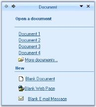
{:.image }

* Invoke the Add Page verb again in the task pane to add more pages. Repeat the steps above to customize the newly added tab page.

See Also

Concepts and Features

##### Concepts and Features

This section discusses the concepts of XP TaskPane Control in the below topics.

###### XPTaskPane

XPTaskPane has a TaskPanePageContainer which hosts the Task pages. Any number of controls can added to the Task pages and can be customized. Properties which controls the appearance of the Task pages are discussed in this section.

Page Title and Layout Name

The title text for an XPTaskPage can be edited using XPTaskPage.Title property.

_Table_ _961__: Property Table_

<table>
<tr>
<td>
Property</td><td>
Description</td></tr>
<tr>
<td>
Title</td><td>
Sets the title text for Task page.</td></tr>
<tr>
<td>
SelectedPage</td><td>
Specifies the selected Task page.</td></tr>
<tr>
<td>
LayoutName</td><td>
The individual Task page is identified using its LayoutName in the SelectedPage property. By default the LayoutName is set as Card1, for the first page added, Card2 for the next page and so on. </td></tr>
</table>

[C#]

this.xpTaskPage1.Title = "XPTaskPane Header";

this.xpTaskPage1.LayoutName = "Card1";

[VB.NET]

Me.xpTaskPage1.Title = "XPTaskPane Header"

Me.xpTaskPage1.LayoutName = "Card1"

{:.image }

TaskPage Border

The below properties controls the border settings for a Task page.

_Table_ _962__: Property Table_

<table>
<tr>
<td>
XPTaskPage Property</td><td>
Description</td></tr>
<tr>
<td>
BorderStyle</td><td>
Specifies the border style for Task page. The available styles are Fixed3D and FixedSingle.</td></tr>
<tr>
<td>
Border3DStyle</td><td>
Specifies the 3D border style for Task page. The available styles are,RaisedOuter,SunkenOuter,RaisedInner,Raised,Etched,SunkenInner,Bump,Sunken,Adjust andFlat.</td></tr>
<tr>
<td>
BorderColor</td><td>
Sets the border color for the Task page.</td></tr>
<tr>
<td>
BorderSides</td><td>
Specifies the sides of the control which should have border.</td></tr>
<tr>
<td>
BorderSingle</td><td>
Specifies the 2D Border style for the Task page when BorderStyle property is set to FixedSingle. The available styles are,Dotted,Dashed,Solid,Inset and Outset.</td></tr>
</table>

[C#]

this.xpTaskPage1.BorderColor = System.Drawing.Color.SteelBlue

this.xpTaskPage1.BorderStyle = System.Windows.Forms.BorderStyle.FixedSingle

[VB.NET]

Me.xpTaskPage1.BorderColor = System.Drawing.Color.SteelBlue

Me.xpTaskPage1.BorderStyle = System.Windows.Forms.BorderStyle.FixedSingle

{:.image }

XPTaskPage Foreground

Font style and fore color of the Task pages can be set using XPTaskPage.Font and XPTaskPage.ForeColor properties. 

[C#]

this.xpTaskPage1.Font = new System.Drawing.Font("Arial", 8.25F);

this.xpTaskPage1.ForeColor = System.Drawing.Color.SteelBlue;

[VB.NET]

Me.xpTaskPage1.Font = New System.Drawing.Font("Arial", 8.25F)

Me.xpTaskPage1.ForeColor = System.Drawing.Color.SteelBlue

{:.image }

Reordering XPTaskPage

When the end user adds a page to the XPTaskPane control, the order of the page is decided, as the page is added. They can be reordered using any one of the below methods in the designer.

* Through XPTaskPage Collection Editor.

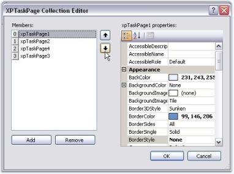
{:.image }

* Select a page in the designer and choose the 'Bring To Front' or 'Send To Back' verb which will move the page to the beginning of the collection or to the end of the collection, respectively.

{:.image }

Going to Next Page or Previous Page

* Right Click a page in the designer and choose the 'Previous Page' or 'Next Page' verb which will show you the page, which is before the current page or the page which is after the current page. These options can also be accessed through smart tag and property grid commands.

{:.image }

Page Order at RunTime

XPTaskPage allows you to set the next or the previous page to the currently selected page through the NextPage and PreviousPage properties.

_Table_ _963__: Property Table_

<table>
<tr>
<td>
XPTaskPage Property</td><td>
Description</td></tr>
<tr>
<td>
NextPage</td><td>
It sets the next page for XP TaskPane.</td></tr>
<tr>
<td>
PreviousPage</td><td>
It sets the previous page for XP TaskPane.</td></tr>
</table>
> 
{:.image }
 _Note: The TaskPane follows this order at run time._

[C#]

this.xpTaskPage2.NextPage = this.xpTaskPage3;

this.xpTaskPage2.PreviousPage = this.xpTaskPage1;

[VB.NET]

Me.xpTaskPage2.NextPage = Me.xpTaskPage3

Me.xpTaskPage2.PreviousPage = Me.xpTaskPage1

###### XPTaskPane Appearance

This section comprises the below topics:

Foreground Settings

XPTaskPane Foreground

Font style and fore color of the Task pages can be set using XPTaskPane.Font and XPTaskPane.ForeColor properties. 

> 
{:.image }
 _Note: These settings can be overridden by individual XPTaskPage.Font and XPTaskPage.ForeColor properties._

[C#]

this.xpTaskPane1.Font = new System.Drawing.Font("Verdana", 8.25F);

this.xpTaskPane1.ForeColor = System.Drawing.Color.SteelBlue;

[VB.NET]

Me.xpTaskPane1.Font = New System.Drawing.Font("Verdana", 8.25F)

Me.xpTaskPane1.ForeColor = System.Drawing.Color.SteelBlue

Header Foreground

The font style and forecolor for the Header text is controlled through HeaderLabel.Font and HeaderLabel.ForeColor properties.

[C#]

this.xpTaskPane1.HeaderLabel.Font = new System.Drawing.Font("Verdana", 9.75F, System.Drawing.FontStyle.Bold);

this.xpTaskPane1.HeaderLabel.ForeColor = System.Drawing.Color.Navy;

[VB.NET]

Me.xpTaskPane1.HeaderLabel.Font = New System.Drawing.Font("Verdana", 9.75F, System.Drawing.FontStyle.Bold)

Me.xpTaskPane1.HeaderLabel.ForeColor = System.Drawing.Color.Navy

{:.image }

Visual Styles

The Visual appearance of XP Task Pane can be defined by the XPTaskPane.VisualStyle property. It supports _OfficeXP_ and new _Office2007_ styles which provides you a more polished user interface. 

[C#]

this.xpTaskPane1.VisualStyle = VisualStyle.Office2007;

this.xpTaskPane1.VisualStyle = VisualStyle.OfficeXP;

[VB.NET]

Me.xpTaskPane1.VisualStyle = VisualStyle.Office2007

Me.xpTaskPane1.VisualStyle = VisualStyle.OfficeXP

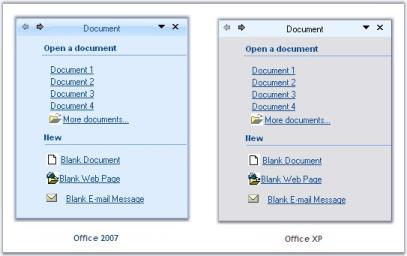
{:.image }

Office Color Schemes

XPTaskPane supports all the three office color schemes.

[C#]

//Setting Blue color scheme

this.xpTaskPane1.Office2007ColorScheme = Syncfusion.Windows.Forms.Office2007Theme.Blue;

//Setting Silver color scheme

this.xpTaskPane1.Office2007ColorScheme = Syncfusion.Windows.Forms.Office2007Theme.Silver;

//Setting Black color scheme

this.xpTaskPane1.Office2007ColorScheme = Syncfusion.Windows.Forms.Office2007Theme.Black;

[VB.NET]

'Setting Blue color schemes

Me.xpTaskPane1.Office2007ColorScheme = Syncfusion.Windows.Forms.Office2007Theme.Blue

'Setting Silver color schemes

Me.xpTaskPane1.Office2007ColorScheme = Syncfusion.Windows.Forms.Office2007Theme.Silver

'Setting Black color schemes

Me.xpTaskPane1.Office2007ColorScheme = Syncfusion.Windows.Forms.Office2007Theme.Black

{:.image }

Custom Colors

We can also apply custom colors to the XPTaskPane by setting Office2007ColorScheme to "Managed" and specifying the custom color through the ApplyManagedColors method as follows.

[C#]

this.xpTaskPane1.Office2007ColorScheme = Syncfusion.Windows.Forms.Office2007Theme.Managed;

Office2007Colors.ApplyManagedColors(this, Color.Lime);

[VB.NET]

Me.xpTaskPane1.Office2007ColorScheme = Syncfusion.Windows.Forms.Office2007Theme.Managed;

Office2007Colors.ApplyManagedColors(Me, Color.Lime)

{:.image }

###### Header Settings

Setting Visibility of the ToolBar Items

The header section by default has four toolbar items. Left and right navigating buttons at the top left corner of the TaskPane Header and DropDownMenu and Close Button at the top right corner of the TaskPane Header. 

{:.image }

* HeaderLeftToolbar.Items[0] - Indicates Left navigating button, lets you navigate to the previous page.
* HeaderLeftToolbar.Items[1] - Indicates Right navigating button, lets you navigate to the next page.
* HeaderRightToolbar.Items[0] - Indicates Header Menu Item which lists all the Task pages when clicked at run time.

{:.image }

* HeaderRightToolbar.Items[1] - Indicates Close button, using which we can close the Task Pane.

The visibility of these items can be controlled using the below code snippets.

[C#]

//Setting the visibility of the left navigating button at the top left corner

this.xpTaskPane1.HeaderLeftToolbar.Items[0].Visible = true;

//Setting the visibility of the Right navigating button at the top left corner

this.xpTaskPane1.HeaderLeftToolbar.Items[1].Visible = true;

//Setting the visibility of the header menu item at the top right corner

this.xpTaskPane1.HeaderRightToolbar.Items[0].Visible = true;

//Setting the visibility of the close button item at the top right corner

this.xpTaskPane1.HeaderRightToolbar.Items[1].Visible = true;

[VB.NET]

'Setting the visibility of the left navigating button at the top left corner

Me.xpTaskPane1.HeaderLeftToolbar.Items[0].Visible = True

'Setting the visibility of the Right navigating button at the top left corner

Me.xpTaskPane1.HeaderLeftToolbar.Items[1].Visible = True

'Setting the visibility of the header menu item at the top right corner

Me.xpTaskPane1.HeaderRightToolbar.Items[0].Visible = True

'Setting the visibility of the close button item at the top right corner

Me.xpTaskPane1.HeaderRightToolbar.Items[1].Visible = True

Images for Toolbar items

We can change the existing image for the toolbar items using the below code snippets.

[C#]

//Setting Image for the right navigating button

this.xpTaskPane1.HeaderLeftToolbar.Items[1].ImageList = this.imageList1;

this.xpTaskPane1.HeaderLeftToolbar.Items[1].ImageIndex = 0;

//Setting Image for the left navigating button

this.xpTaskPane1.HeaderLeftToolbar.Items[0].ImageList = this.imageList1;

this.xpTaskPane1.HeaderLeftToolbar.Items[0].ImageIndex = 1;

[VB.NET]

'Setting Image for the right navigating button

Me.xpTaskPane1.HeaderLeftToolbar.Items[1].ImageList = Me.imageList1

Me.xpTaskPane1.HeaderLeftToolbar.Items[1].ImageIndex = 0

'Setting Image for the left navigating button

Me.xpTaskPane1.HeaderLeftToolbar.Items[0].ImageList = Me.imageList1

Me.xpTaskPane1.HeaderLeftToolbar.Items[0].ImageIndex = 1

{:.image }

Customizing Header Menu Item Image

The Header Menu Item image can be changed through ImageIndex property which lists a set of pre-defined images, else set the Image property to the custom image you want to set for the dropdown image.

_Table_ _964__: Property Table_

<table>
<tr>
<td>
Property</td><td>
Description</td></tr>
<tr>
<td>
HeaderMenuItem.ImageIndex</td><td>
Specifies index of the image to be displayed in the DropDownMenu item.</td></tr>
<tr>
<td>
HeaderMenuItem.Image</td><td>
Sets the image to be displayed in DropDownMenu item.</td></tr>
</table>

[C#]

//Setting Image for the DropDownMenu item

this.xpTaskPane1.HeaderMenuItem.ImageIndex = 1;

[VB.NET]

'Setting Image for the DropDownMenu item

Me.xpTaskPane1.HeaderMenuItem.ImageIndex = 1

{:.image }

###### Scroll Settings

XPTaskPane Enables vertical scrolling for the pages using VerticalScroll property. On mouse hovering over the scroll bar, the taskpage automatically moves and show the hidden contents. Scrolling speed can be fixed using ScrollSpeed property.

_Table_ _965__: Property Table_

<table>
<tr>
<td>
XPTaskPane Property</td><td>
Description</td></tr>
<tr>
<td>
ScrollSpeed</td><td>
Specifies the scrolling speed. Default value is 10.</td></tr>
<tr>
<td>
VerticalScroll</td><td>
Enables scroll buttons that occupy vertical space instead of default horizontal space.</td></tr>
</table>

[C#]

this.xpTaskPane1.ScrollSpeed= 20;

this.xpTaskPane1.VerticalScroll = true;

[VB.NET]

Me.xpTaskPane1.ScrollSpeed = 20

Me.xpTaskPane1.VerticalScroll = True

{:.image }

