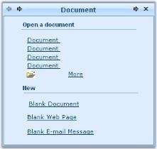
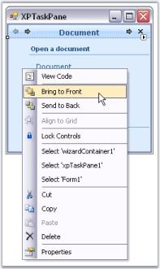
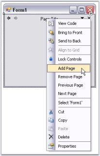

# XPTaskPane

XPTaskPane has a TaskPanePageContainer which hosts the Task pages. Any number of controls can added to the Task pages and can be customized. Properties which controls the appearance of the Task pages are discussed in this section.

## Page Title and Layout Name

The title text for an XPTaskPage can be edited using XPTaskPage.Title property.

_Table_ _972_: Property Table

<table>
<tr>
<th>
Property</th><th>
Description</th></tr>
<tr>
<td>
Title</td><td>
Sets the title text for Task page.</td></tr>
<tr>
<td>
SelectedPage</td><td>
Specifies the selected Task page.</td></tr>
<tr>
<td>
LayoutName</td><td>
The individual Task page is identified using its LayoutName in the SelectedPage property. By default the LayoutName is set as Card1, for the first page added, Card2 for the next page and so on. </td></tr>
</table>



this.xpTaskPage1.Title = "XPTaskPane Header";

this.xpTaskPage1.LayoutName = "Card1";





Me.xpTaskPage1.Title = "XPTaskPane Header"

Me.xpTaskPage1.LayoutName = "Card1"



## TaskPage Border

The below properties controls the border settings for a Task page.

_Table_ _973_: Property Table

<table>
<tr>
<th>
XPTaskPage Property</th><th>
Description</th></tr>
<tr>
<td>
BorderStyle</td><td>
Specifies the border style for Task page. The available styles are Fixed3D and FixedSingle.</td></tr>
<tr>
<td>
Border3DStyle</td><td>
Specifies the 3D border style for Task page. The available styles are,RaisedOuter,SunkenOuter,RaisedInner,Raised,Etched,SunkenInner,Bump,Sunken,Adjust andFlat.</td></tr>
<tr>
<td>
BorderColor</td><td>
Sets the border color for the Task page.</td></tr>
<tr>
<td>
BorderSides</td><td>
Specifies the sides of the control which should have border.</td></tr>
<tr>
<td>
BorderSingle</td><td>
Specifies the 2D Border style for the Task page when BorderStyle property is set to FixedSingle. The available styles are,Dotted,Dashed,Solid,Inset and Outset.</td></tr>
</table>



this.xpTaskPage1.BorderColor = System.Drawing.Color.SteelBlue

this.xpTaskPage1.BorderStyle = System.Windows.Forms.BorderStyle.FixedSingle





Me.xpTaskPage1.BorderColor = System.Drawing.Color.SteelBlue

Me.xpTaskPage1.BorderStyle = System.Windows.Forms.BorderStyle.FixedSingle



## XPTaskPage Foreground

Font style and fore color of the Task pages can be set using XPTaskPage.Font and XPTaskPage.ForeColor properties. 



this.xpTaskPage1.Font = new System.Drawing.Font("Arial", 8.25F);

this.xpTaskPage1.ForeColor = System.Drawing.Color.SteelBlue;





Me.xpTaskPage1.Font = New System.Drawing.Font("Arial", 8.25F)

Me.xpTaskPage1.ForeColor = System.Drawing.Color.SteelBlue



## Reordering XPTaskPage

When the end user adds a page to the XPTaskPane control, the order of the page is decided, as the page is added. They can be reordered using any one of the below methods in the designer.

* Through XPTaskPage Collection Editor.

* Select a page in the designer and choose the 'Bring To Front' or 'Send To Back' verb which will move the page to the beginning of the collection or to the end of the collection, respectively.

Going to Next Page or Previous Page

* Right Click a page in the designer and choose the 'Previous Page' or 'Next Page' verb which will show you the page, which is before the current page or the page which is after the current page. These options can also be accessed through smart tag and property grid commands.

## Page Order at RunTime

XPTaskPage allows you to set the next or the previous page to the currently selected page through the NextPage and PreviousPage properties.

_Table_ _974_: Property Table

<table>
<tr>
<th>
XPTaskPage Property</th><th>
Description</th></tr>
<tr>
<td>
NextPage</td><td>
It sets the next page for XP TaskPane.</td></tr>
<tr>
<td>
PreviousPage</td><td>
It sets the previous page for XP TaskPane.</td></tr>
</table>

> Note: The TaskPane follows this order at run time.



this.xpTaskPage2.NextPage = this.xpTaskPage3;

this.xpTaskPage2.PreviousPage = this.xpTaskPage1;





Me.xpTaskPage2.NextPage = Me.xpTaskPage3

Me.xpTaskPage2.PreviousPage = Me.xpTaskPage1



