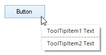
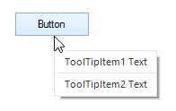
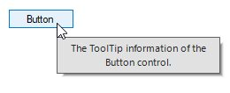

# Appearance in Windows Forms Tooltip (SfToolTip)

## ToolTip Control

The border color and its thickness of the `SfToolTip` can be customized by using the [BorderColor](https://help.syncfusion.com/cr/windowsforms/Syncfusion.WinForms.Controls.ToolTipInfo.html#Syncfusion_WinForms_Controls_ToolTipInfo_BorderColor) and [BorderThickness](https://help.syncfusion.com/cr/windowsforms/Syncfusion.WinForms.Controls.ToolTipInfo.html#Syncfusion_WinForms_Controls_ToolTipInfo_BorderThickness) properties.



ToolTipInfo toolTipInfo1 = new ToolTipInfo();
toolTipInfo1.BorderColor = Color.Gray;
toolTipInfo1.BorderThickness = 5;
ToolTipItem toolTipItem1 = new ToolTipItem();
toolTipItem1.Text = "The ToolTip information of the Button control.";
toolTipInfo1.Items.AddRange(new ToolTipItem[] { toolTipItem1 });
sfToolTip1.SetToolTipInfo(this.button1, toolTipInfo1);




## ToolTip Item

The appearance of `ToolTipItem` can be customized by setting the `ToolTipStyleInfo` property. The `ToolTipStyleInfo` property contains all the settings for the [ToolTipItem](https://help.syncfusion.com/cr/windowsforms/Syncfusion.WinForms.Controls.ToolTipItem.html) appearance customization.



ToolTipInfo toolTipInfo1 = new ToolTipInfo();
ToolTipItem toolTipItem1 = new ToolTipItem();
toolTipItem1.Text = "The ToolTip information of the Button control.";
toolTipItem1.Style.BackColor = Color.LightSkyBlue;
toolTipItem1.Style.ForeColor = Color.Black;
toolTipItem1.Style.TextAlignment = ContentAlignment.MiddleCenter;
toolTipItem1.Style.Font = new Font("Arial", 10.5f, FontStyle.Bold);
toolTipInfo1.Items.AddRange(new ToolTipItem[] { toolTipItem1 });
sfToolTip1.SetToolTipInfo(this.button1, toolTipInfo1);




### Gradient Color

Gradient background drawing for the [ToolTipItem](https://help.syncfusion.com/cr/windowsforms/Syncfusion.WinForms.Controls.ToolTipItem.html) can be done by enabling the [EnableGradientBackground](https://help.syncfusion.com/cr/windowsforms/Syncfusion.WinForms.Controls.ToolTipItem.html#Syncfusion_WinForms_Controls_ToolTipItem_EnableGradientBackground) property and initializing a [GradientBrush](https://help.syncfusion.com/cr/windowsforms/Syncfusion.WinForms.Controls.Styles.ToolTipVisualStyle.html#Syncfusion_WinForms_Controls_Styles_ToolTipVisualStyle_GradientBrush) property for the `ToolTipItem`. 



ToolTipItem toolTipItem1 = new ToolTipItem();
toolTipItem1.Text = "The ToolTip information of the Button control.";
toolTipItem1.EnableGradientBackground = true;
toolTipItem1.Style.GradientBrush = new BrushInfo(GradientStyle.ForwardDiagonal, new Color[] { Color.LightSkyBlue, Color.LightGreen, Color.Orange });
toolTipInfo1.Items.AddRange(new ToolTipItem[] { toolTipItem1 });
sfToolTip1.SetToolTipInfo(this.button2, toolTipInfo1);




N> The [GradientBrush](https://help.syncfusion.com/cr/windowsforms/Syncfusion.WinForms.Controls.Styles.ToolTipVisualStyle.html#Syncfusion_WinForms_Controls_Styles_ToolTipVisualStyle_GradientBrush) property will be considered only when the [EnableGradientBackground](https://help.syncfusion.com/cr/windowsforms/Syncfusion.WinForms.Controls.ToolTipItem.html#Syncfusion_WinForms_Controls_ToolTipItem_EnableGradientBackground) property is set to true.

### ToolTipItem Separator

The separator of the [ToolTipItem](https://help.syncfusion.com/cr/windowsforms/Syncfusion.WinForms.Controls.ToolTipItem.html) can be customized using the [SeparatorColor](https://help.syncfusion.com/cr/windowsforms/Syncfusion.WinForms.Controls.Styles.ToolTipVisualStyle.html#Syncfusion_WinForms_Controls_Styles_ToolTipVisualStyle_SeparatorColor) and [SeparatorStyle](https://help.syncfusion.com/cr/windowsforms/Syncfusion.WinForms.Controls.Styles.ToolTipVisualStyle.html#Syncfusion_WinForms_Controls_Styles_ToolTipVisualStyle_SeparatorStyle) properties.



ToolTipItem toolTipItem1 = new ToolTipItem();
toolTipItem1.Text = "ToolTipItem1 Text";
toolTipItem1.EnableSeparator = true;
toolTipItem1.Style.SeparatorColor = Color.Gray;
toolTipItem1.Style.SeparatorStyle = DashStyle.DashDot;
ToolTipItem toolTipItem2 = new ToolTipItem();
toolTipItem2.Text = "ToolTipItem2 Text";
toolTipInfo1.Items.AddRange(new ToolTipItem[] { toolTipItem1, toolTipItem2 });
sfToolTip1.SetToolTipInfo(this.button2, toolTipInfo1);




## Customizing Appearance based on Control

The appearance of the `ToolTipItem` can be customized before showing the tooltip based on the control in which it is configured using the [ToolTipShowing](https://help.syncfusion.com/cr/windowsforms/Syncfusion.Windows.Forms.SfToolTip.html#Syncfusion_Windows_Forms_SfToolTip_ToolTipShowing) event.



this.sfToolTip1.ToolTipShowing += SfToolTip1_ToolTipShowing;
private void SfToolTip1_ToolTipShowing(object sender, ToolTipShowingEventsArgs e)
{
    if (e.Control is Button)
    {
        e.ToolTipInfo.Items[0].Style.BackColor = Color.LightSkyBlue;
        e.ToolTipInfo.Items[0].Style.ForeColor = Color.Black;
    }
}




## Enabling the Shadow

The shadow of the tooltip can be enabled by setting the [ShadowVisible](https://help.syncfusion.com/cr/windowsforms/Syncfusion.Windows.Forms.SfToolTip.html#Syncfusion_Windows_Forms_SfToolTip_ShadowVisible) property to `true`.



SfToolTip sfToolTip1 = new SfToolTip();
sfToolTip1.ShadowVisible = true;




## ToolTipItem Separator

The enabled separator of the `ToolTipItem` can be customized by setting the [EnableSeparator](https://help.syncfusion.com/cr/windowsforms/Syncfusion.WinForms.Controls.ToolTipItem.html#Syncfusion_WinForms_Controls_ToolTipItem_EnableSeparator) property to `true`.



ToolTipItem toolTipItem1 = new ToolTipItem();
toolTipItem1.Text = "ToolTipItem1 Text";
toolTipItem1.EnableSeparator = true;
ToolTipItem toolTipItem2 = new ToolTipItem();
toolTipItem2.Text = "ToolTipItem2 Text";
toolTipInfo1.Items.AddRange(new ToolTipItem[] { toolTipItem1, toolTipItem2 });
sfToolTip1.SetToolTipInfo(this.button2, toolTipInfo1);




N> The separator line cannot be drawn for the last `ToolTipItem` in the collection, even the separator is enabled.

## Right to Left

The elements of the tooltip can be aligned from right to left and vice versa using the [RightToLeft](https://help.syncfusion.com/cr/windowsforms/Syncfusion.WinForms.Controls.ToolTipInfo.html#Syncfusion_WinForms_Controls_ToolTipInfo_RightToLeft) property. 



ToolTipInfo toolTipInfo1 = new ToolTipInfo();
toolTipInfo1.RightToLeft = RightToLeft.Yes;
ToolTipItem toolTipItem1 = new ToolTipItem();
toolTipItem1.Text = "David Carter\r\nPhone : +1 919.494.1974\r\nEmail : david@syncfusion.com";
toolTipItem1.Style.TextAlignment = ContentAlignment.MiddleLeft;
toolTipItem1.Image = global::GettingStarted.Properties.Resources.MORGK;
toolTipItem1.Style.ImageSize = new Size(100, 100);
toolTipInfo1.Items.AddRange(new ToolTipItem[] { toolTipItem1 });
sfToolTip1.SetToolTipInfo(this.button2, toolTipInfo1);




## Themes

The SfToolTip offers four built-in themes for professional representation as follows:

* Office2016Colorful
* Office2016White
* Office2016DarkGray
* Office2016Black

Themes can be applied to the SfToolTip by using the following steps:

1. [Load theme assembly](#load-theme-assembly)
2. [Apply theme](#apply-theme)

### Load theme assembly

The `Syncfusion.Office2016Theme.WinForms` assembly should be added as reference to set theme for the SfToolTip in any application.

Before applying theme to the SfToolTip, required theme assembly should be loaded. 





using Syncfusion.WinForms.Controls;

         static class Program
    {
        /// 

        /// The main entry point for the application.
        /// 

        
        static void Main()
        {
            SfSkinManager.LoadAssembly(typeof(Office2016Theme).Assembly);
            Application.EnableVisualStyles();
            Application.SetCompatibleTextRenderingDefault(false);
            Application.Run(new Form1());
        }
    }





Imports Syncfusion.WinForms.Controls

 Friend Module Program
        ''' 

        ''' The main entry point for the application.
        ''' 

        Sub Main()
            SfSkinManager.LoadAssembly(GetType(Office2016Theme).Assembly)
            Application.EnableVisualStyles()
            Application.SetCompatibleTextRenderingDefault(False)
            Application.Run(New Form1())
        End Sub
    End Module





### Apply theme

Appearance of the SfToolTip can be changed by using the `ThemeName`.

#### Office2016Colorful

This option helps to set the Office2016Colorful Theme.





// Office2016Colorful

 this.SfToolTip.ThemeName = "Office2016Colorful";





' Office2016Colorful 

Me.SfToolTip.ThemeName = "Office2016Colorful"





#### Office2016White

This option helps to set the Office2016White Theme.





// Office2016White

 this.SfToolTip.ThemeName = "Office2016White";





' Office2016White 

Me.SfToolTip.ThemeName = "Office2016White"





#### Office2016DarkGray

This option helps to set the Office2016DarkGray Theme.





// Office2016DarkGray

 this.SfToolTip.ThemeName = "Office2016DarkGray";





' Office2016DarkGray 

Me.SfToolTip.ThemeName = "Office2016DarkGray"





#### Office2016Black

This option helps to set the Office2016Black Theme.





// Office2016Black

 this.SfToolTip.ThemeName = "Office2016Black";





' Office2016Black 

Me.SfToolTip.ThemeName = "Office2016Black"





