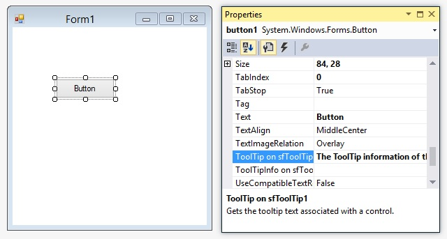
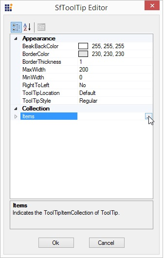
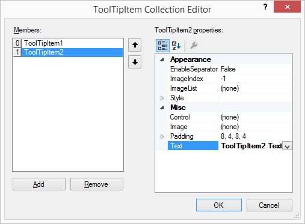
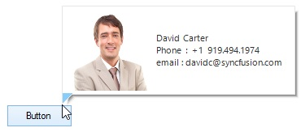

# Getting Started

## Assembly Deployment

The following list of assemblies should be added as reference to use the SfToolTip component in any application:

<table>
<tr>
<td>
{{'**Required Assemblies**'| markdownify }}
</td>
<td>
{{'**Description**'| markdownify }}
</td>
</tr>
<tr>
<td>
 Syncfusion.Core.WinForms </td><td>
 Syncfusion.Core.WinForms assembly contains the theme related classes for the Syncfusion controls and basic components like SfScrollFrame, SfButton, SfForm and SfSkinManager. </td></tr>
</table>

Refer [control dependencies](https://help.syncfusion.com/windowsforms/control-dependencies#sftooltip) section to get the list of assemblies or NuGet package needs to be added as reference to use the control in any application. 

## Setting the SfToolTip to a Control

This section describes how to add the `SfToolTip` to a Control.

### Through Designer

#### Setting using Text

1) Drag and drop the `SfToolTip` to the form.
2) When the `SfToolTip` component is added to a form, an extended property will be added to the properties of the controls in the form.
3) Provide the ToolTip text in the extended property for text. (ToolTip on SfToolTip1)

##### Designer Generated Code



SfToolTip sfToolTip1 = new SfToolTip(this.components);
Button button1 = new System.Windows.Forms.Button();

// 

// button1

// 
this.button1.Location = new System.Drawing.Point(62, 74);
this.button1.Name = "button1";
this.button1.Size = new System.Drawing.Size(84, 28);
this.button1.TabIndex = 0;
this.button1.Text = "Button";
this.sfToolTip1.SetToolTip(this.button1, "The ToolTip information of the Button control.");
this.button1.UseVisualStyleBackColor = true;




The provided ToolTip text will be configured for the control and will be shown when pausing the mouse cursor on the control.

#### Setting using ToolTipInfo

1) Drag and drop the `SfToolTip` to the form.
2) When the `SfToolTip` component is added to a form, an extended property will be added to the properties of the controls in the form. Clicking the Ellipse button in the [ToolTipInfo](https://help.syncfusion.com/cr/windowsforms/Syncfusion.Core.WinForms~Syncfusion.WinForms.Controls.ToolTipInfo.html) on sfToolTip1 extended property will show the `SfToolTip` Editor dialog box. 

3) The `SfToolTip` editor lets customizing the `ToolTipInfo` for the control.
4) Click the Ellipse button in the Items property and you can view the `ToolTipItem` collection editor.

5) Add one or more `ToolTipItem` to the collection and customize the `ToolTipItem` if needed. 

##### Designer Generated Code



ToolTipInfo toolTipInfo1 = new ToolTipInfo();
ToolTipItem toolTipItem1 = new ToolTipItem();
ToolTipItem toolTipItem2 = new ToolTipItem();
SfToolTip sfToolTip1 = new SfToolTip(this.components);
Button button1 = new System.Windows.Forms.Button();

// 

// button1

// 
this.button1.Location = new System.Drawing.Point(62, 74);
this.button1.Name = "button1";
this.button1.Size = new System.Drawing.Size(84, 28);
this.button1.TabIndex = 0;
this.button1.Text = "Button";
toolTipItem1.Text = "ToolTipItem1 Text";
toolTipItem2.Text = "ToolTipItem2 Text";
toolTipInfo1.Items.AddRange(new ToolTipItem[] {
toolTipItem1,
toolTipItem2});
this.sfToolTip1.SetToolTipInfo(this.button1, toolTipInfo1);
this.button1.UseVisualStyleBackColor = true;




The provided `ToolTipInfo` will be configured for the control and will be shown when pausing the mouse cursor on the control.

### Through Code

#### Setting using Text

The `SfToolTip` can be set to the control with tooltip text by using the [SetToolTip](https://help.syncfusion.com/cr/windowsforms/Syncfusion.Core.WinForms~Syncfusion.WinForms.Controls.SfToolTip~SetToolTip.html) method. 



SfToolTip sfToolTip1 = new SfToolTip();
sfToolTip1.SetToolTip(this.button1, " The ToolTip information of the Button control.");




#### Setting using ToolTipInfo

The `SfToolTip` can be set to the control with set of tooltip information by using the [SetToolTipInfo](https://help.syncfusion.com/cr/windowsforms/Syncfusion.Core.WinForms~Syncfusion.WinForms.Controls.SfToolTip~SetToolTipInfo.html) method.



SfToolTip sfToolTip1 = new SfToolTip();
ToolTipInfo toolTipInfo1 = new ToolTipInfo();
ToolTipItem toolTipItem1 = new ToolTipItem();

toolTipItem1.Text = "ToolTipItem 1 Text";
ToolTipItem toolTipItem2 = new ToolTipItem();

toolTipItem2.Text = "ToolTipItem 2 Text";
toolTipInfo1.Items.AddRange(new ToolTipItem[] { toolTipItem1, toolTipItem2 });
sfToolTip1.SetToolTipInfo(this.button1, toolTipInfo1);




## Displaying the SfToolTip Programmatically

### Show Tooltip

The SfToolTip can be shown programmatically using the [Show](https://help.syncfusion.com/cr/windowsforms/Syncfusion.Core.WinForms~Syncfusion.WinForms.Controls.SfToolTip~Show.html) method. The various overloads provided to show the tooltip are documented in `Show`.

N> If the position of tooltip to be shown is not mentioned, the tooltip will be shown in mouse cursor position.



Button button1 = new Button();
this.Controls.Add(button1);
button1.Click += Button1_Click;

Button button2 = new Button();
this.Controls.Add(button2);
button2.Click += Button2_Click;

Button button3 = new Button();
this.Controls.Add(button3);
button3.Click += Button3_Click;
private void Button1_Click(object sender, EventArgs e)
{

// Shows the text in the cursor position.
    this.sfToolTip1.Show("Programmatically showing the tooltip text");
}
private void Button2_Click(object sender, EventArgs e)
{

// Shows the text in the specified position.
    this.sfToolTip1.Show("Programmatically showing the tooltip in specified position", new Point(300, 300));
}
private void Button3_Click(object sender, EventArgs e)
{
    ToolTipInfo toolTipInfo = new ToolTipInfo();
    ToolTipItem toolTipItem = new ToolTipItem();
    toolTipItem.Text = "ToolTipItem text";
    toolTipInfo.Items.Add(toolTipItem);

// Shows the ToolTipInfo in  cursor position.
this.sfToolTip1.Show(toolTipInfo);
}




### Hide Tooltip

The `SfToolTip` can be hidden using the [Hide](https://help.syncfusion.com/cr/windowsforms/Syncfusion.Core.WinForms~Syncfusion.WinForms.Controls.SfToolTip~Hide.html) method. 




this.sfToolTip1.Hide();




## Setting the ToolTip Delay

The following properties can be used to set the ToolTip delay time:

* InitialDelay
* AutoPopDelay.

### InitialDelay

The [InitialDelay](https://help.syncfusion.com/cr/windowsforms/Syncfusion.Core.WinForms~Syncfusion.WinForms.Controls.SfToolTip~InitialDelay.html) property enables you to shorten or lengthen the time that the `SfToolTip` waits before displaying a ToolTip. Default value is 0.




SfToolTip sfToolTip1 = new SfToolTip();
sfToolTip1.InitialDelay = 1000;




### AutoPopDelay

The [AutoPopDelay](https://help.syncfusion.com/cr/windowsforms/Syncfusion.Core.WinForms~Syncfusion.WinForms.Controls.SfToolTip~AutoPopDelay.html) property enables you to shorten or lengthen the time duration that the tooltip is displayed when the mouse pointer is on a control. Default value is 5000.




SfToolTip sfToolTip1 = new SfToolTip();
sfToolTip1.AutoPopDelay = 10000;




## Showing ToolTip with Beak

The `SfToolTip` can be shown with the beak by using the [ToolTipStyle](https://help.syncfusion.com/cr/windowsforms/Syncfusion.Core.WinForms~Syncfusion.WinForms.Controls.ToolTipInfo~ToolTipStyle.html) property.



ToolTipInfo toolTipInfo1 = new ToolTipInfo();
toolTipInfo1.ToolTipStyle = ToolTipStyle.Balloon;

ToolTipItem toolTipItem1 = new ToolTipItem();
toolTipItem1.Text = "David Carter\r\nPhone : +1 919.494.1974\r\nEmail : david@syncfusion.com";
toolTipItem1.Style.TextAlignment = ContentAlignment.MiddleLeft;
toolTipItem1.Image = global::GettingStarted.Properties.Resources.MORGK;
toolTipItem1.Style.ImageSize = new Size(100, 100);
toolTipInfo1.Items.AddRange(new ToolTipItem[] { toolTipItem1 });
sfToolTip1.SetToolTipInfo(this.button2, toolTipInfo1);




### Setting the Beak Back Color

The back color of the balloon beak can be set using the [BeakBackColor](https://help.syncfusion.com/cr/windowsforms/Syncfusion.Core.WinForms~Syncfusion.WinForms.Controls.ToolTipInfo~BeakBackColor.html) of `ToolTipInfo` property.



ToolTipInfo toolTipInfo1 = new ToolTipInfo();
toolTipInfo1.ToolTipStyle = ToolTipStyle.Balloon;
toolTipInfo1.BeakBackColor = Color.LightSkyBlue;
ToolTipItem toolTipItem1 = new ToolTipItem();
toolTipItem1.Text = "David Carter\r\nPhone : +1 919.494.1974\r\nEmail : david@syncfusion.com";
toolTipItem1.Style.TextAlignment = ContentAlignment.MiddleLeft;
toolTipItem1.Image = global::GettingStarted.Properties.Resources.MORGK;
toolTipItem1.Style.ImageSize = new Size(100, 100);
toolTipInfo1.Items.AddRange(new ToolTipItem[] { toolTipItem1 });
sfToolTip1.SetToolTipInfo(this.button2, toolTipInfo1);




