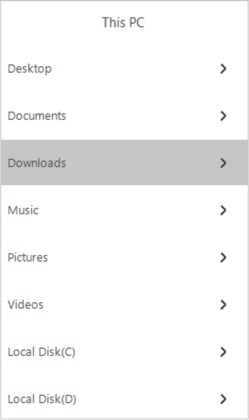
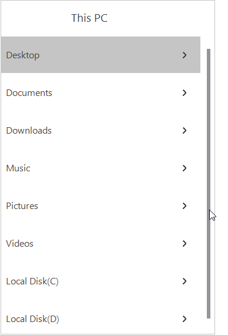

# Selection in Windows Forms Tree Navigator

The selected item of the current hierarchy level is get/set through SelectedItem property.

The following code examples allow you to set the SelectedItem.





//To set the selected item in the Tree navigator.

this.treeNavigator1.SelectedItem = treeMenuItem3;





‘To set the selected item in the Tree navigator.

Me.treeNavigator1.SelectedItem = treeMenuItem3





## SelectionChanging Event
This event is triggered before the selection of the tree menu item changes.

### Event Data

SelectionStateChangingEventArgs contains the following members that provide information specific to this event.          

<table>
<tr>
<th>
Members  </th><th>
Description  </th></tr>
<tr>
<td>
NewValue  </td><td>
This property returns the newly selected item.  </td></tr>
<tr>
<td>
OldValue  </td><td>
This property returns the previously selected item.  </td></tr>
<tr>
<td>
Extended  </td><td>
This property returns true when the selected item is expanded.  </td></tr>
<tr>
<td>
Cancel  </td><td>
This property enables you to avoid particular item from Selection.  </td></tr>
</table>





void treeNavigator1_SelectionChanging(TreeNavigator sender, SelectionStateChangingEventArgs args)
   {
       args.Cancel = true;
       TreeMenuItem item = args.NewValue;
        TreeMenuItem OldItem = args.OldValue;
       bool temp = args.Expanded;
   }





Private Sub treeNavigator1_SelectionChanging(sender As TreeNavigator, args As SelectionStateChangingEventArgs)
        args.Cancel = True
        Dim item As TreeMenuItem = args.NewValue
        Dim OldItem As TreeMenuItem = args.OldValue
        Dim temp As Boolean = args.Expanded
End Sub





## SelectionChanged Event
This event is triggered after the selection of the tree menu item changes.

###  Event Data
SelectionStateChangedEventArgs contains the following members that provide information specific to this event.

<table>
<tr>
<th>
Members  </th><th>
Description  </th></tr>
<tr>
<td>
SelectedItem  </td><td>
This property returns the currently selected item.  </td></tr>
<tr>
<td>
Expanded  </td><td>
This property returns true when the selected item is expanded.  </td></tr>
<tr>
<td>
</table>





void treeNavigator1_SelectionChanged(TreeNavigator sender, SelectionStateChangedEventArgs e)
    {
        TreeMenuItem menu = e.SelectedItem;
        bool temp = e.Expanded;
    }





Private Sub treeNavigator1_SelectionChanged(sender As TreeNavigator, e As SelectionStateChangedEventArgs)
   Dim menu As TreeMenuItem = e.SelectedItem
   Dim temp As Boolean = e.Expanded
End Sub





## Selection in Windows Forms Tree Navigator
Scrolling can be customized by using Touch scroll. When you mouse over or touch near scroll bar area, the scroll bar will be visible and by default, the scroll will not be visible. This can be enabled by setting UseTouchScrollBehavior property to true.

The following code examples allow you to enable touch scroll.





this.treeNavigator1.UseTouchScrollBehavior = true;





Me.treeNavigator1.UseTouchScrollBehavior = True





