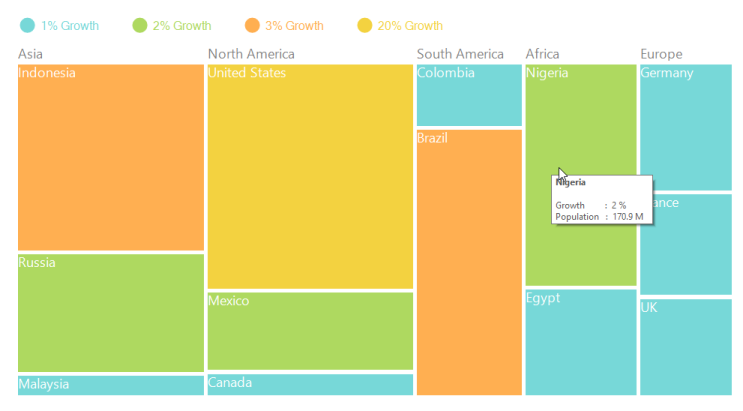

# TreeMap Layout

The ItemsLayoutMode for TreeMap specifies the layout mode of the tree map items. This layout is applied for all the tree map levels. There are four different TreeMap layouts such as,

### Squarified Layout

In this layout the data is visualized in the form of square-like rectangles with best aspect ratio.

The following code illustrates how to set a squarified layout in Treemap.

#### Code Sample:



public partial class Form1 : Form

    {

        TreeMap TreeMap1 = new TreeMap();

     public Form1()

        {

            InitializeComponent();

            PopulationViewModel data = new PopulationViewModel();

            TreeMap1.ItemsSource = data.PopulationDetails;

            TreeMap1.WeightValuePath = "Population";

            TreeMap1.ColorValuePath = "Growth";

            TreeMap1.ItemsLayoutMode = Syncfusion.Windows.Forms.TreeMap.ItemsLayoutModes. Squarified;

            TreeMapFlatLevel treeMapFlatLevel1 = new TreeMapFlatLevel();

            treeMapFlatLevel1.GroupPath = "Continent";

            TreeMap1.Levels.Add(treeMapFlatLevel1);

            TreeMap1.LeafItemSettings.LabelPath ="Country";

            this.Controls.Add(TreeMap1);

         }

     }   



The following screen shot illustrates a squarified layout.

_Figure_ _1_: _Squarified layout_

### SliceAndDiceAuto Layout:

In this layout the data is visualized in the form of long-thin rectangles with high aspect ratio, which can be displayed either vertically or horizontally.

The following code illustrates how to set a slice and dice layout in Treemap.

### Code Sample:



public partial class Form1 : Form

    {

        TreeMap TreeMap1 = new TreeMap();

     public Form1()

        {

            InitializeComponent();

            // ...         

            TreeMap1.ItemsLayoutMode = Syncfusion.Windows.Forms.TreeMap.ItemsLayoutModes. SliceAndDiceAuto;

          // ...         

         } 

    }      



The following screen shot illustrates a slice-and-dice layout.

_Figure_ _2_: _Slice-and-dice layout_

### SliceAndDiceHorizontal Layout:

The following code illustrates how to set a slice and dice layout horizontally in Treemap.

#### Code Sample:



public partial class Form1 : Form

    {

        TreeMap TreeMap1 = new TreeMap();

     public Form1()

        {

            InitializeComponent();

            // ...         

            TreeMap1.ItemsLayoutMode = Syncfusion.Windows.Forms.TreeMap.ItemsLayoutModes. SliceAndDiceHorizontal;

            // ...         

       }

    }



The following screen shot shows a Slice-and-dice treemap in horizontal layout.

<table>
<tr>
<td>
{{ ' ' | markdownify }}

{{ '_Figure_' | markdownify }}{{ '_3_' | markdownify }}{{ '_: Slice-and-dice treemap in horizontal layout_' | markdownify }}</td></tr>
<tr>
<td>
</td></tr>
</table>

### SliceAndDiceVertical Layout:

The following code illustrates how to set a slice and dice layout vertically in Treemap.

#### Code Sample:



public partial class Form1 : Form

    {

        TreeMap TreeMap1 = new TreeMap();

     public Form1()

        {

            InitializeComponent();

            // ...         

            TreeMap1.ItemsLayoutMode = Syncfusion.Windows.Forms.TreeMap.ItemsLayoutModes. SliceAndDiceVertical;

            // ...         

} 

     }  



The following screen shot shows a Slice-and-dice treemap in vertical layout.

_Figure_ _4_: _Slice-and-dice treemap in vertical layout_
