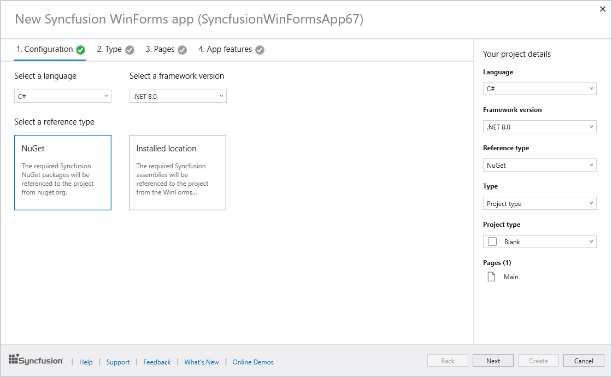
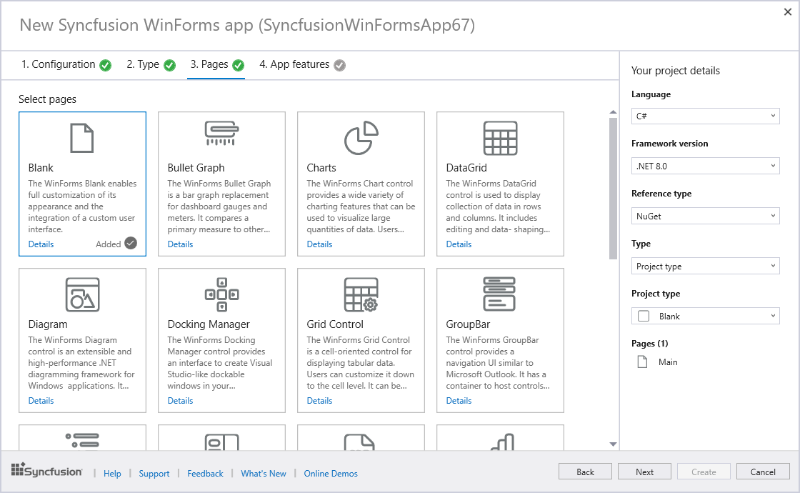
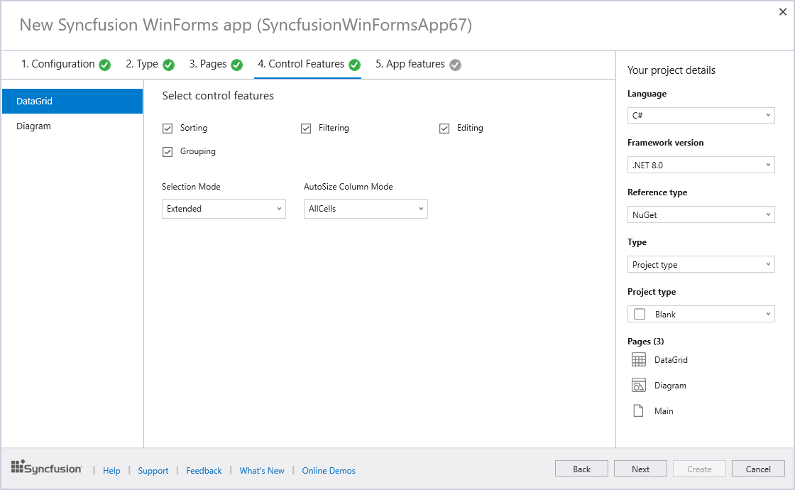
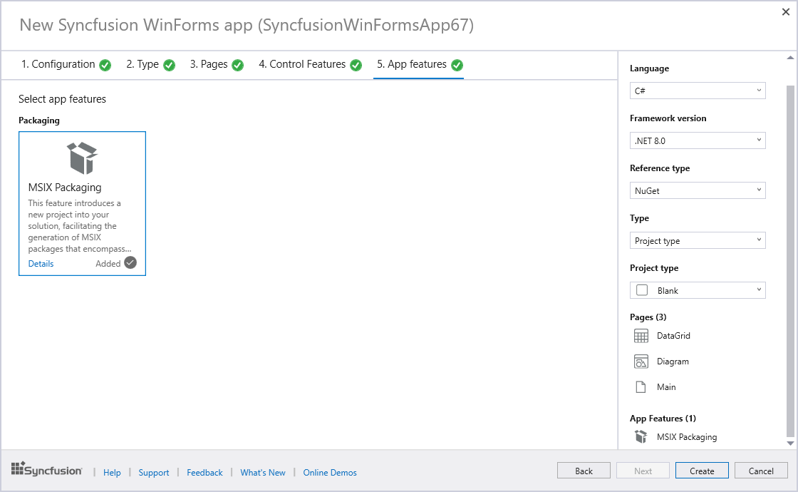
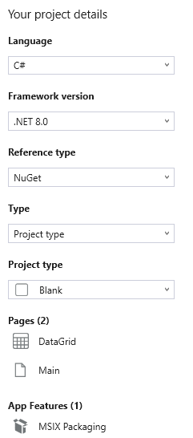
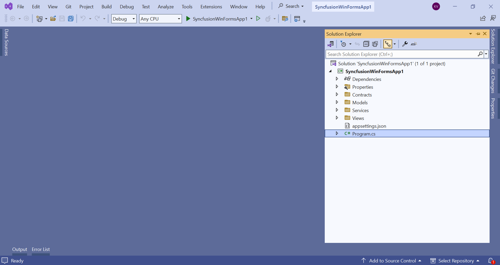

# Syncfusion WinForms Template Studio

The WinForms Template Studio by Syncfusion is a specialized tool for constructing applications with their WinForms components. This studio simplifies development by incorporating crucial Syncfusion components, handling required NuGet references, offering preset namespaces, and creating component render code. Acting as a wizard, it facilitates the creation of WinForms applications using Syncfusion components, streamlining the process for developers.

I> The Syncfusion WinForms Template Studio is available from v24.1.41.

N> WinForms Template Studio is compatible with Visual Studio 2022, Visual Studio 2019, and Visual Studio 2017. For the Visual Studio 2015 or lower versions, it is recommended to use a [WinForms project template](https://help.syncfusion.com/windowsforms/visual-studio-integration/create-project).

Create the Syncfusion WinForms project using the Visual Studio Project Template by following the provided steps.

> Check whether the **WinForms Extensions - Syncfusion** are installed or not in Visual Studio Extension Manager by going to **Extensions -> Manage Extensions -> Installed** for Visual Studio 2019 or later, and for Visual Studio 2017 by going to **Tools -> Extensions and Updates -> Installed**. If this extension is not installed, please install the extension by following the steps from the [download and installation](https://help.syncfusion.com/windowsforms/visual-studio-integration/download-and-installation) help topic.

1.	Open the Visual Studio 2022.

2.	Select one of the following options to create the Syncfusion WinForms application

	**Option 1:**  
	Choose **Extension -> Syncfusion -> Essential Studio for WinForms -> Create New Syncfusion Project…** from the Visual Studio menu.
    
	

	N> In Visual Studio 2017, you can see the Syncfusion menu directly in the Visual Studio menu.

	**Option 2:**   
	Choose **File -> New -> Project** from the menu. This launches a new dialogue for creating a new application. Filtering the application type by Syncfusion or typing Syncfusion as a keyword in the search option can help you find the Syncfusion templates for WinForms.

	

3.	Select the **Syncfusion WinForms Template Studio** and click Next.

	

4.	When you launch the **Syncfusion WinForms Template Studio**, you will encounter a configuration wizard that allows you to set up your Syncfusion WinForms application. Within this wizard, you'll have the option to specify your preferred .NET Core Version or .NET Framework Version, select the desired language, and choose the reference type according to your requirements.

	

	N> The installed location and GAC options will be available only after the Syncfusion Essential WinForms setup has been installed. Use the NuGet option instead of installing the Syncfusion Essential WinForms setup. Also, the GAC option will not be available when you choose .NET 6.0, .NET 7.0, and .NET 8.0 from the project type option in Visual Studio.

	I> Visual Basic Language support is available in WinForms Template Studio starting from version 25.*.*.

5.  Navigate to the **Project type** tab and choose the Syncfusion WinForms application type you want—there are three types: Blank, MenuBar, and Tabbed Form. Click **Next** to proceed.

	

6.	Click **Next** or navigate to the **Pages** tab to access a list of available Syncfusion WinForms components you can add to the application.

	

	To unselect the added control(s), Click ‘x’ for the corresponding control in the control list from the Project Details.

	N> The Control Features option is not accessible for Blank Pages.

7.	Click **Next** or navigate to the **Control Features** tab to view the listed features for the selected controls. From here, choose the features needed.

	

8.	Click **Next** or navigate the **App Features** tab to select the desired application features.

	

    N> The App Features option is not accessible for .NET Framework.	

	**Project Details Section**

	In the **Project Details** section, modify configurations and project types. Additionally, you can remove one or more controls from the selected list and remove the chosen application feature.

	

9.	Click **Create** to initiate the process. This action generates the Syncfusion WinForms application. The resulting Syncfusion WinForms app has the necessary Syncfusion NuGet 	packages, styles, and rendering code specific to the chosen Syncfusion component.

	

10.	10.	The Syncfusion WinForms app is set up with the latest Syncfusion WinForms NuGet packages, including the right namespaces and rendering code. This ensures smooth integration of Syncfusion components.

	N> The .Net 6.0, .Net 7.0, and .Net 8.0 option will be listed in  Select a framework version	 when only the .Net 6.0, .Net 7.0, and .Net 8.0 SDK setup has been installed.

	> .NET 6.0 version is available from v19.4.0.38 and it support from Visual Studio 2022.

	> .NET 7.0 version is available from v20.4.0.38 and it support from Visual Studio 2022.

	> .NET 8.0 version is available from v23.2.4 and it support from Visual Studio 2022.

11.	11.	If you install the trial setup or NuGet packages from nuget.org, you must register the Syncfusion license key to your application since Syncfusion introduced the licensing system from the 2018 Volume 2 (v16.2.0.41) Essential Studio release. Navigate to the [help topic](https://help.syncfusion.com/common/essential-studio/licensing/overview#how-to-generate-syncfusion-license-key)to generate and register the Syncfusion license key to your application. Refer to this [blog](https://www.syncfusion.com/blogs/post/whats-new-in-2018-volume-2.aspx) post for understanding the licensing changes introduced in 		Essential Studio.

	   