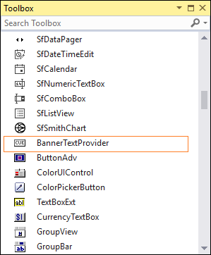
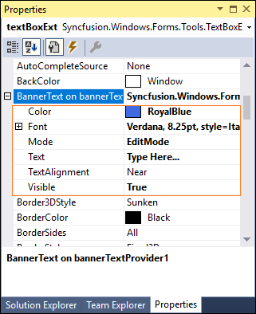

# Getting Started with Windows Forms Watermark Text Provider (BannerText)

This section briefly describes how to create a new Windows Forms project in Visual Studio and add **BannerTextProvider** with its basic functionalities.

## Assembly deployment

Refer to the [control dependencies](https://help.syncfusion.com/windowsforms/control-dependencies#bannertextprovider) section to get the list of assemblies or the details of NuGet package that needs to be added as reference to use the control in any application.

Refer to this [documentation](https://help.syncfusion.com/windowsforms/visual-studio-integration/nuget-packages) to find more details about installing nuget packages in a Windows Forms application.

## Adding a BannerTextProvider control via designer

1) Create a new Windows Forms application using Visual Studio.

2) Add the the [BannerTextProvider](https://help.syncfusion.com/cr/cref_files/windowsforms/Syncfusion.Shared.Base~Syncfusion.Windows.Forms.BannerTextProvider.html) control to an application by dragging it from the toolbox to design view. The following dependent assembly will be added automatically:

* Syncfusion.Shared.Base

 

3) Drag a component from toolbox and add to the form. For example, you can choose [TextBoxExt](https://help.syncfusion.com/cr/windowsforms/Syncfusion.Shared.Base~Syncfusion.Windows.Forms.Tools.TextBoxExt.html) control and get an extender provider property as illustrated in the following sample.

 

## Adding a BannerTextProvider control via code

1) Create a C# or VB application using Visual Studio.

2) Add the following assembly reference to the project:

* Syncfusion.Shared.Base

3) Include the required namespace.





using Syncfusion.Windows.Forms;





Imports Syncfusion.Windows.Forms





4) Create an instance of the [BannerTextProvider](https://help.syncfusion.com/cr/cref_files/windowsforms/Syncfusion.Shared.Base~Syncfusion.Windows.Forms.BannerTextProvider.html) control.





private BannerTextProvider bannerTextProvider;
this.bannerTextProvider = new Syncfusion.Windows.Forms.BannerTextProvider(this.components);





Private bannerTextProvider As BannerTextProvider
Me.bannerTextProvider = New Syncfusion.Windows.Forms.BannerTextProvider(Me.components)





## Assigning banner text to a control

1) First, add a control to the form. For example, you can choose [TextBoxExt](https://help.syncfusion.com/cr/windowsforms/Syncfusion.Shared.Base~Syncfusion.Windows.Forms.Tools.TextBoxExt.html) control. Create an instance of **TextBoxExt**, and add it to the form.





private TextBoxExt textBoxExt;
this.textBoxExt = new Syncfusion.Windows.Forms.Tools.TextBoxExt();
this.Controls.Add(this.textBoxExt);





Private textBoxExt As TextBoxExt
Me.textBoxExt = New Syncfusion.Windows.Forms.Tools.TextBoxExt()
Me.Controls.Add(Me.textBoxExt)





2) Assign the banner text to the control.




// Textbox is the control used for example.
BannerTextInfo info = bannerTextProvider1.GetBannerText(this.textBoxExt);
info.Text = "New Banner Text";





' Textbox is the control used for example.
Dim info As BannerTextInfo = bannerTextProvider1.GetBannerText(Me.textBoxExt)
info.Text = "New Banner Text"




N> Make sure to clear the default value of the [Text](https://help.syncfusion.com/cr/windowsforms/Syncfusion.Shared.Base~Syncfusion.Windows.Forms.BannerTextInfo~Text.html) property of the controls before setting the banner text.

The following extender properties allow you to customize the banner text:

<table>
<tr>
<th>
Property</th><th>
Description</th></tr>
<tr>
<td>
[Visible](https://help.syncfusion.com/cr/windowsforms/Syncfusion.Shared.Base~Syncfusion.Windows.Forms.BannerTextInfo~Visible.html)</td><td>
Indicates whether the banner text should be visible.</td></tr>
<tr>
<td>
[Text](https://help.syncfusion.com/cr/windowsforms/Syncfusion.Shared.Base~Syncfusion.Windows.Forms.BannerTextInfo~Text.html)</td><td>
Sets the banner text.</td></tr>
<tr>
<td>
[Color](https://help.syncfusion.com/cr/windowsforms/Syncfusion.Shared.Base~Syncfusion.Windows.Forms.BannerTextInfo~Color.html)</td><td>
Sets the banner text color.</td></tr>
<tr>
<td>
[Font](https://help.syncfusion.com/cr/windowsforms/Syncfusion.Shared.Base~Syncfusion.Windows.Forms.BannerTextInfo~Font.html)</td><td>
Sets the font style for the banner text.</td></tr>
<tr>
<td>
[Mode](https://help.syncfusion.com/cr/windowsforms/Syncfusion.Shared.Base~Syncfusion.Windows.Forms.BannerTextInfo~Mode.html)</td><td>
Specifies the rendering mode of the banner text. The modes are, 
1. FocusMode - The banner text disappears when the control gets focus. 
2. EditMode - The banner text disappears only when the control is in Edit mode or when the associated text box is not empty.</td></tr>
</table>




this.bannerTextProvider1.SetBannerText(this.textBoxExt, new Syncfusion.Windows.Forms.BannerTextInfo("Type Here...", true, new System.Drawing.Font("Verdana", 8.25F, System.Drawing.FontStyle.Italic), System.Drawing.Color.RoyalBlue, Syncfusion.Windows.Forms.BannerTextMode.EditMode));





Me.bannerTextProvider1.SetBannerText(Me.textBoxExt, New Syncfusion.Windows.Forms.BannerTextInfo("Type Here...", True, New System.Drawing.Font("Verdana", 8.25F, System.Drawing.FontStyle.Italic), System.Drawing.Color.RoyalBlue, Syncfusion.Windows.Forms.BannerTextMode.EditMode))



 
  

N> BannerText feature can be made available for the following controls only.

* [TextBoxBarItem](http://help.syncfusion.com/windowsforms/popupmenu/popup-menucontext-menuxpmenu-bars#bar-items) (XPMenus)
* [ComboBoxBarItem](http://help.syncfusion.com/windowsforms/popupmenu/popup-menucontext-menuxpmenu-bars#bar-items) (XPMenus)
* [TextBox](http://help.syncfusion.com/windowsforms/ribbon/getting-started#add-toolstriptextbox ) (ToolStripEx)
* [ComboBox](http://help.syncfusion.com/windowsforms/ribbon/getting-started#toolstripcombobox ) (ToolStripEx)
* [ComboBoxEx](http://help.syncfusion.com/windowsforms/ribbon/getting-started#toolstripcomboboxex ) (ToolStripEx)
* [TextBoxExt](http://help.syncfusion.com/windowsforms/textbox/overview ) (Editor Control)
* [CurrencyTextBox](http://help.syncfusion.com/windowsforms/currency-textbox/overview ) (Editor Control)
* [ComboBoxAdv](http://help.syncfusion.com/windowsforms/classic/combobox/overview ) (Editor Control)
* [ComboDropDown](http://help.syncfusion.com/windowsforms/combobox-dropdown/overview ) (Editor Control)
* [ComboBoxAutoComplete](http://help.syncfusion.com/windowsforms/classic/autocomplete/overview ) (Editor Control)
* [Integer TextBox](http://help.syncfusion.com/windowsforms/integer-textbox/overview ) (Editor Control)
* [Double TextBox](http://help.syncfusion.com/windowsforms/double-textbox/overview ) (Editor Control)
* [Percent TextBox](http://help.syncfusion.com/windowsforms/percent-textbox/overview )(Editor Control)
* Other Microsoft Editor Controls

