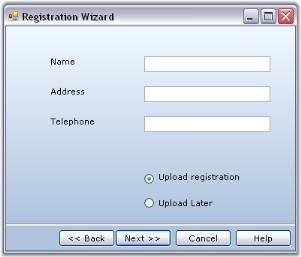

# Wizard page settings

A Wizard Page can include a collection of controls implementing an interactive Wizard interface. The Wizard pages are added to the Wizard Container. You can drag and drop any control into a wizard page. Wizard Control lets you to customize the individual Wizard pages to give a unique functionality for each page.

Creating a Basic Wizard topic discussed how to add Wizard Pages. Let us see how to customize the Wizard pages.

## Setting title and description

You can specify the title and description in the Banner Panel, for a particular Wizard Page using the [WizardPage.Title](https://help.syncfusion.com/cr/windowsforms/Syncfusion.Windows.Forms.Tools.WizardPage.html#Syncfusion_Windows_Forms_Tools_WizardPage_Title) and WizardPage.Description properties. The appearance of the title and description can be controlled through Label properties. 





this.wizardControlPage1.Title = "Registration Details";

this.wizardControlPage1.Description = "Please enter your Details:";





Me.wizardControlPage1.Title = "Registration Details"

Me.wizardControlPage1.Description = "Please enter your Details:"





### Accessing wizard pages

We can also access the properties of a Wizard Page using SelectedWizardPage property of the WizardControl in the Designer.

* [SelectedWizardPage](https://help.syncfusion.com/cr/windowsforms/Syncfusion.Windows.Forms.Tools.WizardControl.html#Syncfusion_Windows_Forms_Tools_WizardControl_SelectedWizardPage)
* [WizardPage.LayoutName](https://help.syncfusion.com/cr/windowsforms/Syncfusion.Windows.Forms.Tools.WizardPage.html#Syncfusion_Windows_Forms_Tools_WizardPage_LayoutName)

The header section (GradientPanel and its child controls) can be hidden by setting [FullPage](https://help.syncfusion.com/cr/windowsforms/Syncfusion.Windows.Forms.Tools.WizardControlPage.html#Syncfusion_Windows_Forms_Tools_WizardControlPage_FullPage) property to `true`. This makes the page occupy the entire space without the header.





this.wizardControlPage1.FullPage = true;





Me.wizardControlPage1.FullPage = True





A sample which demonstrates a Wizard Control with interactive Wizard pages is available in the below location.

…\My Documents\Syncfusion\EssentialStudio\Version Number\Windows\Tools.Windows\Samples\Advanced Editor Functions\ActionGroupingDemo

### Reordering wizard pages

By default, the WizardControl will use the order in which the pages are added to determine the next/previous pages. To reorder the pages, use any one of the following methods.

* Select the WizardControl and choose [WizardPages](https://help.syncfusion.com/cr/windowsforms/Syncfusion.Windows.Forms.Tools.WizardControl.html#Syncfusion_Windows_Forms_Tools_WizardControl_WizardPages) property in the Property Editor. This will bring out the collection editor, where you can reorder the pages using Up and Down arrow keys.

* In the designer, right-click on a page and choose 'Bring To Front' or 'Send To Back' options which will move the page to the beginning or to the end of the collection, respectively.

* The WizardControlPage has the [NextPage](https://help.syncfusion.com/cr/windowsforms/Syncfusion.Windows.Forms.Tools.WizardPage.html#Syncfusion_Windows_Forms_Tools_WizardPage_NextPage) and [PreviousPage](https://help.syncfusion.com/cr/windowsforms/Syncfusion.Windows.Forms.Tools.WizardPage.html#Syncfusion_Windows_Forms_Tools_WizardPage_PreviousPage) properties with which you can specify the order of page selection. Users may set these properties in the designer for all the pages. If set, the WizardControl will use that as a cue to determine the new page to be selected at run time.





this.wizardControlPage2.NextPage = this.wizardControlPage3;

this.wizardControlPage2.PreviousPage = this.wizardControlPage1;





Me.wizardControlPage2.NextPage = Me.wizardControlPage3

Me.wizardControlPage2.PreviousPage = Me.wizardControlPage1





