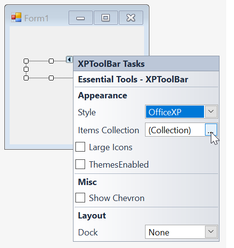
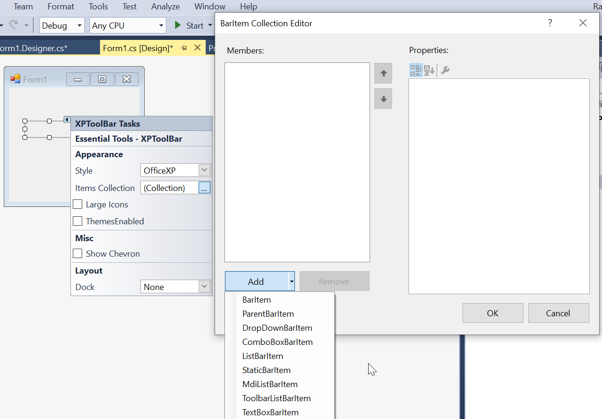
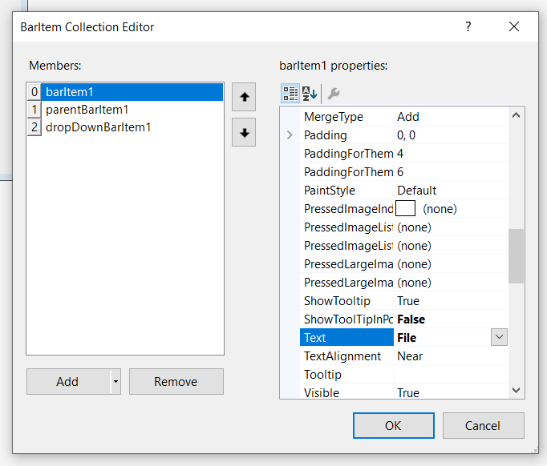

# Getting Started with Windows Forms xp toolbar (XPToolbar)

>**Important**
Starting with v16.2.0.x, if you refer to Syncfusion assemblies from trial setup or from the NuGet feed, include a license key in your projects. Refer to this [link](https://help.syncfusion.com/common/essential-studio/licensing/overview) to learn about registering Syncfusion license key in your Windows Forms application to use our components.

This section provides a quick overview for working with the **XPToolbar** control in a WinForms application.

## Dependent Assemblies

The following assemblies needs to be added as reference to use the control in any application.

* Syncfusion.Tools.Windows
* Syncfusion.Grid.Base
* Syncfusion.Grid.Windows
* Syncfusion.Shared.Base
* Syncfusion.Shared.Windows
* Syncfusion.Tools.Base

## Adding the toolbar through designer

The XPToolbar control can be added through designer by following the below steps.

1. Drag and drop the XPToolbar control from the toolbox (under the section "Syncfusion Windows **Visual Studio Version** Toolbox **Essential Studio Version**") into the designer page.

   

2. Now the XPToolbar control will be successfully added into the application along with the required dependent assemblies.

   

3. For designing, click on the smart tag of XPToolbar control to choose the **Items Collection**.

   

4. In BarItem Collection Editor window, click on down arrow of **Add** button. It will display different types of bar items. Using this, user can add appropriate bar items as per their need.

   

5. Or, we can also add the bar items by right-clicking on the control in the designer and selecting **Properties**. Now, in the **Properties** panel, under **Misc > Items** select the items from the **BarItem Collection Editor**.

   

   

6. In BarItem Collection Editor window, under **Appearance > Text** we can set the text for particular bar item.

   

7. To position the toolbar we need to drag and drop any supportive control of your choice like Label, Panel, GroupBox, TabControl, etc... into the application. In this illustration, we have used "Panel".

   

> "Toolbar" control cannot be directly dropped inside "Panel" via designer. Instead, you can place both these controls in the designer and position them through code behind. Appropriate codes are documented in the immediate section.       

## Adding the toolbar through code

The XPToolbar control can be added through code by following the below steps.

1. Add the following dependency assembly references to the project.

   * Syncfusion.Tools.Windows.dll
   * Syncfusion.Grid.Base.dll
   * Syncfusion.Grid.Windows.dll
   * Syncfusion.Shared.Base.dll
   * Syncfusion.Shared.Windows.dll
   * Syncfusion.Tools.Base.dll
   * Syncfusion.Licensing.dll

   You can get these assemblies by browsing to the default assembly location.
   {System Drive}: \Program Files (x86) \ Syncfusion\Essential Studio\ {Platform} \ {Build Version Number} \ precompiledassemblies \ {Framework Version Number}

2. The below code snippets adds a XPToolbar control to the application.




//Declaration
private Syncfusion.Windows.Forms.Tools.XPMenus.XPToolBar xpToolBar1;
private Syncfusion.Windows.Forms.Tools.XPMenus.BarItem barItem1;
private Syncfusion.Windows.Forms.Tools.XPMenus.ParentBarItem parentBarItem1;
private Syncfusion.Windows.Forms.Tools.XPMenus.DropDownBarItem dropDownBarItem1;
private System.Windows.Forms.Panel panel1;

//Initializing
this.xpToolBar1 = new Syncfusion.Windows.Forms.Tools.XPMenus.XPToolBar();
this.barItem1 = new Syncfusion.Windows.Forms.Tools.XPMenus.BarItem();
this.parentBarItem1 = new Syncfusion.Windows.Forms.Tools.XPMenus.ParentBarItem();
this.dropDownBarItem1 = new Syncfusion.Windows.Forms.Tools.XPMenus.DropDownBarItem();
this.panel1 = new System.Windows.Forms.Panel();

//Add a bar items to the XPToolBar
this.barItem1.Text = "File";
this.parentBarItem1.Text = "Edit";
this.dropDownBarItem1.Text = "View";
this.xpToolBar1.Bar.Items.AddRange(new Syncfusion.Windows.Forms.Tools.XPMenus.BarItem[] { this.barItem1, this.parentBarItem1, this.dropDownBarItem1});
this.panel1.Controls.Add(this.xpToolBar1);
this.Controls.Add(this.panel1);





'Declaration
Private xpToolBar1 As Syncfusion.Windows.Forms.Tools.XPMenus.XPToolBar
Private barItem1 As Syncfusion.Windows.Forms.Tools.XPMenus.BarItem
Private parentBarItem1 As Syncfusion.Windows.Forms.Tools.XPMenus.ParentBarItem
Private dropDownBarItem1 As Syncfusion.Windows.Forms.Tools.XPMenus.DropDownBarItem
Private panel1 As System.Windows.Forms.Panel

'Initializing
Me.xpToolBar1 = New Syncfusion.Windows.Forms.Tools.XPMenus.XPToolBar()
Me.barItem1 = New Syncfusion.Windows.Forms.Tools.XPMenus.BarItem()
Me.parentBarItem1 = New Syncfusion.Windows.Forms.Tools.XPMenus.ParentBarItem()
Me.dropDownBarItem1 = New Syncfusion.Windows.Forms.Tools.XPMenus.DropDownBarItem()
Me.panel1 = New System.Windows.Forms.Panel()

'Add a bar items to the XPToolBar
Me.barItem1.Text = "File"
Me.parentBarItem1.Text = "Edit"
Me.dropDownBarItem1.Text = "View"
Me.xpToolBar1.Bar.Items.AddRange(New Syncfusion.Windows.Forms.Tools.XPMenus.BarItem() { Me.barItem1, Me.parentBarItem1, Me.dropDownBarItem1})
Me.panel1.Controls.Add(Me.xpToolBar1)
Me.Controls.Add(Me.panel1)




{{ codesnippet1 | OrderList_Indent_Level_1 }}

## Adding the toolbar through NuGet package

Refer [control dependencies](https://help.syncfusion.com/windowsforms/control-dependencies#xptoolbar) section to get the list of assemblies or NuGet package needs to be added as reference to use the control in any application.

Find more details regarding how to install the NuGet packages in WinForms application in the following link: [Steps to install NuGet packages](https://help.syncfusion.com/windowsforms/installation/install-nuget-packages).

