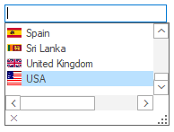
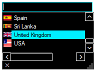
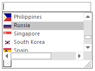
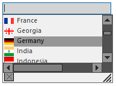
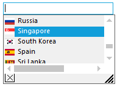

# Customization

This section explains about the customization of the AutoComplete component.

## Item customization
### Appearance 

The appearance of the AutoComplete popup window and the items can be customized using the following properties:
<table>
<tr>
<th>
AutoComplete properties</th><th>
Description</th></tr>
<tr>
<td>
{{'[HeaderForeColor](https://help.syncfusion.com/cr/windowsforms/Syncfusion.Tools.Windows~Syncfusion.Windows.Forms.Tools.AutoComplete~HeaderForeColor.html)' || markdownify}} </td><td>
Specifies the HeaderForeColor of the AutoCompletePopup.</td></tr>
<tr>
<td>
{{'[HeaderForeColor](https://help.syncfusion.com/cr/windowsforms/Syncfusion.Tools.Windows~Syncfusion.Windows.Forms.Tools.AutoComplete~HeaderForeColor.html)' || markdownify}} </td><td>
Specifies the item text ForeColor of the AutoCompletePopup.</td></tr>
<tr>
<td>
{{'[HeaderFont](https://help.syncfusion.com/cr/windowsforms/Syncfusion.Tools.Windows~Syncfusion.Windows.Forms.Tools.AutoComplete~HeaderFont.html)' || markdownify}} </td><td>
Specifies the header font of the AutoCompletePopup.</td></tr>
<tr>
<td>
{{'[ItemFont](https://help.syncfusion.com/cr/windowsforms/Syncfusion.Tools.Windows~Syncfusion.Windows.Forms.Tools.AutoComplete~ItemFont.html)' || markdownify}} </td><td>
Specifies the item font of the AutoCompletePopup.</td></tr>
<tr>
<td>
{{'[HeaderStyle](https://help.syncfusion.com/cr/windowsforms/Syncfusion.Tools.Windows~Syncfusion.Windows.Forms.Tools.AutoComplete~HeaderStyle.html)' || markdownify}} </td><td>
Specifies the AutoCompletePopup column header style.</td></tr>
</table>




    // Specifies the header fore color of the AutoComplete popup.
    this.autoComplete1.HeaderForeColor = Color.Red;

    // Specifies the item fore color of the AutoComplete popup.
    this.autoComplete1.TextColor = Color.Blue;

    // Specifies the font for ColumnHeader in the AutoComplete popup.
    this.autoComplete1.HeaderFont = new System.Drawing.Font("Arial Black", 10.25F);

    // Specifies the font of items in the AutoComplete Popup.
    this.autoComplete1.ItemFont = new System.Drawing.Font("Monotype Corsiva", 9.25F);

    // Specifies the style of ColumnHeader in the AutoComplete popup.
    this.autoComplete1.HeaderStyle = ColumnHeaderStyle.Clickable;





    'Specifies the header fore color of the AutoComplete popup.
    Me.autoComplete1.HeaderForeColor = Color.Red

    'Specifies the item fore color of the AutoComplete popup.
    Me.autoComplete1.TextColor = Color.Blue

    'Specifies the font of the ColumnHeader in the AutoComplete popup.
    Me.autoComplete1.HeaderFont = New System.Drawing.Font("Arial Black", 10.25F)

    'Specifies the font of the items in the AutoComplete popup.
    Me.autoComplete1.ItemFont = New System.Drawing.Font("Monotype Corsiva", 9.25F)

    'Specifies the style of ColumnHeader in the AutoComplete popup.
    Me.autoComplete1.HeaderStyle = ColumnHeaderStyle.Clickable 





## Popup customization
### Close button

To show or hide the `CloseButton` at the bottom-left of the DropDownContainer, use the [ShowCloseButton](https://help.syncfusion.com/cr/windowsforms/Syncfusion.Tools.Windows~Syncfusion.Windows.Forms.Tools.AutoComplete~ShowCloseButton.html) property. The default value of this property is `true`.

N> The AutoComplete dropdown can be closed by calling the [CloseDropDown](https://help.syncfusion.com/cr/windowsforms/Syncfusion.Tools.Windows~Syncfusion.Windows.Forms.Tools.AutoComplete~CloseDropDown.html) method.

### Resize gripper

To show or hide the resizing gripper at the bottom-right of the DropDownContainer, use the [ShowGripper](https://help.syncfusion.com/cr/windowsforms/Syncfusion.Tools.Windows~Syncfusion.Windows.Forms.Tools.AutoComplete~ShowGripper.html) property. The default value of this property is `true`.

### Column Header

To show or hide the column header, use the [ShowColumnHeader](https://help.syncfusion.com/cr/windowsforms/Syncfusion.Tools.Windows~Syncfusion.Windows.Forms.Tools.AutoComplete~ShowColumnHeader.html) property.





this.autoComplete1.ShowCloseButton = false;
this.autoComplete1.ShowGripper = false;
this.autoComplete1.ShowColumnHeader = true;





Me.autoComplete1.ShowCloseButton = False
Me.autoComplete1.ShowGripper = False
Me.autoComplete1.ShowColumnHeader = True





### Size Settings

The properties that can control the height and width of the AutoCompletePopup are as follows.

<table>
<tr>
<th>
AutoComplete properties</th><th>
Description</th></tr>
<tr>
<td>
{{ '[AdjustHeightToItemCount](https://help.syncfusion.com/cr/windowsforms/Syncfusion.Tools.Windows~Syncfusion.Windows.Forms.Tools.AutoComplete~AdjustHeightToItemCount.html)' || markdownify }} </td><td>
Specifies whether the height of the dropdown should be adjusted automatically based on the number of items.</td></tr>
<tr>
<td>
{{ '[AutoPersistentDropDownSize](https://help.syncfusion.com/cr/windowsforms/Syncfusion.Tools.Windows~Syncfusion.Windows.Forms.Tools.AutoComplete~AutoPersistentDropDownSize.html)' || markdownify }}</td><td>
The dropdown size of Autocomplete component is automatically persistent when this property is set to true.</td></tr>
<tr>
<td>
{{ '[PreferredHeight](https://help.syncfusion.com/cr/windowsforms/Syncfusion.Tools.Windows~Syncfusion.Windows.Forms.Tools.AutoComplete~PreferredHeight.html)' || markdownify }}</td><td>
Specifies preferred height for the dropdown displayed by the AutoComplete component when AdjustHeightToItemCount property is false. The default value of this property is 200.</td></tr>
<tr>
<td>
{{ '[PreferredWidth](https://help.syncfusion.com/cr/windowsforms/Syncfusion.Tools.Windows~Syncfusion.Windows.Forms.Tools.AutoComplete~PreferredWidth.html)' || markdownify }}</td><td>
Specifies preferred width for the dropdown displayed by the AutoComplete component when AdjustHeightToItemCount property is false. The default value of this property is -1.</td></tr>
</table>





this.autoComplete1.AdjustHeightToItemCount = false;
this.autoComplete1.AutoPersistentDropDownSize = true;
this.autoComplete1.PreferredHeight = 100;
this.autoComplete1.PreferredWidth = 300;





Me.autoComplete1.AdjustHeightToItemCount = False
Me.autoComplete1.AutoPersistentDropDownSize = True
Me.autoComplete1.PreferredHeight = 100
Me.autoComplete1.PreferredWidth = 300





## Visual styles 

The built-in themes for professional representation of AutoComplete are as follows.

### Office2019Colorful

Sets the Office2019Colorful theme.





this.autoComplete1.ThemeName = "Office2019Colorful";





Me.autoComplete1.ThemeName = "Office2019Colorful"





### HighContrastBlack

Sets the HighContrastBlack theme.





this.autoComplete1.ThemeName = "HighContrastBlack";





Me.autoComplete1.ThemeName = "HighContrastBlack"





 

### Office2016Colorful

Sets the Office2016Colorful theme.





this.autoComplete1.Style = AutoCompleteStyle.Office2016Colorful;





Me.autoComplete1.Style = AutoCompleteStyle.Office2016Colorful





### Office2016White

Sets the Office2016White theme.





this.autoComplete1.Style = AutoCompleteStyle.Office2016White;





Me.autoComplete1.Style = AutoCompleteStyle.Office2016White





### Office2016Black

Sets the Office2016Black theme.





this.autoComplete1.Style = AutoCompleteStyle.Office2016Black;





Me.autoComplete1.Style = AutoCompleteStyle.Office2016Black





### Office2016DarkGray

Sets the Office2016DarkGray theme.





this.autoComplete1.Style = AutoCompleteStyle.Office2016DarkGray;





Me.autoComplete1.Style = AutoCompleteStyle.Office2016DarkGray





### Metro

Sets the Metro theme.





this.autoComplete1.Style = AutoCompleteStyle.Metro;





Me.autoComplete1.Style = AutoCompleteStyle.Metro





### Default

Sets the default theme.

## Persistence

The history list of AutoComplete component can be saved in the following formats:

* Binary Format
* XML Format
* IsolatedStorage medium
* MemoryStream
* PersistState property

The AutoComplete component has a fully built-in serialization feature that provides automatic serialization for the AutoComplete's history list. The serialization mechanism is implemented using the standardized Syncfusion.Windows.Forms.AppStateSerializer component that acts as a central coordinator for all the Essential tools components and provides options to read or write to different media such as the default isolated storage, XML file, XML stream, binary file, binary stream, and the Windows Registry.

### Persisting AutoComplete's data in the default storage

The data of AutoComplete component can be persisted by setting the [AutoSerialize](https://help.syncfusion.com/cr/windowsforms/Syncfusion.Tools.Windows~Syncfusion.Windows.Forms.Tools.AutoComplete~AutoSerialize.html) property to `true`. It specifies whether the AutoComplete component can persist its data. This information is stored in the isolated storage.





this.autoComplete1.AutoSerialize = true;





Me.autoComplete1.AutoSerialize = True





### Persisting in XML file

To save and load the AutoComplete data in XML.





using Syncfusion.Runtime.Serialization;

// To save
AppStateSerializer aser = new AppStateSerializer(SerializeMode.XMLFile, @"C:\info.xml");
this.autoComplete1.SaveCurrentState(aser);

// To load
AppStateSerializer aser = new AppStateSerializer(SerializeMode.XMLFile, @"C:\info.xml");
this.autoComplete1.LoadCurrentState(aser);




Imports Syncfusion.Runtime.Serialization

' To save
Private aser As AppStateSerializer = New AppStateSerializer(SerializeMode.XMLFile, "C:\info.xml")
Me.autoComplete1.SaveCurrentState(aser)

' To load
Private aser As AppStateSerializer = New AppStateSerializer(SerializeMode.XMLFile, "C:\info.xml")
Me.autoComplete1.LoadCurrentState(aser)

End Sub()




### Persisting in memory stream

It serializes the data into a memory stream. The following methods are storing and retrieving data in AutoComplete.

#### Storing state

The current internal list information is stored to the persistence medium using the [SaveCurrentState](https://help.syncfusion.com/cr/windowsforms/Syncfusion.Tools.Windows~Syncfusion.Windows.Forms.Tools.AutoComplete~SaveCurrentState(AppStateSerializer).html) method. 





MemoryStream ms = new MemoryStream();
AppStateSerializer aser = new AppStateSerializer(SerializeMode.BinaryFmtStream, ms);
this.autoComplete1.SaveCurrentState(aser);
aser.PersistNow();





Dim ms As MemoryStream = New MemoryStream()
Private aser As AppStateSerializer = New AppStateSerializer(SerializeMode.BinaryFmtStream, ms)
Me.autoComplete1.SaveCurrentState(aser)
aser.PersistNow()





### Retrieving state

Retrieving state reads the previously serialized internal history list using the [LoadCurrentState](https://help.syncfusion.com/cr/windowsforms/Syncfusion.Tools.Windows~Syncfusion.Windows.Forms.Tools.AutoComplete~LoadCurrentState(AppStateSerializer).html) method.




// Code to retrieve data(stream) from database.
MemoryStream ms = new MemoryStream(val);
ms.Position = 0;
AppStateSerializer aser = new AppStateSerializer(SerializeMode.BinaryFmtStream, ms);
this.autoComplete1.LoadCurrentState(aser);





' Code to retrieve data(stream) from database.

Dim ms As MemoryStream = New MemoryStream(value)
ms.Position = 0
Dim aser As AppStateSerializer = New AppStateSerializer(SerializeMode.BinaryFmtStream, ms)
this.autoComplete1.LoadCurrentState(aser);





#### To serialize in binary format





// To save
AppStateSerializer aser = new AppStateSerializer(SerializeMode.BinaryFile,"myfile");
this.autoComplete1.SaveCurrentState(aser);
aser.PersistNow();

// To load
AppStateSerializer aser = new AppStateSerializer(SerializeMode.BinaryFile,"myfile");
this.autoComplete1.LoadCurrentState(aser);





' To save

Private aser As AppStateSerializer = New AppStateSerializer(SerializeMode.BinaryFile, "myfile")

Me.autoComplete1.SaveCurrentState(aser)

aser.PersistNow()

' To load
Private aser As AppStateSerializer = New AppStateSerializer(SerializeMode.BinaryFile, "myfile")
Me.autoComplete1.LoadCurrentState(aser)





#### To serialize in isolated storage medium





// To save
AppStateSerializer aser = new AppStateSerializer(SerializeMode.IsolatedStorage, "myfile");
this.autoComplete1.SaveCurrentState(aser);
aser.PersistNow();

// To load
AppStateSerializer serializer = new AppStateSerializer(SerializeMode.IsolatedStorage, "myfile");
this.autoComplete1.LoadCurrentState(aser);





' To save
Private aser As AppStateSerializer = New AppStateSerializer(SerializeMode.IsolatedStorage, "myfile")
Me.autoComplete1.SaveCurrentState(aser)
aser.PersistNow()

' To load
Private serializer As AppStateSerializer = New AppStateSerializer(SerializeMode.IsolatedStorage, "myfile")
Me.autoComplete1.LoadCurrentState(aser)





A sample that demonstrates the Persistence features is available [here](https://github.com/SyncfusionExamples/AutoCompleteModes_in_AutoComplete_Component/tree/master/Persistence)