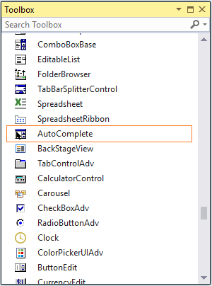
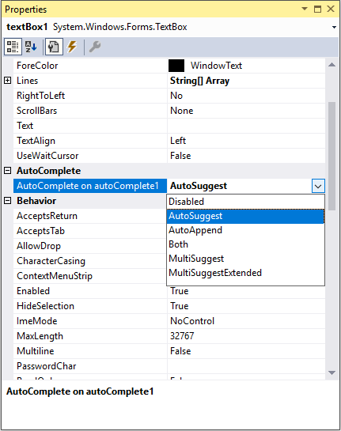
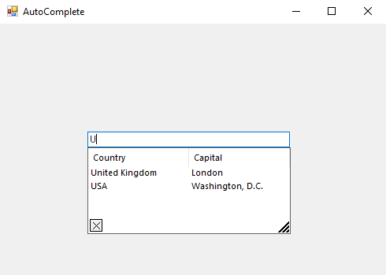

# Getting Started with Windows Forms AutoComplete

This section provides a quick overview for working with the [AutoComplete](https://help.syncfusion.com/cr/windowsforms/Syncfusion.Windows.Forms.Tools.AutoComplete.html) in Windows Forms.

## Assembly deployment

Refer to the [Control dependencies](https://help.syncfusion.com/windowsforms/control-dependencies#autocomplete) section to get the list of assemblies or NuGet package that needs to be added as reference to use the component in any application.

Refer to this [documentation](https://help.syncfusion.com/windowsforms/visual-studio-integration/nuget-packages) to find more details about installing nuget packages in a Windows Forms application.

## Creating Application with AutoComplete

In this walk through, users will create WinForms application that contains [AutoComplete](https://help.syncfusion.com/cr/windowsforms/Syncfusion.Windows.Forms.Tools.AutoComplete.html) control.

### Creating the Project

Create new Windows Forms Project in Visual Studio to display [AutoComplete](https://help.syncfusion.com/cr/windowsforms/Syncfusion.Windows.Forms.Tools.AutoComplete.html) control.

### Adding control via designer

[AutoComplete](https://help.syncfusion.com/cr/windowsforms/Syncfusion.Windows.Forms.Tools.AutoComplete.html) control can be added to the application by dragging it from Toolbox and dropping it in Designer. The required assembly references will be added automatically.

### Adding control in code

1. Create a new Windows Forms application in Visual Studio. Add the following required assembly references:

* Syncfusion.Grid.Base
* Syncfusion.Grid.Windows
* Syncfusion.Shared.Base
* Syncfusion.Shared.Windows
* Syncfusion.SpellChecker.Base
* Syncfusion.Tools.Base
* Syncfusion.Tools.Windows

2. Add the required namespace and create an instance for [AutoComplete](https://help.syncfusion.com/cr/windowsforms/Syncfusion.Windows.Forms.Tools.AutoComplete.html) and TextBox controls.




Using Syncfusion.Windows.Forms.Tools

public Form1()
{
    InitializeComponent();
    AutoComplete autoComplete1 = new AutoComplete();
    TextBox textBox1 = new TextBox();
    this.Controls.Add(textBox1);
}




Imports Syncfusion.Windows.Forms.Tools

Public Sub New()
    InitializeComponent()
    Dim autoComplete1 As AutoComplete = New AutoComplete()
    Dim textBox1 As TextBox = New TextBox()
    Me.Controls.Add(textBox1)
End Sub



## Enable AutoComplete functionality for TextBox control

### Enabling via designer

Set the **AutoComplete on autoComplete1** property as AutoSuggest using the drop-down provided in the TextBox properties dialog window. The Default value is `Disabled`.

### Enabling via Code

Use the [SetAutoComplete](https://help.syncfusion.com/cr/windowsforms/Syncfusion.Windows.Forms.Tools.AutoComplete.html#Syncfusion_Windows_Forms_Tools_AutoComplete_SetAutoComplete_System_Windows_Forms_Control_Syncfusion_Windows_Forms_Tools_AutoCompleteModes_) method to add the [AutoComplete](https://help.syncfusion.com/cr/windowsforms/Syncfusion.Windows.Forms.Tools.AutoComplete.html) component with the TextBox control.




public Form1()
{
    InitializeComponent();
    AutoComplete autoComplete1 = new AutoComplete();
    TextBox textBox1 = new TextBox();
    autoComplete1.SetAutoComplete(textBox1, AutoCompleteModes.AutoSuggest);
    this.Controls.Add(textBox1);
}




Public Sub New()
    InitializeComponent()
    Dim autoComplete1 As AutoComplete = New AutoComplete()
    Dim textBox1 As TextBox = New TextBox()
    autoComplete1.SetAutoComplete(textBox1, AutoCompleteModes.AutoSuggest)
    Me.Controls.Add(textBox1)
End Sub




## Creating Datasource for Sample Application

The [AutoComplete](https://help.syncfusion.com/cr/windowsforms/Syncfusion.Windows.Forms.Tools.AutoComplete.html) component supports variety of data sources such as DataTables, DataSets, or any component that implement interfaces like IList, IBindingList, ITypedList, or IListSource. For assigning data source to AutoComplete, use the [DataSource](https://help.syncfusion.com/cr/windowsforms/Syncfusion.Windows.Forms.Tools.AutoComplete.html#Syncfusion_Windows_Forms_Tools_AutoComplete_DataSource) property.




private void Form1_Load(object sender, EventArgs e)
{
    //Create a data table
    DataTable dt = new DataTable("Table1");
    dt.Columns.Add("Country");
    dt.Columns.Add("Capital");

    // Create a data set
    DataSet ds = new DataSet();
    ds.Tables.Add(dt);
    dt.Rows.Add(new string[] { "United Kingdom ", "London" });
    dt.Rows.Add(new string[] { "USA", "Washington, D.C." });
    dt.Rows.Add(new string[] { "Brazil", "Brasilia" });
    dt.Rows.Add(new string[] { "France", "Paris" });
    dt.Rows.Add(new string[] { "Russia", "Moscow" });
    dt.Rows.Add(new string[] { "India", "Delhi" });
    DataView view = new DataView(dt);

    // Setting data source to AutoComplete
    this.autoComplete1.DataSource = view;
}




Private Sub Form1_Load(ByVal sender As Object, ByVal e As EventArgs)

    'Create dataTable
    Dim dt As DataTable = New DataTable("Table1")
    dt.Columns.Add("Country")
    dt.Columns.Add("Capital")

    'Create a Data Set
    Dim ds As DataSet = New DataSet()
    ds.Tables.Add(dt)
    dt.Rows.Add(New String() {"United Kingdom ", "London"})
    dt.Rows.Add(New String() {"USA", "Washington, D.C."})
    dt.Rows.Add(New String() {"Brazil", "Brasilia"})
    dt.Rows.Add(New String() {"France", "Paris"})
    dt.Rows.Add(New String() {"Russia", "Moscow"})
    dt.Rows.Add(New String() {"India", "Delhi"})
    Dim view As DataView = New DataView(dt)

    ' setting datasource to autocomplete
    Me.autoComplete1.DataSource = view
End Sub




