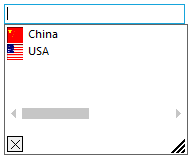

# Multiple Columns

The AutoComplete allows you to display multiple columns of information. The columns can be configured using the following properties:

## Columns

The [Columns](https://help.syncfusion.com/cr/windowsforms/Syncfusion.Windows.Forms.Tools.AutoComplete.html#Syncfusion_Windows_Forms_Tools_AutoComplete_Columns) property specifies a collection of columns in the AutoComplete dropdown when the AutoCompleteModes enumerator value is AutoSuggest. Each column is represented by an AutoCompleteDataColumnInfo object. This class includes a definition for specifying whether the column is the matching column or the image column.

### Column configuration

The information needed for setting the attributes of a column in the drop-down list of the AutoComplete is handled using [AutoCompleteDataColumnInfo](https://help.syncfusion.com/cr/windowsforms/Syncfusion.Windows.Forms.Tools.AutoCompleteDataColumnInfo.html). It specifies the appearance and behavior of each column that should be visible. The AutoCompleteDataColumnInfo properties are as follows.

<table>
<tr>
<th>
AutoCompleteDataColumn properties</th>
<th>
Description</th></tr>
<tr>
<td>
{{ '[ColumnHeaderText](https://help.syncfusion.com/cr/windowsforms/Syncfusion.Windows.Forms.Tools.AutoCompleteDataColumnInfo.html#Syncfusion_Windows_Forms_Tools_AutoCompleteDataColumnInfo_ColumnHeaderText)' || markdownify }}</td><td>
Represents the text for the column header.</td></tr>
<tr>
<td>
{{ '[MatchingColumn](https://help.syncfusion.com/cr/windowsforms/Syncfusion.Windows.Forms.Tools.AutoCompleteDataColumnInfo.html#Syncfusion_Windows_Forms_Tools_AutoCompleteDataColumnInfo_MatchingColumn)' || markdownify }}</td><td>
Indicates whether the column that this item represents to be treated as the matching column.</td></tr>
<tr>
<td>
{{ '[ImageColumn](https://help.syncfusion.com/cr/windowsforms/Syncfusion.Windows.Forms.Tools.AutoCompleteDataColumnInfo.html#Syncfusion_Windows_Forms_Tools_AutoCompleteDataColumnInfo_ImageColumn)' || markdownify }}</td><td>
Indicates whether the column that this item represents to be treated as the image column.</td></tr>
<tr>
<td>
{{ '[MinColumnWidth](https://help.syncfusion.com/cr/windowsforms/Syncfusion.Windows.Forms.Tools.AutoCompleteDataColumnInfo.html#Syncfusion_Windows_Forms_Tools_AutoCompleteDataColumnInfo_MinColumnWidth)' || markdownify }}</td><td>
Sets minimum width for the column.</td></tr>
<tr>
<td>
{{'[Visible](https://help.syncfusion.com/cr/windowsforms/Syncfusion.Windows.Forms.Tools.AutoCompleteDataColumnInfo.html#Syncfusion_Windows_Forms_Tools_AutoCompleteDataColumnInfo_Visible)' || markdownify }}</td><td>
Shows or hides the column at run time.</td></tr>
</table>

## Showing image in column

You can add a drop-down item with image to the AutoComplete popup.

An image list should be set to the [ImageList](https://help.syncfusion.com/cr/windowsforms/Syncfusion.Windows.Forms.Tools.AutoComplete.html#Syncfusion_Windows_Forms_Tools_AutoComplete_ImageList) property of AutoComplete component, and the [ImageColumn](https://help.syncfusion.com/cr/windowsforms/Syncfusion.Windows.Forms.Tools.AutoCompleteDataColumnInfo.html#Syncfusion_Windows_Forms_Tools_AutoCompleteDataColumnInfo_ImageColumn) property should be set to `true` for displaying images in the column. Specify the item text and the image index in the [AddHistoryItem](https://help.syncfusion.com/cr/windowsforms/Syncfusion.Windows.Forms.Tools.AutoComplete.html#Syncfusion_Windows_Forms_Tools_AutoComplete_AddHistoryItem_System_String_) method.





this.autoCompleteDataColumnInfo1.ColumnHeaderText = "Flag";
this.autoCompleteDataColumnInfo1.ImageColumn = true;
this.autoCompleteDataColumnInfo1.MatchingColumn = false;
this.autoCompleteDataColumnInfo1.Visible = true;

this.autoCompleteDataColumnInfo2.ColumnHeaderText = "Country";
this.autoCompleteDataColumnInfo2.ImageColumn = false;
this.autoCompleteDataColumnInfo2.MatchingColumn = false;
this.autoCompleteDataColumnInfo2.Visible = true;

this.autoComplete1.Columns.Add(this.autoCompleteDataColumnInfo2);
this.autoComplete1.Columns.Add(this.autoCompleteDataColumnInfo1);

// Add Images in the image list and set to this property.

this.autoComplete1.ImageList = this.imageList;

this.autoComplete1.AddHistoryItem("USA", 0);
this.autoComplete1.AddHistoryItem("China", 1);





Me.autoCompleteDataColumnInfo1.ColumnHeaderText = "Flag"
Me.autoCompleteDataColumnInfo1.ImageColumn = True
Me.autoCompleteDataColumnInfo1.MatchingColumn = False
Me.autoCompleteDataColumnInfo1.Visible = True

Me.autoCompleteDataColumnInfo2.ColumnHeaderText = "Country"
Me.autoCompleteDataColumnInfo2.ImageColumn = False
Me.autoCompleteDataColumnInfo2.MatchingColumn = True
Me.autoCompleteDataColumnInfo2.Visible = True

Me.autoComplete1.Columns.Add(Me.autoCompleteDataColumnInfo2)
Me.autoComplete1.Columns.Add(Me.autoCompleteDataColumnInfo1)

'Add Images in the image list and set to this property.
Me.autoComplete1.ImageList = Me.imageList

Me.autoComplete1.AddHistoryItem("USA", 0)

Me.autoComplete1.AddHistoryItem("China", 1)





A sample that demonstrates showing image in a column using data table is available [here](https://github.com/SyncfusionExamples/AutoCompleteModes_in_AutoComplete_Component/tree/master/ImageSettings).
