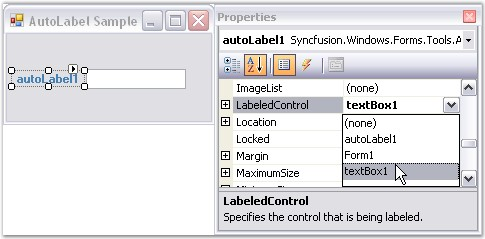

# Labeling a Control

The following steps allow you to label a control.

*  Create or open a Windows Forms project.
*  Add an AutoLabel control from the toolbox onto the form by dragging and dropping it on the form or double clicking the control.
*  Add the control, for example TextBox, that has to be labeled to the form.
*  Go to the Property grid and select the LabeledControl property.
*  Select the control to be labeled, TextBox, from the dropdown box as shown here.

    




private Syncfusion.Windows.Forms.Tools.AutoLabel autoLabel1;
this.autoLabel1 = new Syncfusion.Windows.Forms.Tools.AutoLabel();
this.autoLabel1.LabeledControl = this.textBox1;
this.Controls.Add(this.autoLabel1);




   
Private autoLabel1 As Syncfusion.Windows.Forms.Tools.AutoLabel
Me.autoLabel1 = New Syncfusion.Windows.Forms.Tools.AutoLabel()
Me.autoLabel1.LabeledControl = Me.textBox1
Me.Controls.Add(Me.autoLabel1)




*  Run the application.

   
