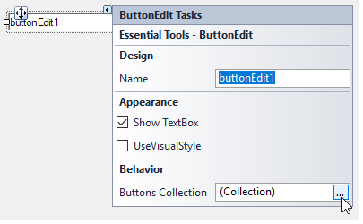
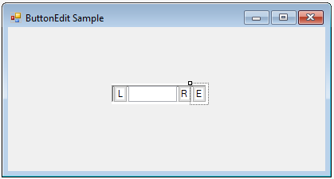

# Getting Started

This section briefly describes how to create a new Windows Forms project in Visual Studio and add **"ButtonEdit"** with it's basic functionalities.

## Assembly deployment

Refer to the [control dependencies](https://help.syncfusion.com/windowsforms/control-dependencies#buttonedit) section to get the list of assemblies or NuGet package details which needs to be added as reference to use the control in any application.

[Click here](https://help.syncfusion.com/windowsforms/nuget-packages) to find more details on how to install nuget packages in Windows Forms application.

## Adding a ButtonEdit control through designer

The **"ButtonEdit"** control can be added through designer by following steps.

**Step 1**: The **"ButtonEdit"** control can be added to an application by dragging it from the toolbox to design view. The following dependent assemblies will be added automatically.

* Syncfusion.Grid.Base
* Syncfusion.Grid.Windows
* Syncfusion.Shared.Base
* Syncfusion.Shared.Windows
* Syncfusion.Tools.Base
* Syncfusion.Tools.Windows

    

**Step 2**: When the control is initially added to the form, it appears like an edit control with no buttons.

 

**Step 3**: We can add child buttons to the control using **"ButtonEditChildButton Collection Editor"** which is displayed by `Buttons` property.

   

Editor can also be accessed using Smart Tag option.

**Step 4**: Now, the **"ButtonEditChildButton Collection Editor"** dialog will be opened. Then, click **"Add"** for adding new child buttons to the control.

   

N> You can also add or remove child buttons through the **"Add"** or **"Remove"** button.

## Adding a ButtonEdit control through Code

To create a **"ButtonEdit"** control programmatically, follow the below steps.

**Step 1**: Create a C# or VB application through Visual Studio.

**Step 2**: Add the following assembly reference to the project.

* Syncfusion.Tools.Windows

**Step 3**: Include the required namespace.




using Syncfusion.Windows.Forms.Tools;





Imports Syncfusion.Windows.Forms.Tools

   

   
**Step 4**: Create an instance of **"ButtonEdit"**, **"TextBox"** and **"ButtonEditChildButton"**.



   
private Syncfusion.Windows.Forms.Tools.ButtonEdit buttonEdit1;
private System.Windows.Forms.TextBox textBox1;
private Syncfusion.Windows.Forms.Tools.ButtonEditChildButton buttonEditChildButton1;
this.buttonEdit1=new Syncfusion.Windows.Forms.Tools.ButtonEdit();
this.textBox1=new TextBox();
this.buttonEditChildButton1=new Syncfusion.Windows.Forms.Tools.ButtonEditChildButton();





Private buttonEdit1 As Syncfusion.Windows.Forms.Tools.ButtonEdit
Private textBox1 As System.Windows.Forms.TextBox
Private buttonEditChildButton1 As Syncfusion.Windows.Forms.Tools.ButtonEditChildButton
Me.buttonEdit1 = New Syncfusion.Windows.Forms.Tools.ButtonEdit()
Me.textBox1 = New TextBox()
Me.buttonEditChildButton1 = New Syncfusion.Windows.Forms.Tools.ButtonEditChildButton()



 
**Step 5**: Embed the textBox1 to the TextBox of **"ButtonEdit"**.



   
//Associating the TextBoxExt control.
this.buttonEdit1.TextBox=this.textBox1;

 



'Associating the TextBoxExt control.
Me.buttonEdit1.TextBox=Me.textBox1




**Step 6**: Set the text for the buttons.




//Setting text for child Buttons.
this.buttonEditChildButton1.Text = "R";





'Setting text for child Buttons
Me.buttonEditChildButton1.Text = "R"




**Step 7**: Add **"ButtonEditChildButtons"** to the **"ButtonEdit"** which then add it to the form.




this.buttonEdit1.Buttons.Add(this.buttonEditChildButton1);
this.Controls.Add(this.buttonEdit1);





Me.buttonEdit1.Buttons.Add(Me.buttonEditChildButton1)
Me.Controls.Add(Me.buttonEdit1)




## Adding child buttons

**Step 1**: Add the child buttons to the control using below code.





private Syncfusion.Windows.Forms.Tools.ButtonEdit buttonEdit1;
private Syncfusion.Windows.Forms.Tools.ButtonEditChildButton buttonEditChildButton1;
private Syncfusion.Windows.Forms.Tools.ButtonEditChildButton buttonEditChildButton2;
private Syncfusion.Windows.Forms.Tools.ButtonEditChildButton buttonEditChildButton3;
this.buttonEdit1=new Syncfusion.Windows.Forms.Tools.ButtonEdit();
this.buttonEditChildButton1=new Syncfusion.Windows.Forms.Tools.ButtonEditChildButton();
this.buttonEditChildButton2=new Syncfusion.Windows.Forms.Tools.ButtonEditChildButton();
this.buttonEditChildButton3=new Syncfusion.Windows.Forms.Tools.ButtonEditChildButton();





Private buttonEdit1 As Syncfusion.Windows.Forms.Tools.ButtonEdit
Private buttonEditChildButton1 As Syncfusion.Windows.Forms.Tools.ButtonEditChildButton
Private buttonEditChildButton2 As Syncfusion.Windows.Forms.Tools.ButtonEditChildButton
Private buttonEditChildButton3 As Syncfusion.Windows.Forms.Tools.ButtonEditChildButton
Me.buttonEdit1 = New Syncfusion.Windows.Forms.Tools.ButtonEdit()
Me.buttonEditChildButton1 = New Syncfusion.Windows.Forms.Tools.ButtonEditChildButton()
Me.buttonEditChildButton2 = New Syncfusion.Windows.Forms.Tools.ButtonEditChildButton()
Me.buttonEditChildButton3 = New Syncfusion.Windows.Forms.Tools.ButtonEditChildButton()





**Step 2**: Add child buttons to the **"ButtonEdit"** which then add it to the form.





this.buttonEdit1.Buttons.Add(this.buttonEditChildButton1);
this.buttonEdit1.Buttons.Add(this.buttonEditChildButton2);
this.buttonEdit1.Buttons.Add(this.buttonEditChildButton3);





Me.buttonEdit1.Buttons.Add(Me.buttonEditChildButton1)
Me.buttonEdit1.Buttons.Add(Me.buttonEditChildButton2)
Me.buttonEdit1.Buttons.Add(Me.buttonEditChildButton3)





**Step 3**: Set the alignment and text for the buttons.





//Setting Button alignment for ChildButton1

//By default the alignment for other buttons will be right
this.buttonEditChildButton1.ButtonAlign = ButtonAlignment.Left;

//Setting text for child Buttons.
this.buttonEditChildButton1.Text = "L";
this.buttonEditChildButton2.Text = "R";
this.buttonEditChildButton3.Text = "E";





'Setting Button alignment for Child Button 1. 

'By default the alignment for other buttons will be right
Me.buttonEditChildButton1.ButtonAlign = ButtonAlignment.Left

'Setting text for child Buttons
Me.buttonEditChildButton1.Text = "L"
Me.buttonEditChildButton2.Text = "R"
Me.buttonEditChildButton3.Text = "E"





