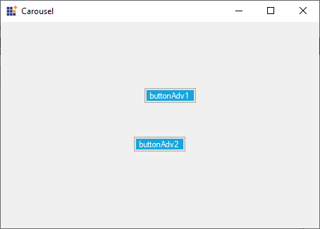

# Getting started

This section briefly describes how to create a Windows Forms project in Visual Studio and add the **Carousel** control with its basic functionalities.

## Assembly deployment

Refer [control dependencies](https://help.syncfusion.com/windowsforms/control-dependencies#carousel) section to get the list of assemblies or NuGet package details that need to be added as reference to use the control in any application. 

[Click here](https://help.syncfusion.com/windowsforms/visual-studio-integration/nuget-packages) to find more details on how to install NuGet packages in any application.

## Adding the Carousel control via designer

The following steps describe how to create a **Carousel** control via the designer.

1) Create a new Windows Forms application in Visual Studio.

2) The **Carousel** control can be added to an application by dragging it from the toolbox to the design view. The following dependent assemblies will be added automatically.

* Syncfusion.Grid.Base
* Syncfusion.Grid.Windows
* Syncfusion.Shared.Base
* Syncfusion.Shared.Windows
* Syncfusion.Tools.Base
* Syncfusion.Tools.Windows

 

## Adding the Carousel control via code

The following steps illustrate how to create an **Carousel** control programmatically.

1) Create a C# or VB application via Visual Studio.

2) Add the following assembly reference to the project.

 * Syncfusion.Grid.Base
 * Syncfusion.Grid.Windows
 * Syncfusion.Shared.Base
 * Syncfusion.Shared.Windows
 * Syncfusion.Tools.Base
 * Syncfusion.Tools.Windows

3) Include the required namespaces.





using Syncfusion.Windows.Forms.Tools;





Imports Syncfusion.Windows.Forms.Tools





4) Create an instance of **Carousel** control and add it to the form.





Carousel carousel = new Carousel();
this.Controls.Add(carousel);





Dim carousel As Carousel = New Carousel
Me.Controls.Add(carousel)





## Configuration of Carousel
 
Carousel control is a circular conveyor used for displaying and rotating the custom controls or images objects

## Adding controls into Carousel

To load custom controls in Carousel, it needs to added into [Items](https://help.syncfusion.com/cr/windowsforms/Syncfusion.Tools.Windows~Syncfusion.Windows.Forms.Tools.Carousel~Items.html) collection property in Carousel class.





//Initialization
ButtonAdv buttonAdv1 =new ButtonAdv();
ButtonAdv buttonAdv2 =new ButtonAdv();

//Set the properties for two buttonadv
buttonAdv1.BackColor = System.Drawing.Color.FromArgb(((int)(((byte)(22)))), ((int)(((byte)(165)))), ((int)(((byte)(220)))));
buttonAdv1.ForeColor = System.Drawing.Color.White;

buttonAdv2.BackColor = System.Drawing.Color.FromArgb(((int)(((byte)(22)))), ((int)(((byte)(165)))), ((int)(((byte)(220)))));
buttonAdv2.ForeColor = System.Drawing.Color.White;

//Add the custom controls into carousel
this.carousel1.Controls.Add(this.buttonAdv1);
this.carousel1.Controls.Add(this.buttonAdv2);

//Add the custom controls into carousel items
this.carousel1.Items.Add(this.buttonAdv1);
this.carousel1.Items.Add(this.buttonAdv2);





'Initialization
Dim buttonAdv1 As ButtonAdv = New ButtonAdv
Dim buttonAdv2 As ButtonAdv = New ButtonAdv

'Set the properties for two buttonadv
buttonAdv1.BackColor = System.Drawing.Color.FromArgb((CInt(Fix((CByte(22))))), (CInt(Fix((CByte(165))))), (CInt(Fix((CByte(220))))))
buttonAdv1.ForeColor = System.Drawing.Color.White

buttonAdv2.BackColor = System.Drawing.Color.FromArgb((CInt(Fix((CByte(22))))), (CInt(Fix((CByte(165))))), (CInt(Fix((CByte(220))))))
buttonAdv2.ForeColor = System.Drawing.Color.White

'Add the custom controls into carousel
Me.carousel1.Controls.Add(this.buttonAdv1)
Me.carousel1.Controls.Add(this.buttonAdv2)

'Add the custom controls into carousel items
Me.carousel1.Items.Add(this.buttonAdv1)
Me.carousel1.Items.Add(this.buttonAdv2)





 

## Adding images into Carousel

To load images in Carousel, it needs to added into [ImageListCollection](https://help.syncfusion.com/cr/windowsforms/Syncfusion.Tools.Windows~Syncfusion.Windows.Forms.Tools.Carousel~ImageListCollection.html) property in Carousel class.





//Image slides
carousel1.ImageSlides = true;

//Initialization
CarouselImage carouselImage1 = new CarouselImage();
CarouselImage carouselImage2 = new CarouselImage();
CarouselImage carouselImage3 = new CarouselImage();
CarouselImage carouselImage4 = new CarouselImage();
CarouselImage carouselImage5 = new CarouselImage();
CarouselImage carouselImage6 = new CarouselImage();

// Adding carousel image
carouselImage1.ItemImage = ((System.Drawing.Image)(resources.GetObject("carouselImage1.ItemImage")));
carouselImage2.ItemImage = ((System.Drawing.Image)(resources.GetObject("carouselImage2.ItemImage")));
carouselImage3.ItemImage = ((System.Drawing.Image)(resources.GetObject("carouselImage3.ItemImage")));
carouselImage4.ItemImage = ((System.Drawing.Image)(resources.GetObject("carouselImage4.ItemImage")));
carouselImage5.ItemImage = ((System.Drawing.Image)(resources.GetObject("carouselImage5.ItemImage")));
carouselImage6.ItemImage = ((System.Drawing.Image)(resources.GetObject("carouselImage6.ItemImage")));

// Add capture images to imagelistcollection
this.carousel1.ImageListCollection.Add(carouselImage1);
this.carousel1.ImageListCollection.Add(carouselImage2);
this.carousel1.ImageListCollection.Add(carouselImage3);
this.carousel1.ImageListCollection.Add(carouselImage4);
this.carousel1.ImageListCollection.Add(carouselImage5);
this.carousel1.ImageListCollection.Add(carouselImage6);





'Image slides
carousel1.ImageSlides = True

'Initialization
Dim carouselImage1 As New CarouselImage()
Dim carouselImage2 As New CarouselImage()
Dim carouselImage3 As New CarouselImage()
Dim carouselImage4 As New CarouselImage()
Dim carouselImage5 As New CarouselImage()
Dim carouselImage6 As New CarouselImage()

' Adding carousel image
carouselImage1.ItemImage = (CType(resources.GetObject("carouselImage1.ItemImage"), System.Drawing.Image))
carouselImage2.ItemImage = (CType(resources.GetObject("carouselImage2.ItemImage"), System.Drawing.Image))
carouselImage3.ItemImage = (CType(resources.GetObject("carouselImage3.ItemImage"), System.Drawing.Image))
carouselImage4.ItemImage = (CType(resources.GetObject("carouselImage4.ItemImage"), System.Drawing.Image))
carouselImage5.ItemImage = (CType(resources.GetObject("carouselImage5.ItemImage"), System.Drawing.Image))
carouselImage6.ItemImage = (CType(resources.GetObject("carouselImage6.ItemImage"), System.Drawing.Image))

' Add capture images to imagelistcollection
Me.carousel1.ImageListCollection.Add(carouselImage1)
Me.carousel1.ImageListCollection.Add(carouselImage2)
Me.carousel1.ImageListCollection.Add(carouselImage3)
Me.carousel1.ImageListCollection.Add(carouselImage4)
Me.carousel1.ImageListCollection.Add(carouselImage5)
Me.carousel1.ImageListCollection.Add(carouselImage6)





