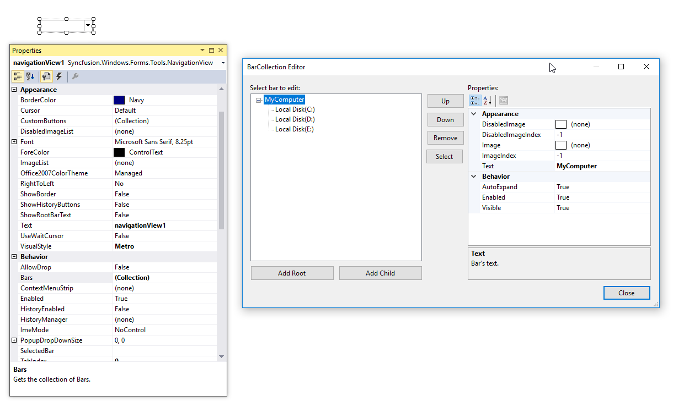

# Getting started

This section describes how to add `NavigationView` control in a Windows Forms application and overview of its basic functionalities.

## Assembly deployment

Refer [control dependencies](https://help.syncfusion.com/windowsforms/control-dependencies#navigationview) section to get the list of assemblies or NuGet package needs to be added as reference to use the control in any application.
 
Please find more details regarding how to install the nuget packages in windows form application in the below link:
 
[How to install nuget packages](https://help.syncfusion.com/windowsforms/nuget-packages)

# Creating simple application with NavigationView

You can create the Windows Forms application with NavigationView control as follows:

1. [Creating project](#creating-the-project)
2. [Adding control via designer](#adding-control-via-designer)
3. [Adding control manually using code](#adding-control-manually-using-code)

### Creating the project

Create a new Windows Forms project in the Visual Studio to display the NavigationView with functionalities.

## Adding control via designer

The NavigationView control can be added to the application by dragging it from the toolbox and dropping it in a designer view. The following required assembly references will be added automatically:

* Syncfusion.Grid.Base.dll
* Syncfusion.Grid.Windows.dll
* Syncfusion.Shared.Base.dll
* Syncfusion.Shared.Windows.dll
* Syncfusion.Tools.Base.dll
* Syncfusion.Tools.Windows.dll

**Adding Bars into NavigationView**

Add Bars into NavigationView using `Bars` collection property in PropertyGrid window of NavigationView.

## Adding control manually using code

To add control manually in C#, follow the given steps:

**Step 1** - Add the following required assembly references to the project:

* Syncfusion.Grid.Base.dll
* Syncfusion.Grid.Windows.dll
* Syncfusion.Shared.Base.dll
* Syncfusion.Shared.Windows.dll
* Syncfusion.Tools.Base.dll
* Syncfusion.Tools.Windows.dll

**Step 2** - Include the namespaces **Syncfusion.Windows.Forms.Tools**.





using Syncfusion.Windows.Forms.Tools;





Imports Syncfusion.Windows.Forms.Tools



 

**Step 3** - Create `NavigationView` control instance and add it to the form.





NavigationView navigationView1 = new NavigationView();

this.navigationView1.VisualStyle = Syncfusion.Windows.Forms.Tools.Navigation.VisualStyles.Metro;

this.Controls.Add(navigationView1);





Dim navigationView1 As NavigationView = New NavigationView()

Me.navigationView1.VisualStyle = Syncfusion.Windows.Forms.Tools.Navigation.VisualStyles.Metro

Me.Controls.Add(navigationView1)





**Adding Bars into NavigationView**

To add root Bar, create a new instance for Bar and add it to `Bars` collection property in NavigationView class. To add child Bar, create an instance and add it to `Bars` collection property in its root Bar.





Bar bar1 = new Bar();
Bar bar2 = new Bar();
Bar bar3 = new Bar();
Bar bar4 = new Bar();

bar1.Text = "MyComputer"
bar2.Text = "Local Disk(C:)"
bar3.Text = "Local Disk(D:)"
bar4.Text = "Local Disk(E:)"

// Adding root Bars

this.navigationView1.Bars.AddRange(new Bar[] { bar1 });

// Adding child Bars

bar1.Bars.AddRange(new Bar[] {bar2, bar3, bar4});

// Set selected Bar

this.navigationView1.SelectedBar = bar1;





Dim bar1 As Bar = New Bar()
Dim bar2 As Bar = New Bar()
Dim bar3 As Bar = New Bar()
Dim bar4 As Bar = New Bar()

bar1.Text = "MyComputer"
bar2.Text = "Local Disk(C:)"
bar3.Text = "Local Disk(D:)"
bar4.Text = "Local Disk(E:)"

' Adding root Bars

Me.navigationView1.Bars.AddRange(New Bar[] { bar1 })

' Adding child Bars

bar1.Bars.AddRange(New Bar[] {bar2, bar3, bar4})

' Set selected Bar 

Me.navigationView1.SelectedBar = bar1





