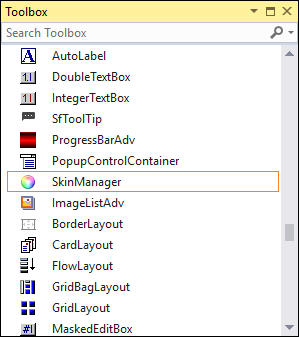

# WinForms Skin Manager

This section briefly describes how to create a new Windows Forms project in Visual Studio and apply themes using **SkinManager** component.

## Assembly deployment & theme assemblies

SkinManager present in `Syncfusion.Shared.Base` assembly. 

<table>
<tr>
<th>Theme name</th>
<th>Assembly name</th>
</tr>
<tr>
<td>Office2016Theme</td>
<td>Syncfusion.Office2016Theme.WinForms.dll. Assembly reference needed only for SfDataGrid, SfButton, SfDateTimeEdit, SfNumericTextBox, SfToolTip, SfSmithChart controls only.
</td>
<tr>
<td>Office2019Theme</td>
<td>Syncfusion.Office2019Theme.WinForms.dll</td>
</tr>
<tr>
<td>HighContrastTheme</td>
<td>Syncfusion.HighContrastTheme.WinForms.dll</td>
</tr>
<tr>
<td>Other Themes</td>
<td>Themes are included in the control assembly itself. 
</tr>
</table>

## Loading theme assemblies

Skin manager loads theme assembly using [LoadAssembly](https://help.syncfusion.com/cr/windowsforms/Syncfusion.Shared.Base~Syncfusion.Windows.Forms.SkinManager~LoadAssembly.html) method before applying theme. This is applicable for the themes which are loaded from separatly assembly and not applicable for the themes built-in to the control assembly. 





// Loading Office2019Theme assembly
SkinManager.LoadAssembly(typeof(Office2019Theme).Assembly);

//Loading HighContrastTheme assembly
SkinManager.LoadAssembly(typeof(HighContrastTheme).Assembly);

// Loading Office2016Theme assembly
SkinManager.LoadAssembly(typeof(Syncfusion.WinForms.Themes.Office2016Theme).Assembly);





' Loading Office2019Theme assembly
SkinManager.LoadAssembly(GetType(Office2019Theme).Assembly)

' Loading HighContrastTheme assembly
SkinManager.LoadAssembly(GetType(HighContrastTheme).Assembly)

' Loading Office2016Theme assembly
SkinManager.LoadAssembly(GetType(Syncfusion.WinForms.Themes.Office2016Theme).Assembly)





## Adding skin manager component

## Through designer

1) Create a new Windows Forms application in Visual Studio.

2) The `SkinManager` component can be added to designer by dragging it from the toolbox to the design view. The following dependent assemblies will be added automatically.

* Syncfusion.Shared.Base

### Applying theme

Once SkinManager component added into the designer, select the SkinManager component and go to properties window. Here, you can apply theme for a control or form using `Controls` property. 

### Applying theme to the form

Skin manager support to apply theme for all the control in the Form or a Container by applying theme to the Form or Container. So, no need to apply theme for each control. 

## Through code

Theme for a control or form can be applied by settings `Controls` property of `SkinManager`. 





using Syncfusion.Windows.Forms;

this.components = new System.ComponentModel.Container();
SkinManager skinManager1 = new SkinManager(this.components);
skinManager1.Controls = treeViewAdv1;





Imports Syncfusion.Windows.Forms

Me.components = New System.ComponentModel.Container()
Dim skinManager1 As New SkinManager(Me.components)
skinManager1.Controls = treeViewAdv1





### Applying theme to the form

Skin manager support to apply theme for all the control in the Form or a Container by applying theme to the Form or Container. So, no need to apply theme for each control.





skinManager1.Controls = this;
skinManager1.VisualTheme = VisualTheme.Office2016Black;





skinManager1.Controls = Me
skinManager1.VisualTheme = VisualTheme.Office2016Black





## Apply Themes to entire application

Skin manager allows to apply theme for all the controls and forms in an application by setting [ApplicationVisualTheme](https://help.syncfusion.com/cr/windowsforms/Syncfusion.Shared.Base~Syncfusion.Windows.Forms.SkinManager~ApplicationVisualTheme.html) property. It allows you to theme entier application using single `ApplicationVisualTheme` property. 




static void Main() 
{ 
    SkinManager.ApplicationVisualTheme = "Office2019Colourful";
    Application.EnableVisualStyles(); 
    Application.SetCompatibleTextRenderingDefault(false); 
    Application.Run(new Form1()); 
} 




N> Set `ApplicationVisualTheme` property before main form is initialized.

## Apply theme for individual control

Theme can be applied to individual component using Skin manager or by setting `ThemeName` property. You need to call [LoadAssembly](https://help.syncfusion.com/cr/windowsforms/Syncfusion.Shared.Base~Syncfusion.Windows.Forms.SkinManager~LoadAssembly.html) method for required themes when applying using `ThemeName` property also. 





this.treeViewAdv1.ThemeName = "Office2019Colorful";





Me.treeViewAdv1.ThemeName = "Office2019Colorful"





## Theme studio based themes

The Office2019Colorful and HighContrastBlack themes can be customized using WinForms Theme studio. In other way, these themes are created from theme studio. Please refer theme studio documentation to know how to create custom themes.

N> Appearance customization settings done in Control level won;t take effect, when Theme studio based theme is applied. So for customization refer Style section.

### Change font for entire application

When using theme studio based themes, the font for entire application can be customized by setting [CanOverrideFontFamily](https://help.syncfusion.com/cr/cref_files/windowsforms/Syncfusion.Shared.Base~Syncfusion.WinForms.Theme.FontHelper~CanOverrideFontFamily.html) property as true. This property is used only in constructor.





FontHelper.CanOverrideFontFamily = true;
FontHelper.FontFamily = new FontFamily("Algerian");





FontHelper.CanOverrideFontFamily = True
FontHelper.FontFamily = New FontFamily("Algerian")





### Styles

When using theme studio based themes, the appearence of each control or component can be customized using `ThemeStyle` property.

N> If the control name start with **SF**, you can access appearence properties using `Style` property and for remaining controls use `ThemeStyle` property.

For example, In the below code we have change the different style of each control.





this.treeViewAdv1.ThemeStyle.BackColor = System.Drawing.Color.White;
this.treeViewAdv1.ThemeStyle.BorderColor = System.Drawing.Color.SteelBlue;
this.treeViewAdv1.ThemeStyle.LineColor = System.Drawing.Color.DarkBlue;
this.treeViewAdv1.ThemeStyle.TreeNodeAdvStyle.ArrowColor = System.Drawing.Color.Aqua;
this.treeViewAdv1.ThemeStyle.TreeNodeAdvStyle.TextColor = System.Drawing.Color.Red;





Me.treeViewAdv1.ThemeStyle.BackColor = System.Drawing.Color.White
Me.treeViewAdv1.ThemeStyle.BorderColor = System.Drawing.Color.SteelBlue
Me.treeViewAdv1.ThemeStyle.LineColor = System.Drawing.Color.DarkBlue
Me.treeViewAdv1.ThemeStyle.TreeNodeAdvStyle.ArrowColor = System.Drawing.Color.Aqua
Me.treeViewAdv1.ThemeStyle.TreeNodeAdvStyle.TextColor = System.Drawing.Color.Red





### Overriding user customization when applying theme

You can customize the appearence of control using `Style` or `ThemeStyle` properties when using theme studio based themes. Syncfusion control provides option whether theme can override style settings using `CanOverrideStyle` property.

For example, In the below code TreeView forecolor is customized and theme applied after that line. If you run the applicaiton theme will not override the forecolor settings since default value of `CanOverrideStyle` is `false`. If you set `CanOverrideStyle` property as `true` before setting the theme, then forecolor setting will get overridden by theme.





this.treeViewAdv1.ThemeName = "Office2019Colorful";
this.treeViewAdv1.ThemeStyle.TreeNodeAdvStyle.TextColor = System.Drawing.Color.Red;
this.treeViewAdv1.CanOverrideStyle = false;





Me.treeViewAdv1.ThemeName = "Office2019Colorful"
Me.treeViewAdv1.ThemeStyle.TreeNodeAdvStyle.TextColor = System.Drawing.Color.Red
Me.treeViewAdv1.CanOverrideStyle = False





